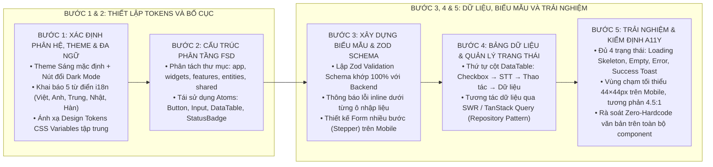

# KỸ NĂNG: ĐẶC TẢ VÀ TRIỂN KHAI GIAO DIỆN NGƯỜI DÙNG HIỆN ĐẠI (UI-WRITER)

Kỹ năng này cung cấp phương pháp luận và các biểu mẫu chuẩn mực để thiết kế, đặc tả và triển khai các màn hình giao diện người dùng (Frontend UI/UX) trên nền tảng Next.js / React theo phương pháp Feature-Sliced Design (FSD), bảo đảm tính mới mẻ, hiện đại, trải nghiệm tối ưu, đa ngôn ngữ 5 thứ tiếng và linh hoạt chuyển đổi Light/Dark Mode.

---

## 1. NGUYÊN TẮC THIẾT KẾ MẶC ĐỊNH

1. **Phong cách thiết kế mới mẻ — hiện đại (Contemporary Modern UI Style):**
   * Nếu người dùng **không chỉ định một codebase hoặc UI template cụ thể**, mặc định **BẮT BUỘC áp dụng phong cách thiết kế mới mẻ, hiện đại, cao cấp** (Clean Contemporary Minimalist):
     * Bố cục thoáng đãng (Generous Whitespace), bo góc mềm mại (`rounded-xl: 12px`, `rounded-2xl: 16px`).
     * Đổ bóng phân tầng tinh tế (`shadow-sm`, `shadow-md`), hiệu ứng viền kính mờ (Subtle Glassmorphism) cho Header và Modal.
     * Phông chữ hiện đại (Inter, Plus Jakarta Sans, Outfit), vi mô hoạt ảnh (Micro-animations) mượt mà 60 FPS.
2. **Mặc định Theme Sáng & Hỗ trợ Light Mode / Dark Mode cho Web:**
   * Giao diện khởi tạo mặc định ở **Theme Sáng (Light Mode)** trang nhã, tương phản cao.
   * Ứng dụng Web **BẮT BUỘC có nút chuyển đổi Chủ đề (Theme Switcher: Light / Dark / System)** trên thanh Header.
   * Ánh xạ Semantic Tokens đối xứng 1-1 qua CSS Variables, không làm chói mắt ở Dark Mode và không bạc màu ở Light Mode.
3. **Mặc định Đa Ngôn Ngữ 5 Thứ Tiếng (Việt - Anh - Trung - Nhật - Hàn) Đồng Bộ Cả BE và FE:**
   * **Frontend:** Có dropdown chọn ngôn ngữ kèm quốc kỳ trên Header. Khai báo tập trung 5 tệp từ điển: `vi.json` (Mặc định), `en.json` (English), `zh.json` (中文), `ja.json` (日本語), `ko.json` (한국어). 100% văn bản gọi qua `t('key')`, cấm hardcode text.
   * **Backend:** Cấu hình `LocaleResolver` bắt `Accept-Language` header và 5 tệp `messages_*.properties` (`vi`, `en`, `zh`, `ja`, `ko`) tự động dịch thông điệp phản hồi API và mã lỗi `GlobalExceptionHandler`.

---

## 2. QUY TRÌNH THIẾT KẾ GIAO DIỆN 5 BƯỚC

---

## 3. CHECKLIST KIỂM ĐỊNH GIAO DIỆN TRƯỚC KHI BÀN GIAO

- [ ] **Phong cách thiết kế:** Hiện đại, mới mẻ, bo góc tinh tế (`rounded-xl`), đổ bóng phân tầng nhẹ nhàng, bố cục thoáng đãng.
- [ ] **Theme Sáng mặc định & Dark Mode:** Theme Sáng mặc định, có nút chuyển đổi Light/Dark Mode hoạt động trơn tru qua biến CSS.
- [ ] **Đa ngôn ngữ 5 thứ tiếng:** Khai báo đủ 5 tệp ngôn ngữ (`vi.json`, `en.json`, `zh.json`, `ja.json`, `ko.json`) phía FE và 5 tệp `messages_*.properties` phía BE. Có dropdown chọn ngôn ngữ trên Header. 100% văn bản gọi qua `t('key')`.
- [ ] **Design Tokens:** 100% màu sắc và khoảng cách sử dụng biến `var(--color-*)`, `var(--font-*)`, `var(--radius-*)`. Không hardcode mã Hex.
- [ ] **Biểu mẫu (Form):** Có Zod Schema validate đầy đủ, có thông báo lỗi inline tại từng trường khi nhập sai.
- [ ] **DataTable:** Cột Thao tác đặt ngay sau cột STT (`Checkbox` → `STT` → `Thao tác` → `Dữ liệu`).
- [ ] **Trạng thái giao diện:** Đầy đủ Skeleton Loading, Empty State, Error Alert và Success Toast.
- [ ] **Khả năng tiếp cận (A11y):** Đạt chuẩn tương phản 4.5:1, vùng chạm di động `≥ 44×44px`.
- [ ] **Logo & Favicon:** Thiết kế sáng tạo, độc đáo, tối giản (Monoline / Flat Vector nét đậm), không chi tiết vụn vặt, hiển thị sắc nét ở 16×16 / 32×32 px.
