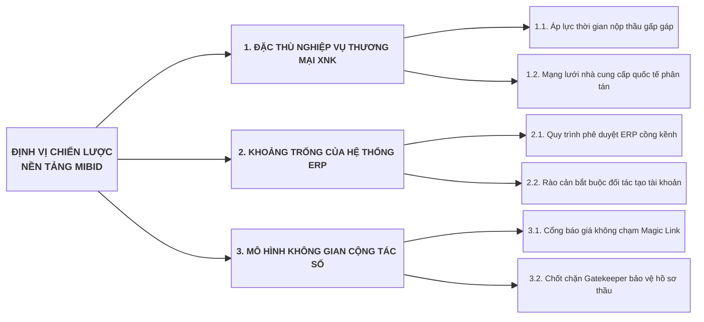
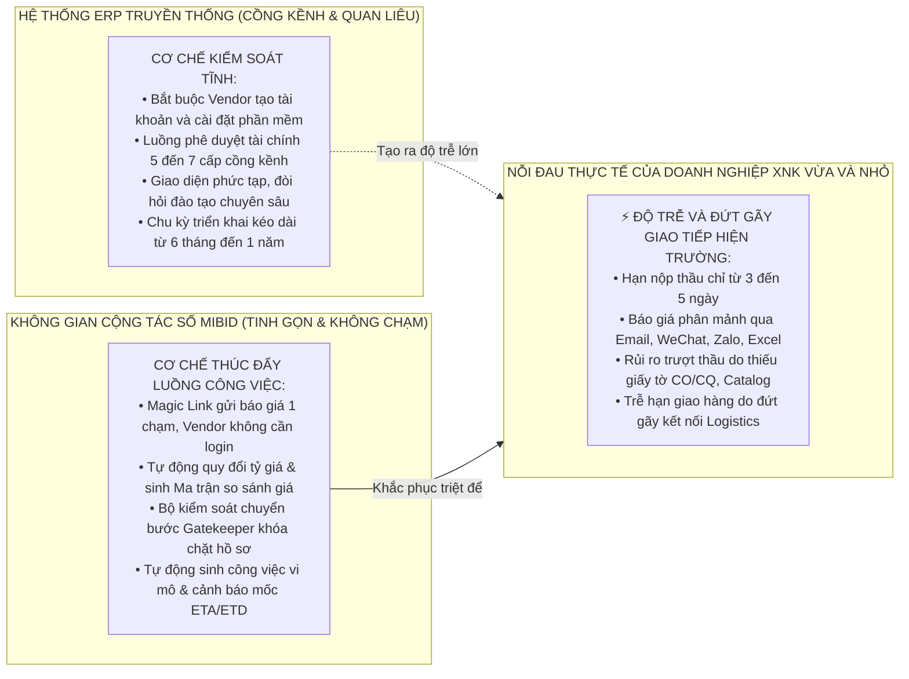
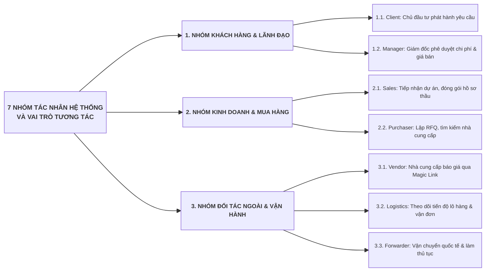
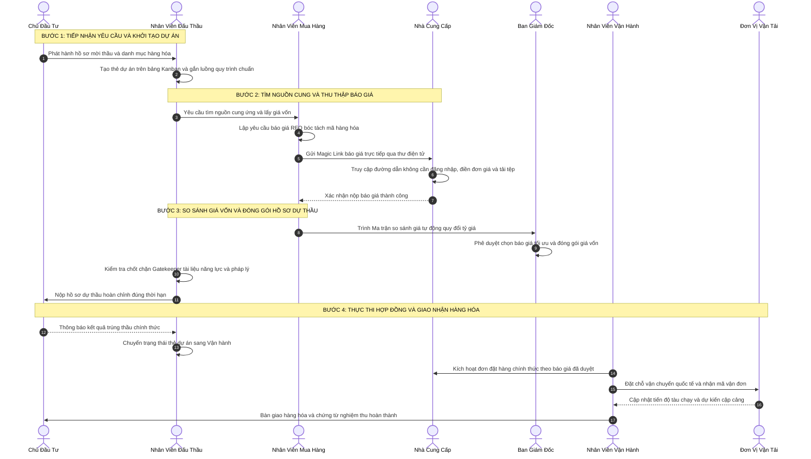
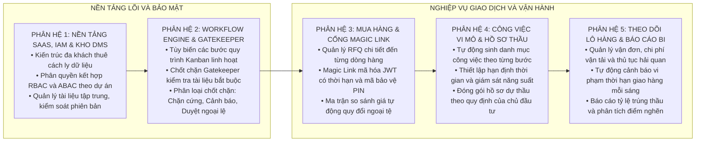

# TÀI LIỆU NGHIÊN CỨU & PHÁT TRIỂN SẢN PHẨM (PRODUCT R&D BLUEPRINT)
## NỀN TẢNG KHÔNG GIAN CỘNG TÁC SỐ QUẢN LÝ GÓI THẦU VÀ HỒ SƠ THẦU XUẤT NHẬP KHẨU: MIBID
### ĐỊNH VỊ: KHÔNG GIAN CỘNG TÁC SỐ TINH GỌN, XÓA BỎ RÀO CẢN KẾT NỐI GIỮA DOANH NGHIỆP THƯƠNG MẠI XNK, CHỦ ĐẦU TƯ VÀ NHÀ CUNG CẤP

---

## PHẦN 1: NGHIÊN CỨU THỊ TRƯỜNG, NỖI ĐAU DOANH NGHIỆP XNK VÀ KHOẢNG TRỐNG ERP

### 1. Phân Tích Thực Trạng và Nỗi Đau Cốt Lõi Của Doanh Nghiệp Thương Mại XNK

Trong phân khúc doanh nghiệp Thương mại và Xuất nhập khẩu (XNK) vừa và nhỏ, hoạt động tham gia dự thầu và cung ứng hàng hóa cho các dự án công nghiệp, xây dựng hoặc chủ đầu tư tư nhân diễn ra với cường độ cao và áp lực cạnh tranh khốc liệt. Các doanh nghiệp này thường xuyên đối mặt với 4 điểm nghẽn nghiêm trọng:

1. **Rào cản tài khoản đối với Nhà cung cấp quốc tế (Vendor Friction):**
   * Khi cần lấy giá vốn cho hàng chục mặt hàng kỹ thuật, nhân viên mua hàng phải liên hệ với nhiều nhà cung cấp tại Trung Quốc, Hàn Quốc, Nhật Bản, châu Âu.
   * Các nhà cung cấp nước ngoài tuyệt đối từ chối việc đăng ký tài khoản, cài đặt phần mềm hoặc tuân theo các quy trình cổng thông tin phức tạp của bên mua. Hậu quả là 90% giao dịch hỏi giá bị đẩy về các kênh rời rạc như Email, WeChat, WhatsApp, Zalo.
2. **Dữ liệu báo giá phân mảnh và sai lệch quy chuẩn:**
   * Báo giá gửi về dưới vô số định dạng: bảng tính Excel không cùng mẫu, ảnh chụp, tệp PDF scan.
   * Khác biệt về đồng tiền thanh toán (USD, EUR, CNY, VND), điều kiện thương mại quốc tế Incoterms (EXW xưởng, FOB cảng đi, CIF cảng đến, DDP kho người mua), chưa tính thuế nhập khẩu, thuế giá trị gia tăng và chi phí kiểm định chuyên ngành.
   * Nhân viên mua hàng mất từ 2 đến 4 ngày làm việc thủ công để nhập liệu, quy đổi tỷ giá và ghép thành bảng so sánh giá, dẫn đến nguy cơ chậm thời hạn nộp hồ sơ thầu.
3. **Nguy cơ trượt thầu do sai sót hồ sơ kỹ thuật và pháp lý:**
   * Hồ sơ dự thầu đòi hỏi tập hợp hàng chục loại giấy tờ pháp lý: Đăng ký kinh doanh, báo cáo tài chính kiểm toán, giấy ủy quyền bán hàng của hãng, chứng chỉ xuất xứ hàng hóa CO, chứng chỉ chất lượng CQ, catalog kỹ thuật.
   * Do không có cơ chế chốt chặn tự động, nhân viên kinh doanh thường nộp hồ sơ thiếu giấy tờ bắt buộc hoặc sử dụng tài liệu đã hết hạn hiệu lực, dẫn đến việc bị loại ngay từ vòng chấm hồ sơ năng lực.
4. **Đứt gãy luồng thông tin giữa Đấu thầu, Mua hàng và Giao nhận Logistics:**
   * Sau khi trúng thầu, thông tin chi tiết về hợp đồng, thông số đóng gói và các mốc thời gian cam kết giao hàng không được chuyển giao thông suốt sang bộ phận Logistics.
   * Không có cơ chế cảnh báo tự động về thời hạn sẵn sàng hàng hóa tại xưởng người bán, thời điểm tàu chạy và thời điểm cập cảng, dẫn đến tình trạng phát sinh chi phí lưu container, lưu bãi và bị chủ đầu tư phạt vi phạm tiến độ giao hàng.

---

### 2. Ma Trận So Sánh Năng Lực Giải Pháp

| Tiêu chí nghiệp vụ | Hệ thống ERP truyền thống (SAP, Odoo, Bravo) | Công cụ Quản lý Dự án (Trello, Jira, Asana) | Nền tảng Đấu thầu Nhà nước / Mua sắm lớn | **Nền tảng Mibid (Đề xuất)** |
| :--- | :--- | :--- | :--- | :--- |
| **Bản chất định vị** | Cỗ máy kiểm soát tài chính và sổ cái kế toán. | Bảng công việc và nhiệm vụ chung chung. | Cổng đấu thầu tuân thủ thủ tục hành chính công. | **Không gian cộng tác số chuyên sâu cho thương mại XNK.** |
| **Tương tác với Vendor** | Bắt buộc đối tác tạo tài khoản và phân quyền. | Không hỗ trợ tương tác thu thập giá từ đối tác ngoài. | Đòi hỏi chứng thư số, token USB, quy trình phức tạp. | **Không chạm qua Magic Link mã hóa JWT/PIN, không cần tài khoản.** |
| **So sánh giá đa ngoại tệ** | Phức tạp, chỉ hạch toán sau khi lập đơn mua hàng PO. | Không có tính năng tính toán so sánh tài chính. | So sánh giá tổng thầu, không bóc tách chi tiết dòng hàng. | **Tự động quy đổi tỷ giá, so sánh từng Line Item, Incoterms, thuế, cước.** |
| **Kiểm soát tính đầy đủ hồ sơ** | Phê duyệt hành chính tuần tự theo chức vụ. | Nhắc việc thủ công, không có điều kiện khóa bước. | Chấm điểm thủ công bởi tổ chấm thầu. | **Gatekeeper Engine chặn cứng hoặc cảnh báo nếu thiếu tài liệu chuẩn.** |
| **Quản lý tài liệu theo ngữ cảnh** | Lưu trữ tệp đính kèm rời rạc theo bản ghi. | Đính kèm file tự do, không kiểm soát phiên bản. | Đóng gói tệp nén dung lượng giới hạn. | **Kho DMS tập trung, kế thừa xuyên suốt từ Mua hàng đến Logistics.** |
| **Theo dõi vận chuyển quốc tế** | Phải mua thêm phân hệ Logistics đắt đỏ. | Người dùng tự gõ text cập nhật ngày tháng. | Không quản lý khâu giao nhận hàng hóa. | **Theo dõi mốc vận đơn BL, tự động cảnh báo trễ hạn ETA/ETD mỗi sáng.** |
| **Thời gian đưa vào sử dụng** | Từ 3 đến 9 tháng, chi phí tư vấn lớn. | 1 ngày nhưng phải cấu hình thủ công toàn bộ. | Phụ thuộc vào quy định cổng mua sắm công. | **Sử dụng ngay trong 1 tuần với các mẫu quy trình chuẩn hóa sẵn.** |

---

## PHẦN 2: ĐỊNH VỊ SẢN PHẨM VÀ GIÁ TRỊ CỐT LÕI

### 1. Định Vị: "Không Gian Cộng Tác Số" Thay Vì "Phần Mềm Quản Trị"

Sự khác biệt mang tính cách mạng của Mibid nằm ở việc **chuyển đổi tư duy từ kiểm soát quan liêu sang thúc đẩy luồng công việc tự nhiên**:
* **Không áp đặt quy trình nội bộ lên đối tác bên ngoài:** Nhà cung cấp và đơn vị vận chuyển được tương tác qua các giao diện web tối ưu cho di động với thời gian phản hồi dưới 60 giây.
* **Tập trung vào chuỗi giá trị sinh lời:** Tập trung xử lý xuất sắc khâu Đấu thầu (Bidding), Mua hàng (Sourcing) và Giao hàng (Logistics). Các nghiệp vụ kế toán sâu như hạch toán nợ có, khấu hao tài sản, tính thuế thu nhập doanh nghiệp sẽ được tích hợp với các phần mềm chuyên ngành thông qua RESTful API.

### 2. Ba Trụ Cột Giá Trị Cốt Lõi

1. **Tốc độ (Speed):** Rút ngắn 70% thời gian thu thập báo giá và lắp ráp hồ sơ dự thầu, giúp doanh nghiệp kịp thời chớp lấy các cơ hội kinh doanh gấp.
2. **Tinh gọn (Lean):** Loại bỏ 100% các biểu mẫu giấy tờ trung gian và các thao tác sao chép dữ liệu thủ công giữa các bộ phận.
3. **Kết nối không rào cản (Frictionless Connectivity):** Kết nối tức thì giữa Doanh nghiệp thương mại, Khách hàng, Nhà cung cấp quốc tế và Đơn vị vận chuyển trong một luồng dữ liệu thống nhất.

---

## PHẦN 3: PHÂN TÍCH 7 NHÓM TÁC NHÂN VÀ LUỒNG GIÁ TRỊ TOÀN TRÌNH

### 1. Chuỗi Giá Trị Toàn Trình (End-to-End Value Stream)

Quy trình nghiệp vụ của Mibid kết nối chặt chẽ từ khi tiếp nhận thông tin gói thầu cho đến khi bàn giao hàng hóa hoàn tất:

---

## PHẦN 4: NĂM PHÂN HỆ NGHIỆP VỤ ĐỘT PHÁ CỦA MIBID

1. **Phân hệ 1 — Quản trị Nền tảng SaaS, IAM và Kho Tài liệu Số (DMS):**
   * Bảo đảm mô hình đa khách thuê (Multi-tenant) cách ly dữ liệu an toàn.
   * Áp dụng mô hình phân quyền lai: Quyền toàn cục (RBAC) kết hợp quyền theo từng dự án (ABAC). Một nhân sự có thể là Trưởng nhóm tại dự án A nhưng chỉ là Thành viên hỗ trợ tại dự án B.
   * Quản lý kho tài liệu số tập trung, hỗ trợ lưu trữ tệp trên Amazon S3 / MinIO với đường dẫn truy cập có chữ ký tạm thời (Pre-signed URL) và quy trình phê duyệt tài liệu nghiêm ngặt.
2. **Phân hệ 2 — Dynamic Workflow Engine và Chốt Chặn Chuyển Bước Đa Tầng (Transition Gatekeeper):**
   * **Khả năng khai báo và tùy biến luồng cực kỳ linh hoạt:** Cho phép doanh nghiệp tự định nghĩa không giới hạn các mẫu quy trình chuẩn theo từng nhóm Chủ đầu tư (Khối Nhà nước EVN/PVN, Tổng thầu EPC, Dự án FDI quốc tế, Khách hàng Tư nhân) hoặc theo nhóm ngành hàng. Quản lý dự án có quyền ghi đè (Workflow Tailoring) riêng cho từng gói thầu cụ thể (thêm bước trung gian, bớt bước không cần thiết, rẽ nhánh có điều kiện theo ngân sách hoặc yêu cầu bảo lãnh) mà không làm ảnh hưởng tới mẫu quy trình gốc của công ty.
   * **Cơ chế chốt chặn Gatekeeper đa tầng bảo đảm vận hành chuẩn xác:** Tự động kiểm tra 4 lớp điều kiện nghiêm ngặt (Chứng từ logic AND/OR, Tiêu chí checklist bắt buộc, Điều kiện thương mại/tài chính, Ký duyệt cấp quản lý) trước khi cho phép kéo thẻ sang bước tiếp theo. Cung cấp 3 chế độ thực thi: Chặn cứng (Hard Stop), Cảnh báo mềm (Soft Warning) và Phê duyệt ngoại lệ (Manager Approval Bypass).
3. **Phân hệ 3 — Mua Hàng, Báo Giá và Cổng Không Chạm Magic Link:**
   * Tự động sinh đường dẫn truy cập duy nhất có gắn mã bảo mật JWT với thời hạn hiệu lực cụ thể gửi thẳng tới hộp thư của từng nhà cung cấp.
   * Vendor mở liên kết trên trình duyệt di động hoặc máy tính để điền giá cho từng dòng hàng, tải tệp catalog và xác nhận mà không cần tạo tài khoản.
   * Ma trận so sánh giá tự động quy đổi ngoại tệ theo tỷ giá cơ sở tại thời điểm lập dự án, giúp ban giám đốc có cái nhìn trực quan và chuẩn xác để ra quyết định lựa chọn nhà cung cấp.
4. **Phân hệ 4 — Quản Trị Công Việc Vi Mô và Hồ Sơ Dự Thầu (Bidding Operations & Tasks):**
   * **Cơ chế điều phối công việc vi mô thông minh (Dynamic Task Dispatcher Engine):** Tự động sinh danh mục công việc cần làm dựa trên thuộc tính gói thầu (gói thầu Nhà nước tự động sinh việc mua HSMT và nộp bảo lãnh ngân hàng; hàng nhập khẩu tự động sinh việc tra cứu HS Code và thẩm tra CO Form E).
   * **Tùy biến SLA động và công việc đột xuất (Ad-hoc Tasks):** Thời hạn hoàn thành tự động co ngắn theo độ gấp gáp của thời điểm đóng thầu; Quản lý dự án có toàn quyền thêm việc đột xuất, giao việc chéo phòng ban ngay trên bảng Kanban.
   * **Chốt chặn hoàn thành công việc (Task Completion Gate):** Ngăn chặn chuyển bước khi còn công việc trọng yếu chưa hoàn thành; hỗ trợ lắp ráp và xuất gói hồ sơ dự thầu ZIP/PDF có mục lục đánh số trang tự động.
5. **Phân hệ 5 — Theo Dõi Lô Hàng, Vận Chuyển và Báo Cáo Phân Tích (Logistics & BI Analytics):**
   * Theo dõi chi tiết thông tin vận đơn, các mốc giao nhận hàng hóa (sẵn sàng tại xưởng, bốc hàng lên tàu, cập cảng đích, thông quan hải quan, giao hàng tại kho người mua).
   * Tiến trình chạy ngầm định kỳ 8:00 AM hằng ngày tự động rà quét các mốc tiến độ để gửi cảnh báo đỏ cho các lô hàng có nguy cơ trễ hạn.
   * Bảng điều khiển phân tích cung cấp báo cáo tỷ lệ trúng thầu theo ngành hàng, nguyên nhân trượt thầu và báo cáo thời gian chu kỳ để xác định điểm nghẽn trong quy trình nội bộ.
