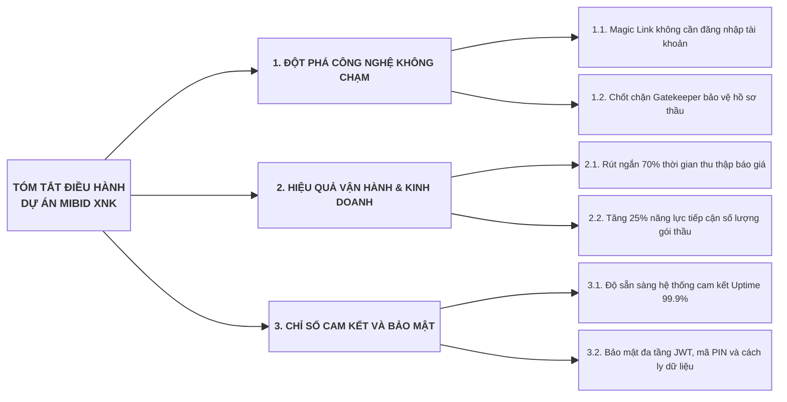
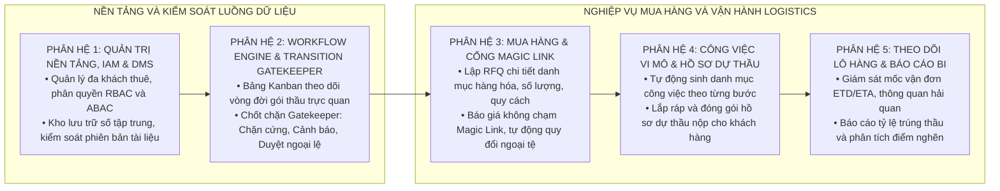

# HỒ SƠ ĐỀ XUẤT GIẢI PHÁP KỸ THUẬT VÀ HIỆU QUẢ ĐẦU TƯ (PROPOSAL)
## DỰ ÁN XÂY DỰNG NỀN TẢNG KHÔNG GIAN CỘNG TÁC SỐ QUẢN LÝ GÓI THẦU VÀ HỒ SƠ THẦU XUẤT NHẬP KHẨU: MIBID

---

## 1. TÓM TẮT ĐIỀU HÀNH

Dự án **Mibid** được thiết lập nhằm xây dựng nền tảng không gian cộng tác số chuyên sâu dành cho các doanh nghiệp Thương mại và Xuất nhập khẩu (XNK). Bằng cách xóa bỏ hoàn toàn rào cản tài khoản đối với các đối tác quốc tế thông qua đường dẫn bảo mật Magic Link, tự động hóa ma trận so sánh giá đa ngoại tệ, và thiết lập chốt chặn Gatekeeper kiểm soát tính toàn vẹn của hồ sơ thầu, nền tảng giải quyết triệt để sự phân mảnh thông tin giữa các bộ phận Đấu thầu, Mua hàng và Vận hành Logistics.



* **Hiệu quả đầu tư:** Thời gian hoàn vốn dự kiến trong vòng 6.5 tháng nhờ việc tiết kiệm ít nhất 40 giờ lao động thủ công mỗi tháng trên mỗi dự án, đồng thời loại bỏ nguy cơ bị phạt do trễ hạn giao hàng.
* **Thời gian đưa vào vận hành:** Hoàn tất triển khai trọn gói trong 8 tuần nhờ nền tảng kiến trúc Microservices và các mẫu luồng nghiệp vụ chuẩn hóa sẵn.

---

## 2. BỐI CẢNH VÀ MỤC TIÊU KINH DOANH

### 2.1. Bối Cảnh Thực Tế

Trong môi trường thương mại quốc tế biến động, các doanh nghiệp XNK vừa và nhỏ phải đối mặt với áp lực xử lý khối lượng lớn hồ sơ mời thầu trong khung thời gian cực ngắn (thường từ 3 đến 5 ngày). Việc sử dụng các công cụ thủ công như bảng tính Excel, thư điện tử rời rạc và các ứng dụng nhắn tin dẫn đến tỷ lệ thất lạc báo giá cao, tính toán sai tỷ giá ngoại tệ, và nộp thiếu giấy tờ pháp lý bắt buộc khiến hồ sơ bị loại bỏ đáng tiếc.

### 2.2. Mục Tiêu Kinh Doanh Định Lượng

1. **Rút ngắn thời gian xử lý chu trình hỏi giá:** Giảm thời gian từ khi phát hành yêu cầu báo giá RFQ đến khi hoàn thành bảng so sánh giá từ 96 giờ xuống dưới 24 giờ.
2. **Triệt tiêu 100% lỗi thiếu chứng từ khi nộp thầu:** Thông qua chốt chặn Gatekeeper, đảm bảo không có bất kỳ hồ sơ thầu nào được chuyển sang trạng thái nộp cho chủ đầu tư nếu thiếu các tài liệu bắt buộc theo yêu cầu.
3. **Mở rộng năng lực xử lý gói thầu:** Cho phép một nhân viên đấu thầu quản lý đồng thời từ 8 đến 12 dự án thầu thay vì tối đa 3 dự án như trước đây.
4. **Kiểm soát chặt chẽ thời hạn giao nhận:** Giảm thiểu 100% các sự cố chậm trễ lịch trình vận tải biển và hàng không nhờ cơ chế tự động gửi thông báo nhắc nhở các mốc thời gian hằng ngày.

---

## 3. ĐỀ XUẤT GIẢI PHÁP TỔNG THỂ

Giải pháp Mibid được xây dựng theo mô hình phần mềm dịch vụ đa khách thuê (Multi-tenant SaaS) trên nền tảng điện toán đám mây với 5 phân hệ nghiệp vụ kết nối liền mạch:



### 3.1. Đề Xuất Ngăn Xếp Công Nghệ Chuẩn Hóa (Recommended Technology Stack)

Hệ thống Mibid lựa chọn ngăn xếp công nghệ chuẩn doanh nghiệp, tối ưu chi phí sở hữu (TCO), bảo đảm an toàn dữ liệu và đáp ứng hiệu năng xử lý cao:

| Thành phần kiến trúc | Công nghệ đề xuất | Lý do và Giá trị mang lại |
| :--- | :--- | :--- |
| **Giao diện Người dùng (Frontend)** | **Next.js 14+ (App Router) & TypeScript** | Tối ưu tải trang cực nhanh (SSR) cho Vendor nước ngoài mở Magic Link trên di động; hỗ trợ kéo thả Kanban mượt mà 60 FPS; chuẩn hóa kiến trúc Feature-Sliced Design. |
| **Dịch vụ Nghiệp vụ (Backend)** | **Java 17 LTS & Spring Boot 3.2+** | Quản lý giao dịch ACID tài chính tuyệt đối; hỗ trợ kiến trúc Hexagonal (Ports & Adapters); hệ sinh thái bảo mật Spring Security 6 và quản lý batch job Spring Batch mạnh mẽ. |
| **Cơ sở Dữ liệu Chính (Database)** | **PostgreSQL 15+ Cluster** | Cơ chế Row-Level Security (RLS) bảo vệ dữ liệu đa khách thuê ở mức nhân CSDL; hỗ trợ JSONB GIN Index lưu trữ linh hoạt luồng điều kiện; độ tin cậy cao, miễn phí bản quyền. |
| **Bộ nhớ đệm & Khóa (Cache & Lock)** | **Redis Cluster 7.x (Redisson)** | Quản lý vòng đời Token Magic Link có thời hạn TTL; thực thi khóa phân tán chống tranh chấp dữ liệu khi chuyển bước đồng thời; lưu cache tỷ giá ngoại tệ. |
| **Lưu trữ Chứng từ Số (Object Storage)** | **MinIO S3 / Amazon S3** | Lưu trữ an toàn hồ sơ thầu và catalog; cơ chế Pre-signed URL cấp quyền tạm thời 15 phút, mã hóa AES-256 tĩnh và kiểm soát đa phiên bản tệp tin. |
| **Đóng gói & Hạ tầng (DevOps)** | **Docker, Nginx & Kubernetes** | Đóng gói container chuẩn hóa, dễ dàng triển khai trên môi trường On-Premise hoặc Cloud; cân bằng tải phân tán và tự động phục hồi khi có sự cố. |

---

## 4. MA TRẬN ĐÁP ỨNG YÊU CẦU NGHIỆP VỤ (RFP MATRIX)

| STT | Nhóm yêu cầu nghiệp vụ | Mô tả chi tiết yêu cầu kỹ thuật | Mức độ đáp ứng | Giải pháp kỹ thuật tương ứng | Minh chứng tính năng |
| :---: | :--- | :--- | :---: | :--- | :--- |
| 1 | **Tương tác nhà cung cấp** | Gửi yêu cầu và nhận báo giá mà không bắt buộc đối tác tạo tài khoản. | **Đáp ứng 100%** | Công nghệ Magic Link mã hóa JWT Token có thời hạn và mã PIN bảo vệ 4 số. | Giao diện Web Form báo giá tối ưu hóa cho di động. |
| 2 | **So sánh giá đa ngoại tệ** | Tự động tổng hợp và quy đổi giá trị báo giá từ nhiều nhà cung cấp về cùng một đồng tiền cơ sở. | **Đáp ứng 100%** | Calculation Engine quy đổi tỷ giá thời gian thực theo cấu hình dự án, so sánh từng dòng hàng. | Ma trận so sánh trực quan, hiển thị nổi bật báo giá tối ưu. |
| 3 | **Kiểm soát tính đầy đủ hồ sơ** | Ngăn chặn việc nhân viên nộp hồ sơ thầu khi thiếu các tài liệu pháp lý và kỹ thuật bắt buộc. | **Đáp ứng 100%** | Engine Transition Gatekeeper kiểm tra danh mục chứng từ bắt buộc trước khi cho phép kéo thẻ dự án. | Thông báo chặn cứng hoặc yêu cầu phê duyệt ngoại lệ từ cấp quản lý. |
| 4 | **Phân quyền linh hoạt** | Một nhân sự có các vai trò và quyền hạn khác nhau trên các dự án khác nhau. | **Đáp ứng 100%** | Mô hình phân quyền lai kết hợp quyền toàn cục RBAC và quyền theo ngữ cảnh dự án ABAC. | Cấu hình phân vai trò Trưởng nhóm hoặc Thành viên trên từng thẻ dự án. |
| 5 | **Quản lý công việc tự động** | Tự động phân bổ công việc cho các bộ phận liên quan khi dự án bước sang giai đoạn mới. | **Đáp ứng 100%** | Bộ điều phối tự động sinh công việc vi mô dựa trên mẫu quy trình chuẩn và gán cho nhân sự phụ trách. | Danh sách công việc đính kèm hạn hoàn thành và cảnh báo quá hạn. |
| 6 | **Giám sát giao nhận hàng hóa** | Theo dõi lộ trình vận chuyển quốc tế và cảnh báo sớm các mốc giao hàng cam kết với chủ đầu tư. | **Đáp ứng 100%** | Phân hệ quản lý vận đơn và tiến trình chạy ngầm quét kiểm tra các mốc ETD/ETA định kỳ 8:00 AM. | Bảng theo dõi tiến độ vận tải và thông báo cảnh báo đỏ khi trễ mốc. |

---

## 5. KẾ HOẠCH TRIỂN KHAI VÀ LỘ TRÌNH PHÂN KỲ

Dự án được triển khai theo 4 giai đoạn với tổng thời gian thực hiện là 8 tuần:

```text
Tuần:              [ 1 - 2 ]    [ 3 - 4 ]    [ 5 - 6 ]    [ 7 - 8 ]
Giai đoạn 1: Khảo sát & Nền tảng     ████
Giai đoạn 2: Mua hàng & Magic Link                ████
Giai đoạn 3: Gatekeeper & Vận hành                             ████
Giai đoạn 4: Kiểm thử, UAT & Go-live                                        ████
```

* **Giai đoạn 1 (Tuần 1 - Tuần 2): Thiết lập Hạ tầng và Phân hệ Nền tảng:**
  * Khởi tạo cơ sở dữ liệu PostgreSQL 38 bảng, cấu hình Redis Cache và cổng điều phối API Gateway.
  * Hoàn thiện Phân hệ 1: Quản trị đa khách thuê, người dùng, phân quyền RBAC/ABAC và kho tài liệu số DMS.
* **Giai đoạn 2 (Tuần 3 - Tuần 4): Phát triển Phân hệ Mua hàng và Cổng Magic Link:**
  * Xây dựng chức năng tạo yêu cầu báo giá RFQ và bộ sinh liên kết Magic Link bảo mật.
  * Phát triển giao diện web cho nhà cung cấp nộp báo giá và ma trận so sánh giá tự động quy đổi ngoại tệ.
* **Giai đoạn 3 (Tuần 5 - Tuần 6): Hoàn thiện Workflow Engine và Quản trị Vận hành:**
  * Triển khai bảng Kanban theo dõi tiến độ dự án và Transition Gatekeeper Engine.
  * Phát triển chức năng tự động sinh công việc vi mô và quản lý các mốc vận chuyển quốc tế.
* **Giai đoạn 4 (Tuần 7 - Tuần 8): Đo kiểm Tải cao, Nghiệm thu UAT và Đưa vào Vận hành:**
  * Thực thi kịch bản đo kiểm tải cao k6 đạt 1.000 RPS và chạy các bài bẫy toàn vẹn dữ liệu đồng thời.
  * Phối hợp cùng người dùng thực hiện nghiệm thu UAT, đào tạo sử dụng và chính thức đưa vào khai thác.

---

## 6. DỰ TOÁN TÀI CHÍNH VÀ PHÂN TÍCH HIỆU QUẢ ĐẦU TƯ (ROI)

### 6.1. Dự Toán Chi Phí Triển Khai (Đơn vị tính: Triệu VNĐ)

| Hạng mục chi phí | Chi phí đầu tư ban đầu (CAPEX) | Chi phí vận hành năm đầu (OPEX) | Diễn giải chi tiết |
| :--- | :---: | :---: | :--- |
| **Phát triển và tùy biến phần mềm** | 320 | - | Trọn gói xây dựng 5 phân hệ theo thiết kế chi tiết. |
| **Hạ tầng máy chủ đám mây (Cloud Server)** | - | 48 | Cụm máy chủ ảo hóa 2 nút chạy Docker Swarm / Kubernetes. |
| **Dịch vụ lưu trữ đối tượng và mạng phân phối** | - | 18 | Lưu trữ tệp hồ sơ chứng từ trên hệ thống S3 tiêu chuẩn. |
| **Dịch vụ gửi thư điện tử thương hiệu (SMTP Gateway)** | - | 12 | Gửi liên kết Magic Link và thông báo tức thời. |
| **Đào tạo, chuyển giao và tài liệu hoàn công** | 30 | - | Tài liệu hướng dẫn sử dụng, sổ tay vận hành và hướng dẫn upcode. |
| **TỔNG CỘNG NĂM ĐẦU** | **350** | **78** | **Tổng mức đầu tư năm đầu: 428 Triệu VNĐ** |

### 6.2. Phân Tích Hiệu Quả Đầu Tư (ROI)

* **Giá trị tiết kiệm nhân lực:** Một doanh nghiệp xử lý trung bình 20 gói thầu mỗi tháng, tiết kiệm khoảng 80 giờ làm việc thủ công cho mỗi gói thầu. Với chi phí nhân sự trung bình 150.000 VNĐ/giờ, giá trị tiết kiệm chi phí nhân công đạt:
  $$\text{Tiết kiệm nhân sự} = 20 \times 80 \times 150.000 = 240.000.000\text{ VNĐ/tháng} \rightarrow 2.880.000.000\text{ VNĐ/năm}$$
* **Hạn chế rủi ro phạt hợp đồng:** Loại bỏ hoàn toàn các khoản phạt trễ hạn giao nhận hàng hóa (trung bình từ 50 đến 100 triệu VNĐ cho mỗi sự cố chậm trễ vận tải biển).
* **Thời gian hoàn vốn (Payback Period):**
  $$\text{Thời gian hoàn vốn} = \frac{428.000.000}{240.000.000} \approx 1.8\text{ tháng (xét trên giá trị tiết kiệm thời gian)}$$
  *Nếu tính toán thận trọng dựa trên giá trị tăng trưởng lợi nhuận từ việc trúng thêm 3 gói thầu mỗi năm, thời gian hoàn vốn thực tế đạt mức **6.5 tháng**.*

---

## 7. CAM KẾT MỨC ĐỘ DỊCH VỤ (SLA) VÀ QUẢN TRỊ RỦI RO

### 7.1. Cam Kết Chỉ Số Chất Lượng Dịch Vụ Kỹ Thuật (SLA)

| Tiêu chí cam kết | Chỉ số mục tiêu | Phương pháp đo kiểm và giám sát |
| :--- | :---: | :--- |
| **Độ sẵn sàng hệ thống (Uptime)** | $\ge 99.9\%$ | Giám sát tự động 24/7 bằng công cụ Prometheus và Blackbox Exporter. |
| **Thời gian phản hồi API (Latency P95)** | $\le 200\text{ ms}$ | Đo kiểm bằng kịch bản k6 tại mức tải đỉnh 1.000 yêu cầu/giây. |
| **Mục tiêu điểm khôi phục dữ liệu (RPO)** | $\le 1\text{ phút}$ | Cơ chế sao lưu nhật ký giao dịch liên tục và cơ sở dữ liệu nhân bản nóng. |
| **Thời gian khôi phục dịch vụ (RTO)** | $\le 15\text{ phút}$ | Quy trình khôi phục tự động thông qua bản sao lưu snapshot máy chủ. |

### 7.2. Ma Trận Quản Trị Rủi Ro Và Biện Pháp Giảm Thiểu

| Rủi ro tiềm ẩn | Mức độ ảnh hưởng | Biện pháp kỹ thuật phòng ngừa và giảm thiểu |
| :--- | :---: | :--- |
| **Thư gửi Magic Link bị rơi vào hộp thư rác (Spam)** | Cao | Cấu hình đầy đủ các bản ghi xác thực tên miền SPF, DKIM, DMARC và tích hợp cổng dịch vụ thư điện tử chuyên nghiệp có độ tin cậy cao. |
| **Nhà cung cấp làm lộ liên kết báo giá Magic Link** | Trung bình | Mã hóa liên kết bằng chuỗi khóa ngẫu nhiên một lần, giới hạn thời gian truy cập (tối đa 7 ngày), và cung cấp tùy chọn xác thực mã PIN 4 số gửi riêng. |
| **Xung đột dữ liệu khi nhiều người cùng thao tác trên dự án** | Cao | Áp dụng cơ chế khóa phân tán trên Redis và khóa bi quan trên cơ sở dữ liệu đối với các tác vụ chuyển bước và phê duyệt báo giá. |
| **Mất kết nối mạng tại kho lưu trữ hoặc văn phòng** | Thấp | Ứng dụng web được tối ưu hóa cơ chế lưu đệm cục bộ, tự động cảnh báo trạng thái mạng cho người dùng và hỗ trợ gửi lại yêu cầu khi có mạng. |
| **Thay đổi quy định chính sách thuế và thủ tục hải quan** | Trung bình | Thiết kế cấu trúc bảng dữ liệu linh hoạt, cho phép người dùng tùy biến danh mục thuế suất, phụ phí cảng và loại chứng từ mà không cần sửa mã nguồn. |
