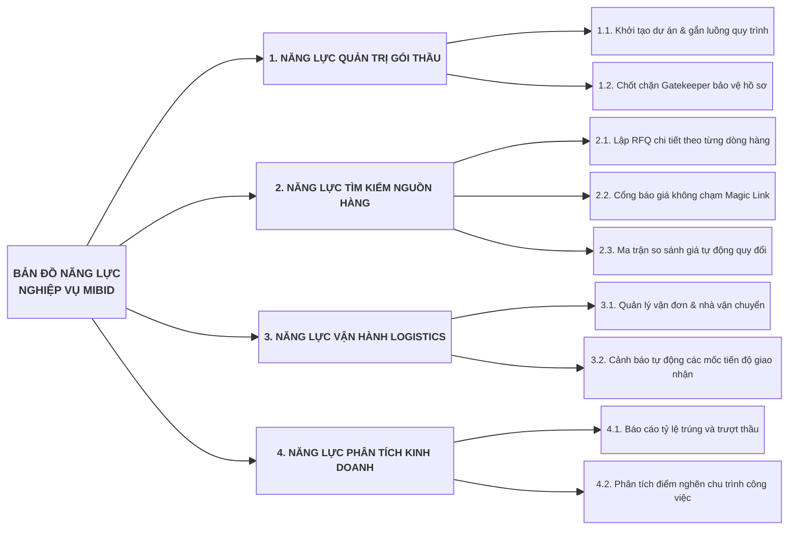
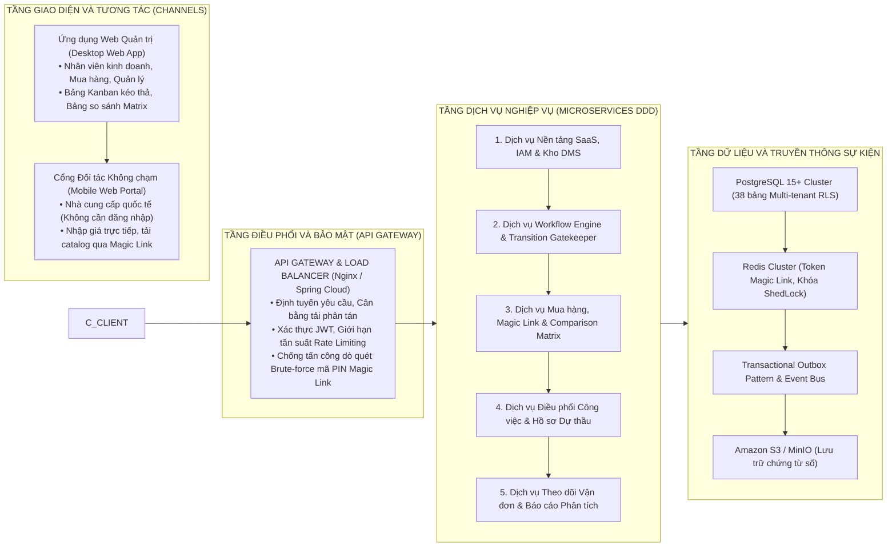
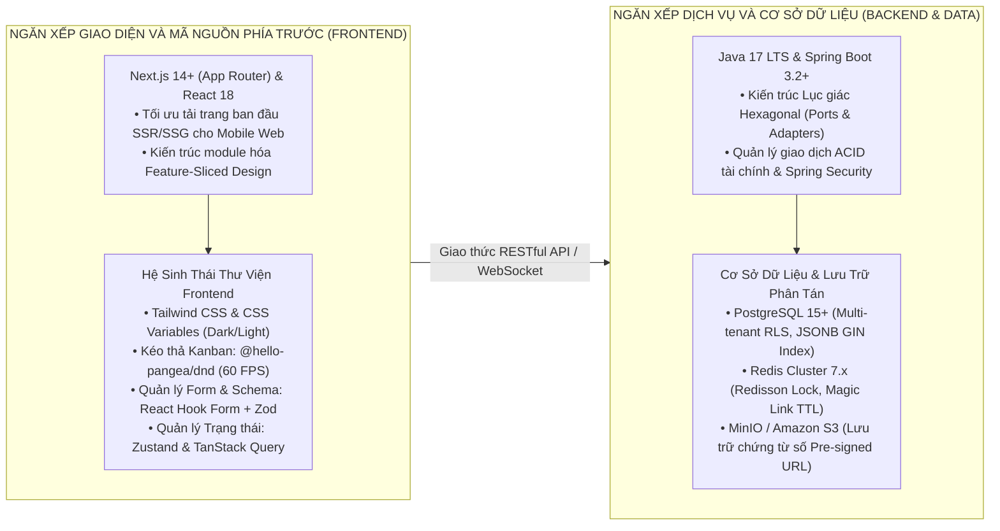
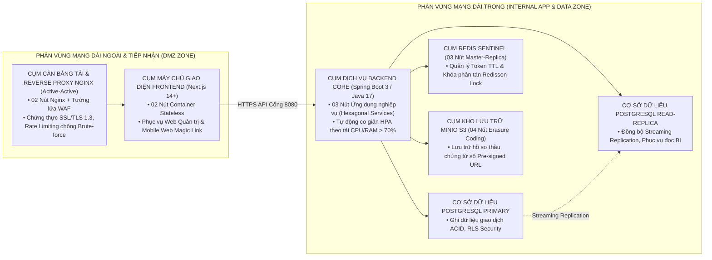
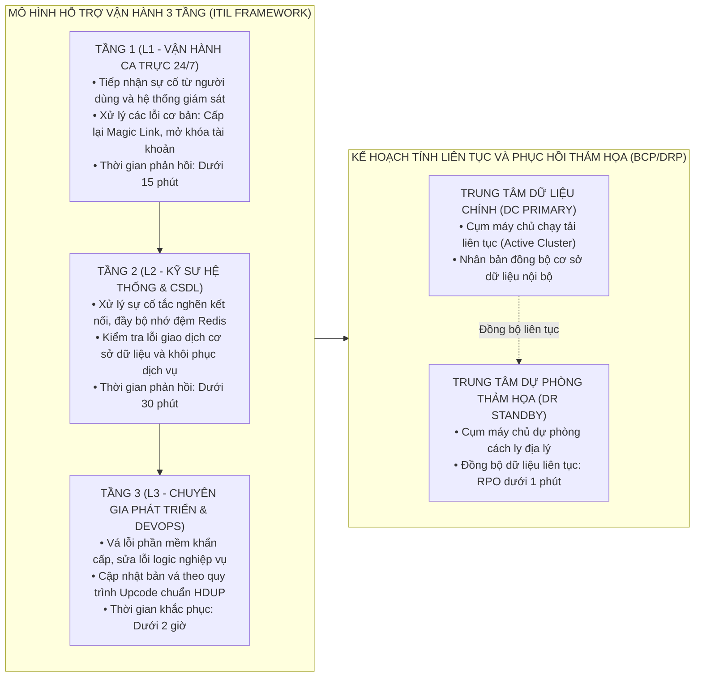
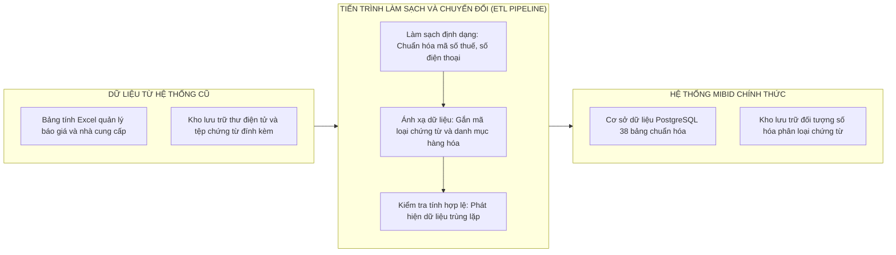

# TÀI LIỆU GIẢI PHÁP TỔNG THỂ (MASTER SOLUTION ARCHITECTURE)
## DỰ ÁN NỀN TẢNG KHÔNG GIAN CỘNG TÁC SỐ QUẢN LÝ GÓI THẦU VÀ HỒ SƠ THẦU XUẤT NHẬP KHẨU: MIBID
### BỐN TRỤ CỘT CHIẾN LƯỢC: NGHIỆP VỤ — KIẾN TRÚC — VẬN HÀNH — TRIỂN KHAI

---

## 1. TRỤ CỘT 1: NGHIỆP VỤ VÀ BẢN ĐỒ NĂNG LỰC DOANH NGHIỆP



### 1.1. Bản Đồ Năng Lực Nghiệp Vụ Cốt Lõi

1. **Khối Năng Lực Quản Trị Dự Án & Hồ Sơ Thầu (Tender & Project Governance):**
   * *Quản lý vòng đời dự án:* Theo dõi trạng thái tiến triển của từng gói thầu qua các bước định nghĩa sẵn trên bảng Kanban (Chuẩn bị → Hỏi giá vốn → Nộp thầu → Trúng thầu / Trượt thầu → Giao nhận).
   * *Kiểm soát hồ sơ nghiêm ngặt (Transition Gatekeeper):* Tự động quét kiểm tra danh mục chứng từ bắt buộc (Đăng ký kinh doanh, báo cáo tài chính, chứng chỉ CO/CQ, catalog) trước khi cho phép chuyển bước.
2. **Khối Năng Lực Tìm Kiếm Nguồn Hàng & Mua Sắm (Sourcing & Procurement):**
   * *Bóc tách danh mục hàng hóa (Line Items Sourcing):* Lập yêu cầu báo giá RFQ với đầy đủ mã HS Code, quy cách kỹ thuật, số lượng, đơn vị tính và điều kiện giao hàng Incoterms.
   * *Cổng đối tác không chạm (Vendor Portal via Magic Link):* Phát hành đường dẫn truy cập mã hóa kèm mã PIN bảo mật, cho phép nhà cung cấp nước ngoài điền giá và gửi tệp mà không cần đăng ký tài khoản.
   * *Ma trận so sánh giá vốn (Comparison Matrix):* Tự động quy đổi ngoại tệ về cùng một đồng tiền cơ sở, phân tích giá từng dòng hàng để ban giám đốc lựa chọn phương án mua hàng tối ưu.
3. **Khối Năng Lực Vận Hành Logistics Quốc Tế (Logistics Operations):**
   * *Quản lý vận đơn và đối tác vận tải:* Theo dõi chi tiết số vận đơn (Bill of Lading), hãng tàu, đại lý giao nhận hàng hóa và biểu phí vận chuyển phát sinh.
   * *Giám sát hành trình (Milestone Tracking):* Tự động cảnh báo trước 24 giờ đối với các mốc thời gian quan trọng (hàng sẵn sàng tại xưởng, bốc hàng lên tàu, cập cảng đích, thông quan hải quan).
4. **Khối Năng Lực Phân Tích Dữ Liệu Kinh Doanh (Business Intelligence):**
   * *Thống kê hiệu suất đấu thầu:* Phân tích tỷ lệ thắng/trượt thầu theo từng chủ đầu tư, theo ngành hàng và theo từng nhân viên kinh doanh.
   * *Phát hiện điểm nghẽn quy trình (Bottleneck Analysis):* Đo lường thời gian trung bình một gói thầu nằm lại ở từng bước để tối ưu hóa năng suất vận hành toàn công ty.

---

## 2. TRỤ CỘT 2: KIẾN TRÚC ĐA TẦNG VÀ THIẾT KẾ CÔNG NGHỆ



### 2.1. Phân Tách Ranh Giới Dịch Vụ Theo Miền Nghiệp Vụ (Domain-Driven Design)

Toàn bộ hệ thống được chia tách thành 5 dịch vụ nghiệp vụ độc lập, giao tiếp với nhau thông qua cơ chế bất đồng bộ đảm bảo tính toàn vẹn dữ liệu:
1. **Dịch vụ Quản trị Nền tảng SaaS, IAM & DMS (Platform & DMS Service):** Quản lý định danh tài khoản, phân quyền kết hợp RBAC/ABAC, quản lý danh mục loại tài liệu và lưu trữ chứng từ trên Amazon S3 với cơ chế cấp đường dẫn có chữ ký tạm thời.
2. **Dịch vụ Workflow Engine & Multi-tier Gatekeeper (Workflow Engine Service):** Quản lý mô hình máy trạng thái hữu hạn dạng đồ thị có hướng (DAG), hỗ trợ người quản lý tùy biến luồng quy trình linh hoạt theo từng nhóm Chủ đầu tư (Nhà nước, EPC, FDI, Tư nhân); cho phép Quản lý dự án ghi đè quy trình riêng (Workflow Tailoring) cho từng gói thầu cụ thể. Thực thi ma trận 4 lớp chốt chặn Gatekeeper nghiêm ngặt (Chứng từ logic AND/OR, Tiêu chí checklist bắt buộc, Điều kiện thương mại/tài chính, Phê duyệt cấp bậc) với 3 chế độ kiểm soát (Hard Stop, Soft Warning, Manager Bypass) bảo đảm vận hành chuẩn xác 100% theo đúng khai báo thực tế.
3. **Dịch vụ Mua hàng & Cổng Magic Link (Sourcing & Vendor Portal Service):** Quản lý yêu cầu báo giá RFQ, thuật toán sinh liên kết mã hóa JWT kèm mã PIN ngẫu nhiên, lưu trữ báo giá của nhà cung cấp và Comparison Matrix Engine đa ngoại tệ.
4. **Dịch vụ Điều phối Công việc Vi mô & Hồ sơ Thầu (Dynamic Task Dispatcher & Bidding Service):** Tự động sinh công việc vi mô dựa trên thuộc tính gói thầu (Loại chủ đầu tư, Ngành hàng, Incoterms, Ngân sách) khi có sự kiện chuyển bước; hỗ trợ tính toán SLA động theo độ khẩn cấp của thời điểm đóng thầu; trao quyền cho Quản lý dự án thêm việc đột xuất (Ad-hoc tasks) và gán việc chéo phòng ban; kích hoạt chốt chặn Task Completion Gate ngăn chặn chuyển bước khi còn việc bắt buộc chưa hoàn thành.
5. **Dịch vụ Vận tải & Báo cáo Kinh doanh (Logistics & Analytics Service):** Giám sát các mốc thời gian của vận đơn quốc tế, thực thi tiến trình chạy ngầm quét kiểm tra hạn giao hàng định kỳ 8:00 AM hằng ngày và tổng hợp dữ liệu báo cáo kinh doanh.

### 2.2. Chiến Lược Toàn Vẹn Dữ Liệu Đồng Thời (Concurrency Data Integrity)

* **Khóa phân tán và Idempotency Key:** Đối với các tác vụ nhạy cảm như gửi báo giá qua Magic Link, chuyển bước dự án trên bảng Kanban hoặc phê duyệt báo giá của nhà cung cấp, hệ thống áp dụng cơ chế khóa phân tán trên Redis kết hợp kiểm tra khóa chống trùng lặp (Idempotency Key) để ngăn chặn hoàn toàn việc ghi nhận trùng lặp dữ liệu khi nhiều người dùng thao tác đồng thời.
* **Mô hình Outbox Pattern:** Mọi sự kiện thay đổi trạng thái đều được ghi nhận vào bảng cơ sở dữ liệu nội bộ trong cùng một giao dịch nguyên tử trước khi được tiến trình nền chuyển tiếp tới các phân hệ liên quan, đảm bảo không bị thất lạc sự kiện ngay cả khi xảy ra sự cố sập nguồn máy chủ.

### 2.3. Phân Tích, So Sánh Và Đề Xuất Ngăn Xếp Công Nghệ (Technology Stack Evaluation & Recommendation)

Để đáp ứng tối ưu các yêu cầu đặc thù về quản trị gói thầu xuất nhập khẩu — bao gồm tính linh hoạt luồng, khả năng tương tác di động không chạm không cần đăng nhập cho nhà cung cấp quốc tế, độ tin cậy giao dịch tài chính tuyệt đối và năng lực mở rộng đa khách thuê — hệ thống Mibid tiến hành phân tích, so sánh các giải pháp công nghệ trên từng tầng kiến trúc:



#### 2.3.1. Phân Tích Và Đề Xuất Tầng Giao Diện (Frontend Stack)

| Tiêu chí đánh giá | Phương án 1: Next.js 14+ (App Router) [ĐỀ XUẤT] | Phương án 2: React SPA thuần (Vite) | Phương án 3: Angular 17+ | Phương án 4: Vue 3 (Nuxt 3) |
| :--- | :--- | :--- | :--- | :--- |
| **Hiệu năng tải Cổng Magic Link cho Vendor** | **Xuất sắc (SSR/Streaming):** Tải nhanh dưới 1.2s trên thiết bị di động của nhà cung cấp quốc tế không cần tải gói JS lớn. | Trung bình (CSR): Phải tải toàn bộ bundle JS, chậm trên mạng di động 3G/4G quốc tế. | Kém: Bundle kích thước lớn, thời gian hiển thị ban đầu lâu. | Khá: SSR tốt nhưng hệ sinh thái thư viện kéo thả doanh nghiệp hẹp hơn. |
| **Tương tác kéo thả Kanban Board 60 FPS** | **Xuất sắc:** Tích hợp mượt mà với `@hello-pangea/dnd` và HTML5 Drag & Drop API. | Xuất sắc: Hỗ trợ tốt các thư viện React. | Trung bình: CDK Drag-Drop cồng kềnh khi cấu hình thẻ phức tạp. | Khá: Hỗ trợ Vue Draggable nhưng ít tùy biến sâu. |
| **Kiểm soát Biểu mẫu Báo giá phức tạp** | **Xuất sắc:** `React Hook Form` kết hợp `Zod Schema` kiểm tra tức thì hàng trăm dòng hàng đa ngoại tệ. | Xuất sắc: Tương đương Next.js. | Tốt: Reactive Forms mạnh nhưng cú pháp dài dòng. | Khá: VeeValidate tốt nhưng cấu hình TypeScript phức tạp. |
| **Kiến trúc mã nguồn và mở rộng** | **Xuất sắc:** Áp dụng kiến trúc Feature-Sliced Design (FSD) phân tầng rõ ràng `shared`, `entities`, `features`, `widgets`, `pages`. | Tốt: Phụ thuộc vào kỷ luật tổ chức thư mục của nhóm dự án. | Xuất sắc: Kiến trúc module chặt chẽ nhưng độ dốc học tập cao. | Khá: Dễ tiếp cận nhưng khó chuẩn hóa cho dự án quy mô lớn. |

* **Đề xuất lựa chọn:** **Next.js 14+ (TypeScript)** làm nền tảng giao diện duy nhất cho cả Cổng Web Quản trị (Desktop Web) và Cổng Không Chạm Nhà cung cấp (Mobile Web Portal).

#### 2.3.2. Phân Tích Và Đề Xuất Tầng Dịch Vụ Nghiệp Vụ (Backend Stack)

| Tiêu chí đánh giá | Phương án 1: Java 17 / Spring Boot 3 [ĐỀ XUẤT] | Phương án 2: Node.js (NestJS / TypeScript) | Phương án 3: Go (Golang / Gin) | Phương án 4: Python (FastAPI) |
| :--- | :--- | :--- | :--- | :--- |
| **Độ tin cậy giao dịch tài chính & ACID** | **Xuất sắc:** Quản lý giao dịch декларатив `@Transactional`, hỗ trợ 2-Phase Commit và Outbox Pattern hoàn hảo. | Trung bình: Quản lý giao dịch bất đồng bộ dễ lỗi khi xảy ra sự cố phân tán. | Khá: Xử lý thủ công, thiếu framework giao dịch doanh nghiệp toàn diện. | Kém: Phù hợp tính toán dữ liệu/AI hơn là xử lý giao dịch tài chính core. |
| **Khả năng triển khai Kiến trúc Hexagonal & DDD** | **Xuất sắc:** Tách biệt tuyệt đối giữa Domain Entities, Use Cases (Ports) và Infrastructure (Adapters) qua Spring IoC. | Tốt: NestJS hỗ trợ Dependency Injection nhưng lỏng lẻo hơn về kiểu dữ liệu. | Trung bình: Cấu trúc đóng gói theo package, thiếu IoC container mạnh mẽ. | Kém: Khó duy trì ranh giới DDD trong các dự án lớn. |
| **Hệ thống Bảo mật & Kiểm toán Doanh nghiệp** | **Xuất sắc:** `Spring Security 6` hỗ trợ lọc JWT, mã hóa bcrypt/PBKDF2, phân quyền RBAC/ABAC và Audit Trail chi tiết. | Khá: Phải lắp ráp nhiều middleware (Passport, Helmet), dễ phát sinh lỗ hổng. | Khá: Hiệu năng cao nhưng phải tự viết nhiều logic bảo mật nghiệp vụ. | Trung bình: Hỗ trợ OAuth2 cơ bản, thiếu các chuẩn bảo mật ngân hàng/doanh nghiệp. |
| **Tiến trình chạy ngầm & Quản lý tác vụ lô** | **Xuất sắc:** `Spring Batch` xử lý triệu bản ghi, `ShedLock` ngăn chặn chạy trùng lặp cronjob 8:00 AM trên cụm phân tán. | Trung bình: BullMQ dựa trên Redis, dễ nghẽn khi khối lượng dữ liệu lớn. | Khá: Goroutines nhẹ nhưng thiếu chuẩn hóa quản trị trạng thái batch job. | Kém: Celery cồng kềnh, tiêu tốn nhiều tài nguyên bộ nhớ. |

* **Đề xuất lựa chọn:** **Java 17 LTS kết hợp Spring Boot 3.2+** bảo đảm tính bền vững 10-15 năm, đáp ứng trọn vẹn tiêu chuẩn an toàn thông tin doanh nghiệp.

#### 2.3.3. Phân Tích Và Đề Xuất Cơ Sở Dữ Liệu Và Bộ Nhớ Đệm (Database & Cache Stack)

1. **Cơ sở Dữ liệu Quan hệ Chính (Primary Relational Database):**
   * **Đề xuất: PostgreSQL 15+**
   * *Luận cứ kỹ thuật:*
     * **Multi-tenant Row-Level Security (RLS):** Cho phép kích hoạt chính sách bảo vệ dữ liệu ở mức nhân cơ sở dữ liệu (`SET app.current_tenant_id = ?`), ngăn chặn 100% rủi ro truy cập chéo dữ liệu giữa các doanh nghiệp.
     * **Lưu trữ Bán cấu trúc JSONB & Chỉ mục GIN:** Hỗ trợ lưu trữ các biểu thức điều kiện chuyển bước linh hoạt (`condition_expression`) và thuộc tính kỹ thuật động của hàng hóa, cho phép truy vấn trực tiếp với tốc độ mili-giây.
     * **Phân vùng bảng (Table Partitioning):** Tự động phân vùng theo khoảng thời gian (`created_at`) cho các bảng dữ liệu phát triển nhanh như `project_transition_logs`, `activity_logs`, `document_audit_logs`.
2. **Bộ nhớ Đệm & Khóa Phân tán (Distributed Cache & Lock):**
   * **Đề xuất: Redis Cluster 7.x**
   * *Luận cứ kỹ thuật:* Quản lý vòng đời Token Magic Link với cơ chế hết hạn tự động (TTL), lưu trữ tỷ giá ngoại tệ phục vụ tính toán thời gian thực, và thực thi khóa phân tán `Redisson Lock` chống xung đột khi chuyển bước đồng thời.
3. **Kho Lưu trữ Tài liệu Số (Object Storage):**
   * **Đề xuất: MinIO (Môi trường Nội bộ / Private Cloud) & Amazon S3 (Môi trường Public Cloud)**
   * *Luận cứ kỹ thuật:* Tương thích 100% chuẩn S3 API, hỗ trợ cấp quyền truy cập tạm thời an toàn qua Pre-signed URL (thời hạn 15 phút), mã hóa AES-256 tĩnh và kiểm soát đa phiên bản tài liệu (Versioning).

#### 2.3.4. Ma Trận Chấm Điểm Tổng Hợp Ngăn Xếp Công Nghệ (Technology Decision Scorecard)

| Hạng mục công nghệ | Lựa chọn chính thức | Tính ổn định (30đ) | Hiệu năng chịu tải (25đ) | An ninh bảo mật (20đ) | Hệ sinh thái & TCO (25đ) | Tổng điểm (100đ) |
| :--- | :--- | :---: | :---: | :---: | :---: | :---: |
| **Giao diện Web & Portal** | **Next.js 14+ (TypeScript)** | 28 | 24 | 19 | 24 | **95 / 100** |
| **Dịch vụ Backend Core** | **Java 17 / Spring Boot 3.2+** | 30 | 23 | 20 | 24 | **97 / 100** |
| **Cơ sở Dữ liệu Chính** | **PostgreSQL 15+ (RLS + JSONB)**| 30 | 24 | 20 | 25 | **99 / 100** |
| **Bộ nhớ đệm & Khóa** | **Redis Cluster 7.x (Redisson)** | 29 | 25 | 19 | 24 | **97 / 100** |
| **Kho Lưu trữ Đối tượng** | **Amazon S3 / MinIO** | 30 | 25 | 20 | 24 | **99 / 100** |
| **Đóng gói & Vận hành** | **Docker Compose / Kubernetes** | 29 | 24 | 19 | 24 | **96 / 100** |

### 2.4. Thiết Kế Kiến Trúc Hệ Thống Và Hạ Tầng Triển Khai (System Architecture & Infrastructure Deployment Design)

Hệ thống Mibid được thiết kế theo mô hình hạ tầng phân tán có độ khả dụng cao (High Availability - HA), triệt tiêu hoàn toàn điểm lỗi đơn (Single Point of Failure - SPOF), phân vùng an ninh mạng nghiêm ngặt dải trong / dải ngoài:



#### 2.4.1. Bảng Quy Hoạch Cấu Hình Phần Cứng Máy Chủ (Server Hardware Sizing)

| STT | Tên Máy Chủ / Cụm Nút | Phân Vùng Mạng | Số lượng | vCPU | RAM | Ổ cứng SSD/NVMe | Mức độ Sẵn sàng / Dự phòng |
| :---: | :--- | :---: | :---: | :---: | :---: | :---: | :--- |
| 1 | `mibid-lb-01`, `mibid-lb-02` (Nginx + WAF) | DMZ Dải ngoài | 02 | 4 Cores | 8 GB | 100 GB SSD | Active - Active (Keepalived VIP) |
| 2 | `mibid-fe-01`, `mibid-fe-02` (Next.js Frontend) | DMZ Dải ngoài | 02 | 4 Cores | 8 GB | 100 GB SSD | Active - Active (Round-Robin) |
| 3 | `mibid-app-01`, `mibid-app-02`, `mibid-app-03` | Dải trong | 03 | 8 Cores | 16 GB | 200 GB NVMe | Active - Active (HPA Autoscaling) |
| 4 | `mibid-db-primary` (PostgreSQL Master) | Dải trong | 01 | 16 Cores | 32 GB | 500 GB NVMe | Active (Primary Ghi) |
| 5 | `mibid-db-standby` (PostgreSQL Replica) | Dải trong | 01 | 16 Cores | 32 GB | 500 GB NVMe | Standby (Auto-failover Patroni) |
| 6 | `mibid-redis-01..03` (Redis Sentinel Cluster) | Dải trong | 03 | 2 Cores | 4 GB | 50 GB SSD | 1 Master + 2 Replicas + 3 Sentinels|
| 7 | `mibid-storage-01..04` (MinIO S3 Cluster) | Dải trong | 04 | 4 Cores | 8 GB | 1.000 GB SSD | Distributed Erasure Coding (EC:4/2) |

#### 2.4.2. Ma Trận Phân Vùng Mạng Và Mở Cổng Dịch Vụ (Network Port Matrix)

| Nguồn kết nối (Source) | Đích kết nối (Destination) | Cổng dịch vụ | Giao thức | Mục đích nghiệp vụ & Mã hóa |
| :--- | :--- | :---: | :---: | :--- |
| **Internet (Người dùng & Vendor)** | `mibid-lb-01/02` | `443` | TCP / HTTPS | Truy cập Web Quản trị và Cổng Magic Link (TLS 1.3). |
| `mibid-lb-01/02` | `mibid-fe-01/02` | `3000` | TCP / HTTP | Chuyển tiếp yêu cầu render trang giao diện người dùng. |
| `mibid-fe-01/02` | `mibid-app-01..03` | `8080` | TCP / HTTPS | Gọi API Backend Core và kết nối WebSocket `/ws`. |
| `mibid-app-01..03` | `mibid-db-primary/standby` | `5432` | TCP / PostgreSQL | Truy vấn và ghi dữ liệu giao dịch CSDL (mTLS). |
| `mibid-app-01..03` | `mibid-redis-01..03` | `6379`, `26379` | TCP / Redis | Thao tác bộ nhớ đệm, khóa phân tán và giám sát Sentinel. |
| `mibid-app-01..03` | `mibid-storage-01..04` | `9000` | TCP / S3 API | Tải lên và sinh Pre-signed URL chứng từ số DMS. |
| `mibid-db-primary` | `mibid-db-standby` | `5432` | TCP / Replication| Đồng bộ dữ liệu CSDL thời gian thực (WAL Streaming). |

#### 2.4.3. Cơ Chế Khả Dụng Cao (HA) Và Khôi Phục Thảm Họa (DRP)

1. **Khả năng chịu lỗi Tầng Dịch vụ Ứng dụng (Application Resilience):**
   * Triển khai tối thiểu 3 nút Backend không lưu trạng thái (Stateless). Khi một nút gặp sự cố, bộ cân bằng tải tự động cô lập nút lỗi trong dưới 2 giây và điều hướng toàn bộ tải sang các nút còn lại mà không làm gián đoạn phiên làm việc của người dùng.
2. **Khả năng chịu lỗi Cơ sở Dữ liệu (Database High Availability):**
   * Sử dụng cơ chế Streaming Replication đồng bộ liên tục giữa nút Primary và Standby. Tích hợp `Patroni` và `etcd` để tự động kích hoạt tiến trình chuyển quyền Master (Auto-failover) trong dưới 10 giây khi nút chính ngừng phản hồi.
3. **Khả năng chịu lỗi Kho lưu trữ Tài liệu (Storage Redundancy):**
   * Cụm MinIO 4 nút áp dụng thuật toán phân tán mã hóa sửa sai **Erasure Coding (EC:4/2)**, cho phép hệ thống duy trì hoạt động đọc/ghi toàn vẹn ngay cả khi hỏng đồng thời 2 ổ cứng hoặc 1 máy chủ lưu trữ vật lý.
4. **Cam kết Chỉ số Khôi phục Thảm họa (DRP Objectives):**
   * **Mục tiêu Điểm Khôi phục (RPO - Recovery Point Objective):** `RPO ≤ 1 phút` (Dữ liệu giao dịch được nhân bản đồng bộ liên tục sang trung tâm dự phòng).
   * **Mục tiêu Thời gian Khôi phục (RTO - Recovery Time Objective):** `RTO ≤ 15 phút` (Tự động chuyển đổi lưu lượng truy cập sang cụm dự phòng khi trung tâm chính gặp thảm họa).

---

## 3. TRỤ CỘT 3: VẬN HÀNH ITIL, BCP VÀ PHỤC HỒI THẢM HỌA



### 3.1. Chiến Lược Đảm Bảo Tính Liên Tục Trong Kinh Doanh (BCP) Và Phục Hồi Thảm Họa (DRP)

* **Chiến lược sao lưu cơ sở dữ liệu:**
  * Tự động sao lưu toàn bộ (Full Backup) vào 01:00 AM hằng ngày, nén tệp và chuyển tới kho lưu trữ độc lập cách ly vật lý.
  * Sao lưu nhật ký ghi trước (Write-Ahead Logging - WAL) liên tục mỗi 5 phút, đảm bảo chỉ số mất mát dữ liệu tối đa RPO không vượt quá 1 phút.
* **Quy trình chuyển đổi dự phòng (Failover):**
  * Trong trường hợp trung tâm dữ liệu chính gặp sự cố vật lý không thể khắc phục, hệ thống giám sát tự động kích hoạt cảnh báo tới đội ngũ kỹ sư hệ thống để chuyển hướng toàn bộ lưu lượng truy cập sang trung tâm dự phòng trong vòng 15 phút (RTO < 15 phút).

---

## 4. TRỤ CỘT 4: TRIỂN KHAI VÀ CHUYỂN ĐỔI DỮ LIỆU (LEGACY MIGRATION)

### 4.1. Lộ Trình Triển Khai Phân Kỳ (Phased Rollout Plan)

Quá trình đưa hệ thống vào khai thác được chia làm 3 bước nối tiếp nhằm kiểm soát rủi ro vận hành:

```text
Chặng 1 (Tuần 1 - 4): Triển khai Thí điểm (Pilot Phase)
└── Áp dụng cho 1 phòng ban kinh doanh với 5 nhà cung cấp thân thiết để hoàn thiện luồng Magic Link.

Chặng 2 (Tuần 5 - 6): Mở rộng Toàn diện (Full Rollout)
└── Kích hoạt toàn bộ 5 phân hệ cho tất cả các phòng ban trong doanh nghiệp.

Chặng 3 (Tuần 7 - 8): Bàn giao Hoàn công & Tối ưu hóa (Handover & Optimization)
└── Hoàn tất đào tạo, bàn giao bộ hồ sơ kỹ thuật và chuyển giao cho bộ phận vận hành nội bộ.
```

### 4.2. Chiến Lược Chuyển Đổi Dữ Liệu Từ Hệ Thống Cũ (Legacy Data Migration)



* **Bước 1: Trích xuất và làm sạch dữ liệu (Extract & Clean):**
  * Xuất toàn bộ danh bạ nhà cung cấp, danh mục hàng hóa và hồ sơ pháp lý công ty từ các file Excel cũ.
  * Tự động loại bỏ các bản ghi trùng lặp và chuẩn hóa cấu trúc trường dữ liệu (mã số thuế, địa chỉ thư điện tử, đầu số điện thoại).
* **Bước 2: Nạp dữ liệu vào cơ sở dữ liệu mới (Load):**
  * Chạy các kịch bản SQL nạp dữ liệu vào các bảng danh mục hệ thống (`tenants`, `users`, `doc_types`, `subscription_plans`).
  * Kiểm tra tính toàn vẹn tham chiếu khóa ngoại trước khi mở cổng giao dịch chính thức.
* **Bước 3: Chuyển đổi vận hành dứt điểm (Cutover Strategy):**
  * Thực hiện chuyển đổi hệ thống vào ngày cuối tuần để không làm gián đoạn các gói thầu đang xử lý của doanh nghiệp.
