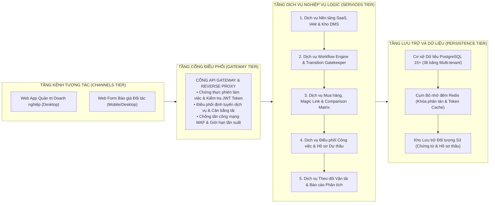
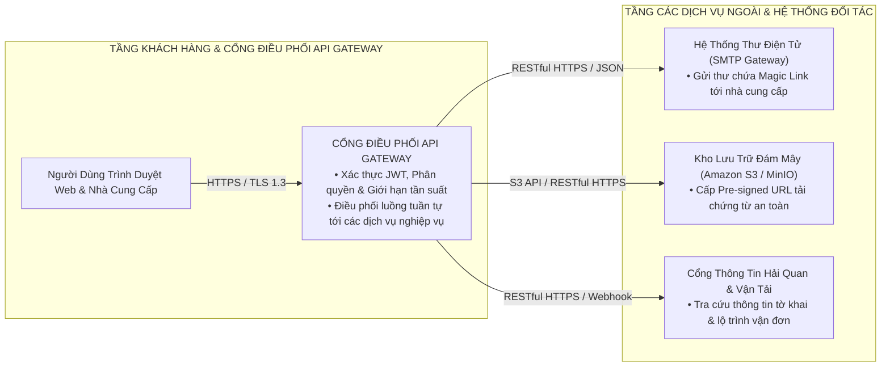

# TÀI LIỆU THIẾT KẾ TỔNG THỂ HỆ THỐNG (HIGH-LEVEL DESIGN - HLD)
## DỰ ÁN NỀN TẢNG KHÔNG GIAN CỘNG TÁC SỐ QUẢN LÝ GÓI THẦU VÀ HỒ SƠ THẦU XUẤT NHẬP KHẨU: MIBID
### MÃ TÀI LIỆU: MIBID_HLD_v1.0 (QUY CHUẨN BM.02.QT.00.CNTT.28 TẬP ĐOÀN VIETTEL)

---

## PHẦN 1: GIỚI THIỆU CHUNG VÀ PHẠM VI HỆ THỐNG

### 1.1. Mục Đích Tài Liệu
Tài liệu Thiết kế Tổng thể (HLD) này xác lập bức tranh toàn cảnh về mặt kiến trúc công nghệ, mô hình phân rã dịch vụ logic, cấu trúc hạ tầng vật lý và quy hoạch an toàn thông tin cho hệ thống Mibid. Tài liệu làm cơ sở kỹ thuật để đội ngũ kỹ sư hệ thống, kỹ sư mạng, chuyên gia cơ sở dữ liệu và kỹ sư phát triển tiến hành xây dựng và triển khai hệ thống.

### 1.2. Phạm Vi Tài Liệu
Tài liệu bao quát toàn bộ 5 phân hệ nghiệp vụ của hệ thống Mibid, mô hình điều phối cổng API Gateway, cơ chế tích hợp các dịch vụ bên ngoài (cổng gửi thư điện tử, lưu trữ đám mây, cổng hải quan), bảng tính toán định cỡ tải và quy hoạch phân vùng mạng trung tâm dữ liệu. Tài liệu chỉ mô tả ở cấp độ kiến trúc dịch vụ và hạ tầng logic, không đi sâu vào chi tiết mã nguồn lập trình.

### 1.3. Bảng Thuật Ngữ Và Từ Viết Tắt

| Thuật ngữ viết tắt | Thuật ngữ đầy đủ | Giải thích nghiệp vụ |
| :--- | :--- | :--- |
| **HLD** | High-Level Design | Tài liệu thiết kế kỹ thuật cấp cao tổng thể hệ thống. |
| **API GW** | Application Programming Interface Gateway | Cổng điều phối, xác thực và cân bằng tải tập trung. |
| **DMS** | Document Management System | Hệ thống quản lý và số hóa kho tài liệu doanh nghiệp. |
| **RFQ** | Request for Quotation | Yêu cầu báo giá gửi tới các nhà cung cấp. |
| **JWT** | JSON Web Token | Chuỗi mã hóa chứa định danh và quyền hạn truy cập. |
| **RLS** | Row-Level Security | Cơ chế bảo mật cách ly dữ liệu theo từng dòng trong CSDL. |
| **DMZ** | Demilitarized Zone | Phân vùng mạng biên tiếp nhận lưu lượng từ Internet. |
| **WAF** | Web Application Firewall | Tường lửa bảo vệ ứng dụng web chống tấn công mạng. |
| **Incoterms** | International Commercial Terms | Bộ quy tắc thương mại quốc tế về giao nhận hàng hóa. |
| **BL** | Bill of Lading | Vận đơn đường biển trong giao dịch xuất nhập khẩu. |

---

## PHẦN 2: KIẾN TRÚC TỔNG THỂ VÀ PHÂN RÃ HỆ THỐNG

### 2.1. Kiến Trúc Phân Lớp Logic (Logical Architecture)

Hệ thống Mibid được tổ chức thành 4 tầng logic độc lập:

### 2.2. Sơ Đồ Giao Tiếp Tích Hợp Hệ Thống Ngoài (System Integration Flowchart)

Toàn bộ luồng giao dịch và tác vụ tương tác với hệ thống ngoài đều do **Cổng API Gateway điều hướng và điều phối tuần tự**; các dịch vụ chuyên biệt nội bộ **hoàn toàn độc lập và tuyệt đối không gọi chéo nhau**:

### 2.3. Quy Hoạch Ngăn Xếp Công Nghệ Chuẩn Hóa Theo Tầng Kiến Trúc

| Tầng kiến trúc | Phân hệ / Thành phần | Công nghệ lựa chọn & Phiên bản | Vai trò kỹ thuật & Tiêu chuẩn |
| :--- | :--- | :--- | :--- |
| **Tầng Kênh Tương Tác** | Web Quản trị (Desktop) & Portal Magic Link (Mobile) | **Next.js 14+ (App Router), TypeScript, Tailwind CSS** | Server-Side Rendering (SSR) tải nhanh cho Vendor di động; `@hello-pangea/dnd` cho Kanban 60 FPS; React Hook Form + Zod. |
| **Tầng Cổng Điều Phối** | Cổng API Gateway & Reverse Proxy | **Nginx 1.24+ / Spring Cloud Gateway** | Xác thực JWT, SSL Termination (TLS 1.3), Cân bằng tải Round-Robin, Giới hạn tần suất Rate Limiting chống Brute-force PIN. |
| **Tầng Dịch Vụ Nghiệp Vụ** | 5 Dịch vụ Core (IAM, Workflow, Sourcing, Tasks, Logistics) | **Java 17 LTS & Spring Boot 3.2+** | Kiến trúc Lục giác Hexagonal (Ports & Adapters), Spring Security 6, Spring Data JPA, Spring Batch, Outbox Event Publisher. |
| **Tầng Cơ Sở Dữ Liệu** | CSDL Quan hệ Chính | **PostgreSQL 15+ Cluster** | Multi-tenant Row-Level Security (RLS), JSONB GIN Index cho rule động, Partitioning theo thời gian, HikariCP Connection Pool. |
| **Tầng Bộ Nhớ Đệm & Khóa** | Cache Phân tán & Khóa Phân tán | **Redis Cluster 7.x (Redisson Client)** | Lưu trữ Token Magic Link TTL, Khóa phân tán Redisson chống race-condition chuyển bước, Cache tỷ giá ngoại tệ. |
| **Tầng Lưu Trữ Đối Tượng** | Kho Chứng Từ Số DMS | **MinIO S3 / Amazon S3** | Lưu trữ tệp tin an toàn, cấp quyền tạm thời Pre-signed URL (15 phút), mã hóa AES-256 tĩnh và kiểm soát Versioning. |
| **Tầng Đo Lường & Giám Sát** | Giám sát Hiệu năng & Logs | **Prometheus, Grafana, OpenTelemetry, Loki** | Giám sát APM 24/7, đo lường Latency P95/P99, cạn kiệt Connection Pool và phân tích log tập trung. |

---

## PHẦN 3: THIẾT KẾ KỸ THUẬT CHI TIẾT VÀ ĐỊNH CỠ TẢI

### 3.1. Thiết Kế Dịch Vụ Logic Và Giao Thức Truyền Thông

1. **Dịch vụ Quản trị Nền tảng SaaS, IAM & DMS:** Tiếp nhận các yêu cầu xác thực người dùng, giải mã phân quyền đa khách thuê, quản lý danh mục chứng từ và ký duyệt đường dẫn tải tệp Pre-signed URL. Giao thức: `RESTful HTTPS / JSON`.
2. **Dịch vụ Workflow Engine & Transition Gatekeeper:** Quản lý vòng đời trạng thái gói thầu, kiểm tra điều kiện chốt chặn hồ sơ trước khi chuyển bước. Giao thức: `RESTful HTTPS / JSON` kết hợp `Redis Distributed Lock`.
3. **Dịch vụ Mua hàng & Magic Link:** Xử lý yêu cầu báo giá RFQ, thuật toán phát hành token một lần cho nhà cung cấp, tổng hợp và quy đổi giá trị ngoại tệ trên bảng so sánh. Giao thức: `RESTful HTTPS / JSON`.
4. **Dịch vụ Điều phối Công việc & Hồ sơ Thầu:** Tự động sinh công việc vi mô và gửi thông báo theo thời gian thực tới người dùng. Giao thức: `WebSocket / WSS` và `RESTful HTTPS`.
5. **Dịch vụ Theo dõi Vận tải & Báo cáo:** Quản lý hành trình vận đơn và thực thi tiến trình chạy ngầm định kỳ rà soát các mốc ETA/ETD. Giao thức: `RESTful HTTPS` và `ShedLock Cronjob`.

### 3.2. Sơ Đồ Quy Hoạch Hạ Tầng Mạng DC/DR Dải Trong Và Dải Ngoài

Mô hình phân vùng mạng tuân thủ quy chuẩn an toàn thông tin mạng của Tập đoàn Viettel, chia tách rạch ròi 3 phân vùng mạng:

```mermaid
flowchart LR
    subgraph S_INTERNET ["VÙNG MẠNG INTERNET DẢI NGOÀI"]
        direction TB
        USERS_OUT["Người dùng ngoài & Nhà cung cấp quốc tế"]
    end

    subgraph S_DMZ ["PHÂN VÙNG MẠNG DMZ (TIẾP NHẬN & CÂN BẰNG TẢI)"]
        direction TB
        FW_OUT["Tường lửa Biên Ngoài (External Firewall)"]
        WAF_LB["Cụm Cân Bằng Tải Nginx & Tường Lửa WAF"]
        FW_OUT --> WAF_LB
    end

    subgraph S_INTERNAL ["PHÂN VÙNG MẠNG NỘI BỘ (INTERNAL APP & DB)"]
        direction TB
        FW_IN["Tường lửa Biên Trong (Internal Firewall)"]
        APP_NODES["Cụm Máy Chủ Ứng Dụng Mibid (App Servers)"]
        DB_CLUSTER["Cụm Máy Chủ Cơ Sở Dữ Liệu PostgreSQL & Redis"]
        FW_IN --> APP_NODES --> DB_CLUSTER
    end

    USERS_OUT -->|HTTPS Cổng 443| FW_OUT
    WAF_LB -->|HTTPS Cổng 8080| FW_IN
```

### 3.3. Bảng Định Cỡ Tải Hệ Thống (Capacity Sizing)

| Chỉ số kỹ thuật | Mức khởi tạo (Năm 1) | Mức mở rộng (Năm 3) | Mức tải đỉnh (Năm 5) | Ghi chú và căn cứ tính toán |
| :--- | :---: | :---: | :---: | :--- |
| **Số lượng khách thuê doanh nghiệp (Tenants)** | 50 | 200 | 500 | Mô hình SaaS đa khách thuê. |
| **Tổng số người dùng nội bộ (Total Users)** | 1.000 | 5.000 | 15.000 | Trung bình 20 - 30 nhân sự/doanh nghiệp. |
| **Số người dùng đồng thời (CCU)** | 200 | 800 | 2.500 | Tỷ lệ CCU xấp xỉ 15% - 20% tổng số người dùng. |
| **Tần suất giao dịch bình thường (RPS)** | 50 | 250 | 800 | Các thao tác tải trang, lọc danh sách, xem báo giá. |
| **Tần suất giao dịch mức tải đỉnh (Peak RPS)** | **300** | **1.000** | **3.000** | Thời điểm đóng thầu dồn dập cuối ngày làm việc. |
| **Dung lượng lưu trữ CSDL (Database Size)** | 30 GB | 150 GB | 500 GB | Lưu trữ bản ghi dự án, RFQ, báo giá, logs giao dịch. |
| **Dung lượng lưu trữ tệp (Object Storage S3)** | 500 GB | 3 TB | 12 TB | Lưu trữ tệp chứng từ scan, catalog kỹ thuật, file hợp đồng. |
| **Băng thông mạng yêu cầu (Bandwidth)** | 50 Mbps | 200 Mbps | 500 Mbps | Bảo đảm tốc độ tải chứng từ không vượt quá 2 giây. |

### 3.4. Bảng Giả Thiết Thiết Lập Địa Chỉ IP Đề Xuất (BM.02 Viettel)

*(Bảng giả thiết phân bổ địa chỉ IP được thiết lập theo quy chuẩn BM.02, sẽ được cập nhật địa chỉ IP chính thức sau khi đơn vị hạ tầng phê duyệt cấp phát).*

| STT | Tên thành phần máy chủ | Vai trò thành phần | Vùng mạng | Địa chỉ IP Dải Ngoài (OOB / Public) | Địa chỉ IP Dải Trong (Internal Service) | Cấu hình đề xuất (vCPU / RAM / Disk) |
| :---: | :--- | :--- | :---: | :---: | :---: | :---: |
| 1 | `MIBID-LB-01` | Cân bằng tải chính (Active) | DMZ | `10.100.10.11` | `192.168.10.11` | 4 vCPU / 8 GB RAM / 50 GB SSD |
| 2 | `MIBID-LB-02` | Cân bằng tải phụ (Standby) | DMZ | `10.100.10.12` | `192.168.10.12` | 4 vCPU / 8 GB RAM / 50 GB SSD |
| 3 | `MIBID-APP-01` | Máy chủ ứng dụng 1 (Docker/K8s) | Internal | `10.100.20.21` | `192.168.20.21` | 8 vCPU / 16 GB RAM / 100 GB SSD |
| 4 | `MIBID-APP-02` | Máy chủ ứng dụng 2 (Docker/K8s) | Internal | `10.100.20.22` | `192.168.20.22` | 8 vCPU / 16 GB RAM / 100 GB SSD |
| 5 | `MIBID-DB-PRI` | CSDL chính PostgreSQL (Master) | Database | `10.100.30.31` | `192.168.30.31` | 8 vCPU / 32 GB RAM / 500 GB NVMe |
| 6 | `MIBID-DB-STB` | CSDL dự phòng PostgreSQL (Replica)| Database | `10.100.30.32` | `192.168.30.32` | 8 vCPU / 32 GB RAM / 500 GB NVMe |
| 7 | `MIBID-REDIS-01`| Cụm bộ nhớ đệm Redis nút 1 | Database | `10.100.30.35` | `192.168.30.35` | 4 vCPU / 8 GB RAM / 50 GB SSD |
| 8 | `MIBID-REDIS-02`| Cụm bộ nhớ đệm Redis nút 2 | Database | `10.100.30.36` | `192.168.30.36` | 4 vCPU / 8 GB RAM / 50 GB SSD |

### 3.5. Ma Trận Mở Cổng Dịch Vụ Tường Lửa (Firewall Port Opening Matrix)

| STT | Phân vùng Nguồn (Source Zone) | Phân vùng Đích (Destination Zone) | Cổng dịch vụ | Giao thức | Mục đích kết nối & Ghi chú bảo mật |
| :---: | :--- | :--- | :---: | :---: | :--- |
| 1 | Internet (Khách hàng & Vendor) | DMZ (`MIBID-LB-01/02`) | `443` | TCP | Truy cập Web Quản trị và Cổng Magic Link qua HTTPS (TLS 1.3). |
| 2 | DMZ (`MIBID-LB-01/02`) | DMZ (`MIBID-FE-01/02`) | `3000` | TCP | Chuyển tiếp render giao diện Next.js Frontend. |
| 3 | DMZ (`MIBID-FE-01/02` hoặc LB) | Internal (`MIBID-APP-01..02`) | `8080` | TCP | Gọi API Backend Core và kết nối WebSocket `/ws` (mTLS). |
| 4 | Internal (`MIBID-APP-01..02`) | Database (`MIBID-DB-PRI/STB`) | `5432` | TCP | Truy vấn dữ liệu CSDL PostgreSQL giao dịch và báo cáo. |
| 5 | Internal (`MIBID-APP-01..02`) | Database (`MIBID-REDIS-01/02`) | `6379`, `26379`| TCP | Bộ nhớ đệm cache, Token TTL và khóa phân tán Redisson. |
| 6 | Database (`MIBID-DB-PRI`) | Database (`MIBID-DB-STB`) | `5432` | TCP | Đồng bộ dữ liệu CSDL thời gian thực (Streaming Replication). |
| 7 | Internal (`MIBID-APP-01..02`) | Internet (SMTP / SMSGW) | `587`, `443` | TCP | Gửi thư điện tử thông báo Magic Link và tin nhắn OTP. |

---

## PHẦN 4: KIẾN TRÚC AN TOÀN THÔNG TIN (ATTT ĐA LỚP)

Hệ thống bảo đảm tuân thủ 100% quy chuẩn an toàn thông tin cấp độ 3 của Tập đoàn Viettel:

1. **Phân Vùng An Ninh Đa Lớp (Network Zoning):**
   * Vùng Internet dải ngoài bị cô lập tuyệt đối khỏi vùng cơ sở dữ liệu.
   * Tất cả các kết nối từ DMZ vào vùng nội bộ bắt buộc phải đi qua tường lửa nội bộ và chỉ mở duy nhất các cổng dịch vụ cần thiết (Cổng 8080 cho ứng dụng, Cổng 5432 cho CSDL chỉ mở cho các địa chỉ IP của máy chủ ứng dụng).
2. **Kiểm Soát Truy Cập Và Xác Thực Tập Trung:**
   * Mật khẩu người dùng được băm bằng thuật toán an toàn Bcrypt với độ phức tạp cao (tối thiểu 8 ký tự gồm chữ hoa, chữ thường, chữ số và ký tự đặc biệt). Tự động khóa tài khoản sau 5 lần đăng nhập sai liên tiếp.
   * Áp dụng mã thông báo xác thực JWT có thời hạn ngắn (tối đa 15 phút) kết hợp mã thông báo làm mới Refresh Token lưu trong bảng cơ sở dữ liệu có gắn thông tin phiên làm việc.
3. **Mã Hóa Dữ Liệu Truyền Thông Và Lưu Trữ:**
   * **Mã hóa khi truyền thông (Data in Transit):** Toàn bộ các kênh giao tiếp qua mạng Internet bắt buộc sử dụng giao thức HTTPS với chứng chỉ số TLS 1.3, vô hiệu hóa hoàn toàn các giao thức cũ (SSL v3, TLS 1.0, TLS 1.1).
   * **Mã hóa dữ liệu lưu trữ (Data at Rest):** Các trường dữ liệu nhạy cảm (mã bí mật Magic Link, thông tin tài chính chi tiết, mật khẩu băm) được mã hóa bằng thuật toán AES-256 trước khi lưu vào cơ sở dữ liệu.
4. **Ghi Nhật Ký Hệ Thống Và Kiểm Toán (Audit Logging):**
   * Mọi thao tác tác động dữ liệu (tạo mới dự án, duyệt chứng từ, xóa dòng hàng RFQ, chuyển bước trên Kanban) đều được tự động ghi nhận vào bảng `activity_logs` và `document_audit_logs` kèm địa chỉ IP, mã định danh người dùng và thời điểm chính xác tính bằng mili-giây.
