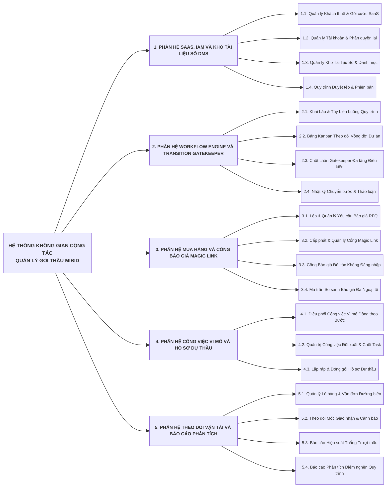

# ĐẶC TẢ YÊU CẦU PHẦN MỀM TỔNG QUAN (SRS CORE ARCHITECTURE)
## DỰ ÁN NỀN TẢNG KHÔNG GIAN CỘNG TÁC SỐ QUẢN LÝ GÓI THẦU VÀ HỒ SƠ THẦU XUẤT NHẬP KHẨU: MIBID
### MÃ TÀI LIỆU: MIBID_SRS_CORE_v1.0

---

## 1. LỊCH SỬ THAY ĐỔI TÀI LIỆU (DOCUMENT CHANGE LOG)

| Phiên bản | Ngày cập nhật | Người thực hiện | Vị trí tác động | Thao tác (A*, M, D) | Nội dung thay đổi chi tiết | Trạng thái phê duyệt |
| :---: | :---: | :--- | :--- | :---: | :--- | :---: |
| **1.0.0** | 01/09/2026 | Kỹ sư Điều phối (Antigravity) | Toàn bộ tài liệu | A* | Khởi tạo Đặc tả Yêu cầu Tổng quan chuẩn 4 mục, Cây phân rã 3 tầng Left-Edge Alignment và Mô hình phân quyền lai RBAC/ABAC | Đã phê duyệt Cổng 2 |

---

## 2. TỔNG QUAN HỆ THỐNG VÀ PHẠM VI NGHIỆP VỤ

Hệ thống Mibid là không gian cộng tác số chuyên sâu kết nối doanh nghiệp thương mại XNK với chủ đầu tư và mạng lưới nhà cung cấp toàn cầu. Hệ thống được tổ chức thành 5 phân hệ nghiệp vụ chính với 19 chức năng thành phần chi tiết, đảm bảo tính liên kết xuyên suốt từ khâu tiếp nhận thông báo mời thầu, bóc tách danh mục hàng hóa, hỏi giá đối tác quốc tế không cần tài khoản, kiểm soát tính đầy đủ của hồ sơ năng lực qua chốt chặn Gatekeeper, đến khâu quản trị công việc vi mô và giám sát hành trình giao nhận hàng hóa.

---

## 3. CÂY PHÂN RÃ CHỨC NĂNG HỆ THỐNG 3 TẦNG (FUNCTIONAL DECOMPOSITION TREE)

Sơ đồ phân rã chức năng dưới đây tuân thủ 100% quy chuẩn dóng thẳng hàng lề trái (Left-Edge Alignment) của kho lưu trữ chuẩn [docsbase](file:///Users/micro/Source/docsbase), đồng bộ độ dài ký tự các ô Tầng 1 và tách biệt hoàn toàn từng chức năng con độc lập ở Tầng 2:

---

## 4. MÔ HÌNH PHÂN QUYỀN HYBRID ACCESS CONTROL (RBAC & ABAC)

Hệ thống Mibid áp dụng mô hình phân quyền kết hợp chặt chẽ giữa Quyền Toàn Cục (Role-Based Access Control - RBAC) và Quyền Theo Ngữ Cảnh Dự Án (Attribute-Based Access Control - ABAC):

### 4.1. Ma Trận Quyền Cấp Hệ Thống (System-Level RBAC)
Xác định phạm vi tài nguyên mà người dùng được phép thao tác trên quy mô toàn doanh nghiệp:

| Tài nguyên / Hành động | Quản Trị Hệ Thống (System Admin) | Giám Đốc Doanh Nghiệp (Company Manager) | Nhân Viên Nghiệp Vụ (Staff / Exec) |
| :--- | :---: | :---: | :---: |
| **Quản lý Tài khoản & Phân quyền** | Toàn quyền (CRUD) | Chỉ Xem (R) | Không có quyền |
| **Cấu hình Mẫu Quy trình Luồng** | Toàn quyền (CRUD) | Tạo & Sửa (CRU) | Chỉ Xem (R) |
| **Danh mục Loại Chứng từ DMS** | Toàn quyền (CRUD) | Toàn quyền (CRUD) | Chỉ Xem (R) |
| **Xem Tất cả Dự án Doanh nghiệp** | Chỉ Xem (R) | Toàn quyền (CRUD) | Chỉ xem dự án tham gia |
| **Xem Báo cáo Kinh doanh Toàn cục** | Không có quyền | Toàn quyền (CRUD) | Không có quyền |

### 4.2. Ma Trận Quyền Cấp Dự Án (Project-Level ABAC)
Xác định quyền hạn thao tác cụ thể của từng nhân sự bên trong từng thẻ dự án/gói thầu. Một nhân sự có thể giữ vai trò Trưởng nhóm (Owner) tại Dự án A nhưng chỉ giữ vai trò Thành viên thực thi tại Dự án B:

| Hành động trong Dự án | Trưởng Nhóm Dự Án (Project Owner) | Trưởng Nhóm Mua Hàng (Sourcing Lead) | Chuyên Viên Đấu Thầu (Sales Exec) | Chuyên Viên Vận Hành (Logistics Exec) |
| :--- | :---: | :---: | :---: | :---: |
| **Cập nhật Thông tin Dự án** | Toàn quyền (CRUD) | Chỉ Xem (R) | Chỉ Xem (R) | Chỉ Xem (R) |
| **Kéo Thẻ Kanban Chuyển Bước** | Toàn quyền (Có) | Chỉ kéo bước Mua hàng | Chỉ kéo bước Đấu thầu | Chỉ kéo bước Giao nhận |
| **Tạo & Gửi RFQ Magic Link** | Toàn quyền (CRUD) | Toàn quyền (CRUD) | Chỉ Xem (R) | Không có quyền |
| **Phê duyệt Báo giá Nhà cung cấp** | Phê duyệt (Approve) | Trình duyệt | Không có quyền | Không có quyền |
| **Tải Lên Chứng từ Dự án** | Toàn quyền (CRUD) | Toàn quyền (CRUD) | Toàn quyền (CRUD) | Toàn quyền (CRUD) |
| **Phê duyệt Chứng từ Cần duyệt** | Phê duyệt (Approve) | Không có quyền | Không có quyền | Không có quyền |
| **Cập nhật Tiến độ Lô hàng BL** | Chỉ Xem (R) | Không có quyền | Không có quyền | Toàn quyền (CRUD) |

---

## 5. QUY ƯỚC ĐẶT TÊN VÀ NGUYÊN TẮC THIẾT KẾ CHUẨN 4 MỤC

Mọi tài liệu đặc tả chức năng chi tiết trong các phân hệ tiếp theo bắt buộc phải tuân thủ nghiêm ngặt 4 mục cấu trúc ở cấp độ Heading 4:
1. **Thông tin chung chức năng:** Mô tả mục tiêu, điều kiện tiên quyết, đường dẫn thao tác giao diện, quy định ghi nhật ký Audit Log và phân quyền RBAC/ABAC.
2. **Màn hình giao diện:** Trực quan hóa bố cục wireframe/mockup, trạng thái dữ liệu trống (Empty State), các hộp thoại xác nhận (Confirmation Popups) và thông báo phản hồi (Toast Notifications).
3. **Mô tả chi tiết các thành phần:** Bảng 6 cột chuẩn hóa: `STT | Tên trường * | Kiểu dữ liệu [Độ dài] | Input/Output | Giá trị khởi tạo | Mô tả (Mapping CSDL, Validate, Behavior)`.
4. **Luồng nghiệp vụ:** Các bước xử lý tuần tự 1..N, phân nhánh tình huống rõ ràng (TH1: Hợp lệ, TH2: Dữ liệu không hợp lệ, TH3: Trùng lặp), tương tác popup, cập nhật trạng thái cơ sở dữ liệu và **sơ đồ Sequence Diagram UML trực giao** mô hình hóa tương tác giữa Người dùng - Giao diện - Backend - Cơ sở dữ liệu.
