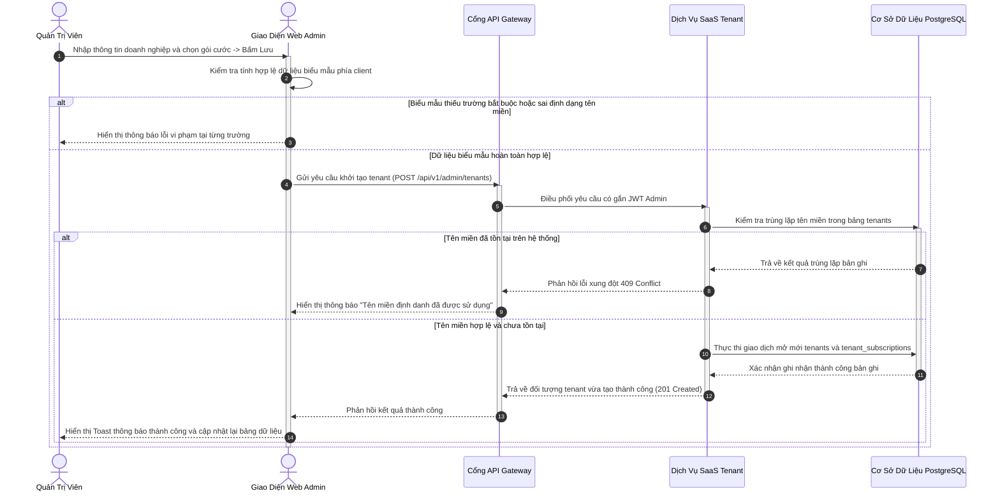
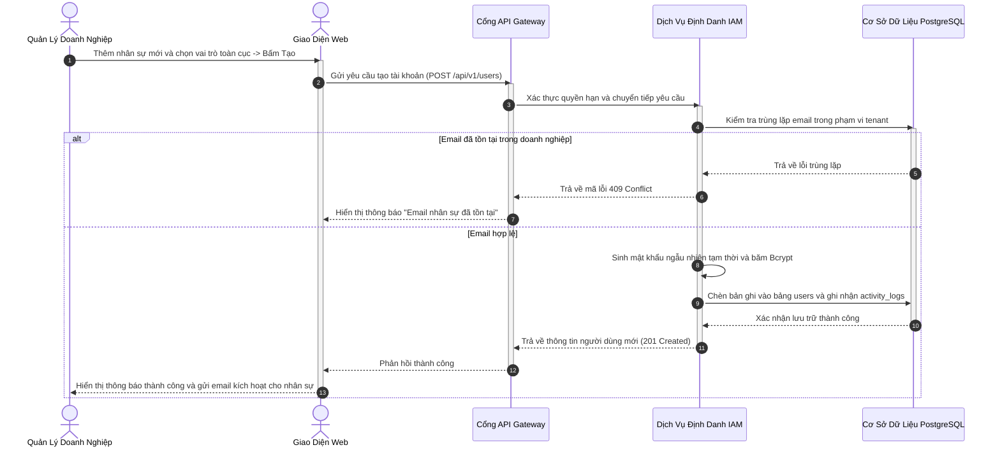
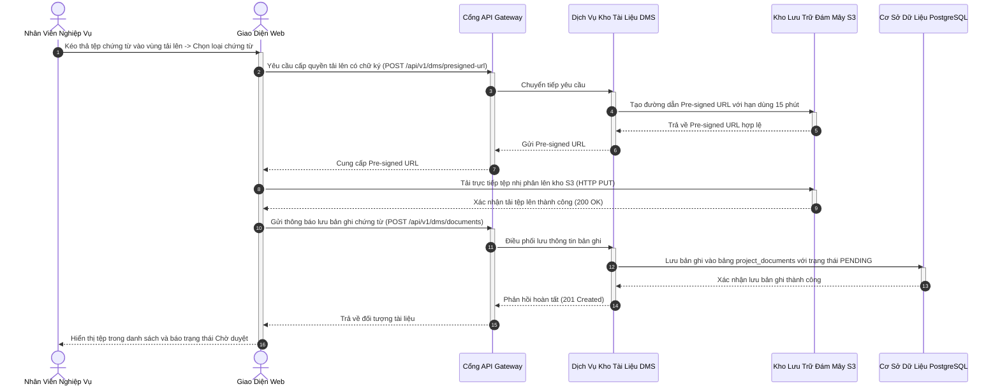
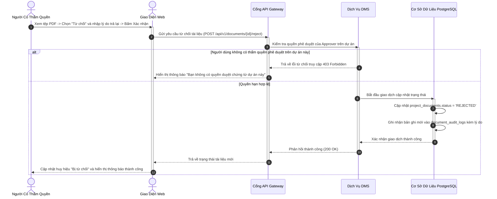

# ĐẶC TẢ YÊU CẦU PHẦN MỀM (SRS) — PHÂN HỆ 1
## QUẢN TRỊ NỀN TẢNG SAAS, IAM VÀ KHO TÀI LIỆU SỐ (DMS)
### MÃ TÀI LIỆU: MIBID_SRS_MOD01_v1.0

---

## 1. TỔNG QUAN PHÂN HỆ

Phân hệ 1 đóng vai trò là xương sống nền tảng của hệ thống Mibid, chịu trách nhiệm quản lý mô hình đa khách thuê (Multi-tenant SaaS), định danh và phân quyền người dùng theo mô hình lai (RBAC kết hợp ABAC theo từng dự án), đồng thời cung cấp hệ thống kho lưu trữ tài liệu số (DMS) tập trung có kiểm soát phiên bản và quy trình phê duyệt chứng từ nghiêm ngặt trước khi sử dụng cho hồ sơ thầu.

---

## 2. ĐẶC TẢ CHI TIẾT CÁC CHỨC NĂNG NGHIỆP VỤ

### 2.1. Chức Năng F-1.1: Quản Lý Khách Thuê Và Gói Cước SaaS (Tenants & Subscription Plans)

#### 2.1.1. Thông Tin Chung Chức Năng
* **Mục tiêu:** Cho phép quản trị viên hệ thống khởi tạo khách thuê doanh nghiệp mới, cấu hình tên miền truy cập, gán gói cước dịch vụ và kiểm soát trạng thái hoạt động (Hoạt động, Tạm khóa, Hủy bỏ).
* **Tác nhân thực hiện:** Quản trị viên Toàn cục (System Admin).
* **Đường dẫn thao tác:** `Menu Hệ thống` → `Quản lý Doanh nghiệp Khách thuê` → `Danh sách Tenants`.
* **Ghi nhật ký hệ thống:** Bắt buộc ghi nhận mọi thay đổi trạng thái thuê bao vào bảng `activity_logs`.

#### 2.1.2. Màn Hình Giao Diện
* **Bố cục màn hình:** Bảng danh sách khách thuê với các cột định danh, tên doanh nghiệp, tên miền truy cập, gói cước hiện tại, số lượng người dùng tối đa và huy hiệu trạng thái hoạt động (Xanh: Hoạt động, Vàng: Tạm khóa, Xám: Đã hủy). Nút bấm `[+ Khởi tạo Doanh nghiệp]` mở hộp thoại dạng trượt (Slide-over Drawer).
* **Trạng thái giao diện:**
  * *Trạng thái trống:* Hiển thị hình ảnh đồ họa và thông điệp "Chưa có doanh nghiệp khách thuê nào được khởi tạo".
  * *Hộp thoại xác nhận:* Bật popup xác nhận khi thao tác tạm khóa doanh nghiệp với cảnh báo "Người dùng thuộc doanh nghiệp này sẽ bị ngắt phiên làm việc ngay lập tức".
  * *Thông báo phản hồi:* Toast thông báo màu xanh "Cập nhật thông tin khách thuê thành công".

#### 2.1.3. Mô Tả Chi Tiết Các Thành Phần Giao Diện
| STT | Tên trường * | Kiểu dữ liệu [Độ dài] | Input / Output | Giá trị khởi tạo | Mô tả & Ràng buộc CSDL |
| :---: | :--- | :--- | :---: | :--- | :--- |
| 1 | Tên Doanh nghiệp * | String [255] | Input | Rỗng | Bắt buộc nhập. Ánh xạ `tenants.name`. |
| 2 | Tên miền định danh * | String [100] | Input | Rỗng | Bắt buộc, duy nhất toàn hệ thống. Định dạng chữ thường không dấu. Ánh xạ `tenants.domain`. |
| 3 | Gói cước dịch vụ * | UUID | Input | Gói Mặc định | Chọn từ danh mục `subscription_plans.id`. |
| 4 | Trạng thái hoạt động * | Enum [20] | Input | 'ACTIVE' | Giá trị hợp lệ: `ACTIVE`, `SUSPENDED`, `CANCELLED`. Ánh xạ `tenants.status`. |
| 5 | Ngày hết hạn gói | DateTime | Input | Hiện tại + 1 năm | Ánh xạ `tenant_subscriptions.end_date`. Phải lớn hơn ngày hiện tại. |

#### 2.1.4. Luồng Nghiệp Vụ Xử Lý

---

### 2.2. Chức Năng F-1.2: Quản Lý Người Dùng Và Phân Quyền Lai (Users, Roles & RBAC/ABAC)

#### 2.2.1. Thông Tin Chung Chức Năng
* **Mục tiêu:** Quản trị toàn bộ danh sách tài khoản nội bộ trong doanh nghiệp, quản lý vai trò chức năng và gán vai trò tương ứng trong từng dự án cụ thể.
* **Tác nhân thực hiện:** Giám đốc Doanh nghiệp (Company Manager) hoặc Quản trị viên (System Admin).
* **Đường dẫn thao tác:** `Menu Hệ thống` → `Quản lý Người dùng & Phân quyền`.
* **Ghi nhật ký hệ thống:** Ghi nhận nhật ký mỗi khi tạo mới, phân lại vai trò hoặc khóa tài khoản.

#### 2.2.2. Màn Hình Giao Diện
* **Bố cục màn hình:** Danh sách nhân sự kèm thông tin phòng ban, vị trí công tác, vai trò hệ thống và trạng thái kích hoạt 2FA. Phía trên có thanh công cụ lọc theo phòng ban và ô tìm kiếm theo tên hoặc thư điện tử.
* **Trạng thái giao diện:**
  * *Hộp thoại phân vai trò dự án:* Cho phép chọn người dùng và gán vai trò tương ứng (Trưởng nhóm, Mua hàng, Đấu thầu, Vận hành) trên từng dự án cụ thể.
  * *Popup khóa tài khoản:* Xác nhận trước khi vô hiệu hóa quyền truy cập của nhân sự.

#### 2.2.3. Mô Tả Chi Tiết Các Thành Phần Giao Diện
| STT | Tên trường * | Kiểu dữ liệu [Độ dài] | Input / Output | Giá trị khởi tạo | Mô tả & Ràng buộc CSDL |
| :---: | :--- | :--- | :---: | :--- | :--- |
| 1 | Thư điện tử đăng nhập * | String [150] | Input | Rỗng | Bắt buộc, đúng định dạng email, duy nhất trong tenant. Ánh xạ `users.email`. |
| 2 | Họ và tên đầy đủ * | String [150] | Input | Rỗng | Bắt buộc nhập. Ánh xạ `users.full_name`. |
| 3 | Phòng ban công tác | String [100] | Input | Rỗng | Ví dụ: Mua hàng, Đấu thầu, Logistics. Ánh xạ `users.department`. |
| 4 | Vai trò toàn cục * | UUID | Input | Vai trò Nhân viên | Bắt buộc. Tham chiếu khóa ngoại `roles.id`. |
| 5 | Trạng thái kích hoạt * | Boolean | Input | True | True: Được phép đăng nhập; False: Bị khóa. Ánh xạ `users.is_active`. |

#### 2.2.4. Luồng Nghiệp Vụ Xử Lý

---

### 2.3. Chức Năng F-1.3: Quản Lý Kho Tài Liệu Số Và Phân Loại Chứng Từ (DMS Repository)

#### 2.3.1. Thông Tin Chung Chức Năng
* **Mục tiêu:** Quản lý tập trung các loại chứng từ của doanh nghiệp (Đăng ký kinh doanh, Hồ sơ năng lực, Chứng chỉ CO/CQ, Báo giá mẫu, Vận đơn đường biển) và phân loại theo danh mục để phục vụ việc kiểm tra tự động của chốt chặn Gatekeeper.
* **Tác nhân thực hiện:** Quản trị viên, Trưởng phòng Kinh doanh, Nhân viên được cấp quyền.
* **Đường dẫn thao tác:** `Menu Hệ thống` → `Kho Tài liệu Số DMS`.
* **Ghi nhật ký hệ thống:** Ghi nhận toàn bộ thao tác tải lên, cập nhật danh mục loại chứng từ.

#### 2.3.2. Màn Hình Giao Diện
* **Bố cục màn hình:** Cột bên trái hiển thị cây danh mục loại chứng từ (`doc_types`). Cột bên phải hiển thị danh sách các tệp tài liệu thuộc danh mục đã chọn kèm tên tệp, kích thước, người tải lên, ngày cập nhật và huy hiệu phân loại bắt buộc duyệt hay không.
* **Trạng thái giao diện:**
  * *Vùng tải tệp:* Hỗ trợ kéo thả tệp (Drag and Drop) với giới hạn kích thước tối đa 50 MB, chỉ chấp nhận các định dạng `.pdf`, `.docx`, `.xlsx`, `.jpg`, `.png`.

#### 2.3.3. Mô Tả Chi Tiết Các Thành Phần Giao Diện
| STT | Tên trường * | Kiểu dữ liệu [Độ dài] | Input / Output | Giá trị khởi tạo | Mô tả & Ràng buộc CSDL |
| :---: | :--- | :--- | :---: | :--- | :--- |
| 1 | Mã loại chứng từ * | String [50] | Input | Rỗng | Bắt buộc, duy nhất trong tenant. Ví dụ: `CO_CQ`, `LEGAL_BIZ`. Ánh xạ `doc_types.code`. |
| 2 | Tên loại chứng từ * | String [100] | Input | Rỗng | Bắt buộc nhập. Ánh xạ `doc_types.name`. |
| 3 | Bắt buộc duyệt mặc định | Boolean | Input | False | Nếu bật, các file thuộc loại này khi tải lên phải qua phê duyệt. Ánh xạ `doc_types.default_requires_approval`. |
| 4 | Tệp chứng từ đính kèm * | File Binary | Input | Trống | Tối đa 50 MB. Lưu vật lý lên S3, lưu đường dẫn vào `project_documents.file_url`. |

#### 2.3.4. Luồng Nghiệp Vụ Xử Lý

---

### 2.4. Chức Năng F-1.4: Quy Trình Duyệt Chứng Từ Và Kiểm Soát Phiên Bản (Approval Workflow & Versions)

#### 2.4.1. Thông Tin Chung Chức Năng
* **Mục tiêu:** Kiểm soát chặt chẽ quy trình xem xét, phê duyệt hoặc từ chối chứng từ dự án của cấp quản lý; quản lý lịch sử các phiên bản tệp khi bị trả lại yêu cầu nộp bản mới.
* **Tác nhân thực hiện:** Trưởng nhóm Dự án (Project Owner) hoặc Giám đốc Doanh nghiệp (Manager).
* **Đường dẫn thao tác:** `Chi tiết Dự án` → `Tab Hồ sơ Chứng từ` → `Danh sách Chờ duyệt`.
* **Ghi nhật ký hệ thống:** Lưu vết toàn bộ lịch sử phê duyệt, lý do từ chối vào bảng `document_audit_logs`.

#### 2.4.2. Màn Hình Giao Diện
* **Bố cục màn hình:** Cửa sổ xem trước tệp PDF trực tiếp (PDF Previewer) ở giữa màn hình. Bên phải là thanh tác vụ phê duyệt gồm nút xanh `[Phê duyệt Chứng từ]` và nút đỏ `[Từ chối / Yêu cầu Bản mới]`. Khi bấm từ chối, hiển thị hộp thoại bắt buộc nhập lý do trả lại.
* **Trạng thái giao diện:**
  * *Huy hiệu trạng thái:* `Chờ duyệt` (Màu cam), `Đã duyệt` (Màu xanh lục), `Bị từ chối` (Màu đỏ).
  * *Danh sách phiên bản:* Hiển thị thẻ lịch sử phiên bản (Version 1, Version 2) cho phép người dùng so sánh và xem lại các bản tệp cũ.

#### 2.4.3. Mô Tả Chi Tiết Các Thành Phần Giao Diện
| STT | Tên trường * | Kiểu dữ liệu [Độ dài] | Input / Output | Giá trị khởi tạo | Mô tả & Ràng buộc CSDL |
| :---: | :--- | :--- | :---: | :--- | :--- |
| 1 | Mã tài liệu * | UUID | Output | - | Khóa chính tham chiếu `project_documents.id`. |
| 2 | Trạng thái phê duyệt * | Enum [20] | Input | 'PENDING' | Các giá trị: `PENDING`, `APPROVED`, `REJECTED`. |
| 3 | Lý do từ chối | Text | Input | Rỗng | Bắt buộc nhập nếu trạng thái chọn `REJECTED`. Ánh xạ `document_audit_logs.comment`. |
| 4 | Số phiên bản | Integer | Output | 1 | Tự động tăng khi nhân viên tải lên bản thay thế. Ánh xạ `project_documents.version`. |

#### 2.4.4. Luồng Nghiệp Vụ Xử Lý

