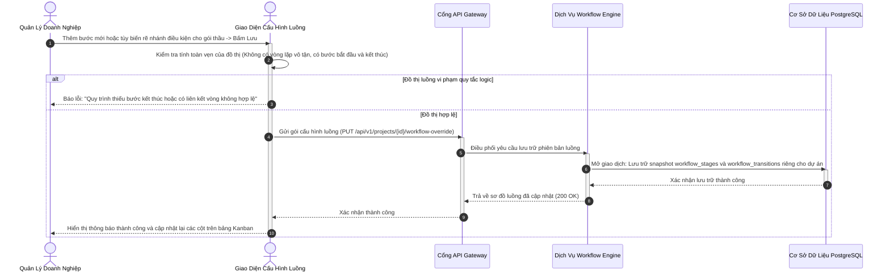
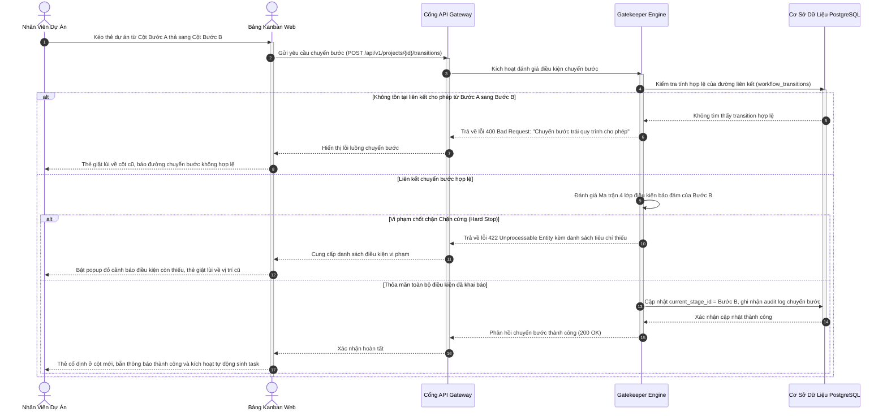
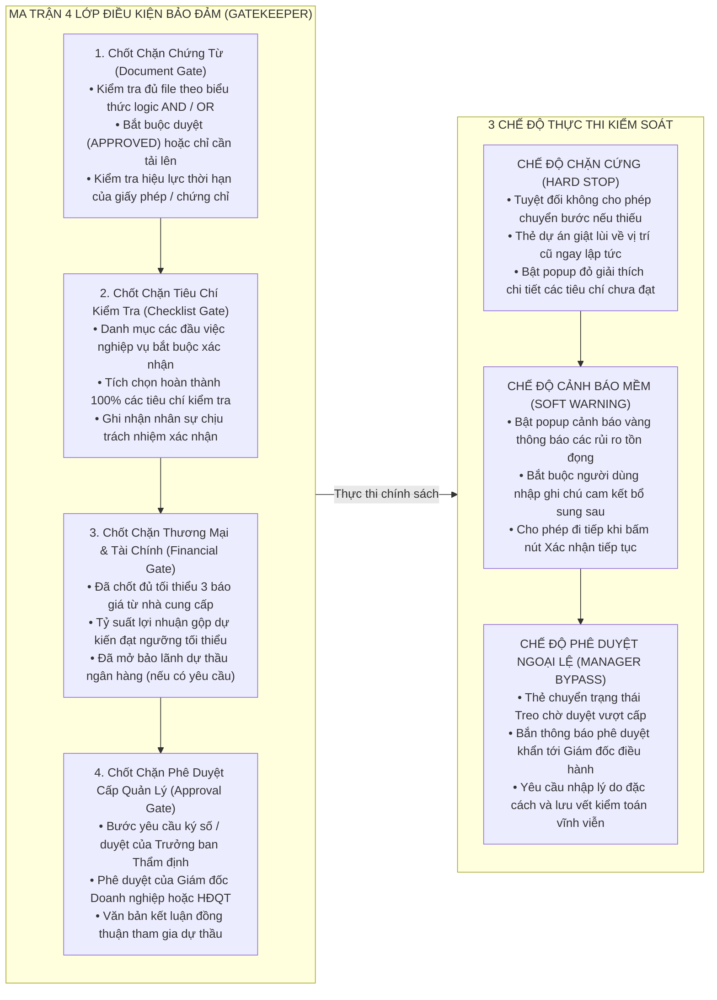
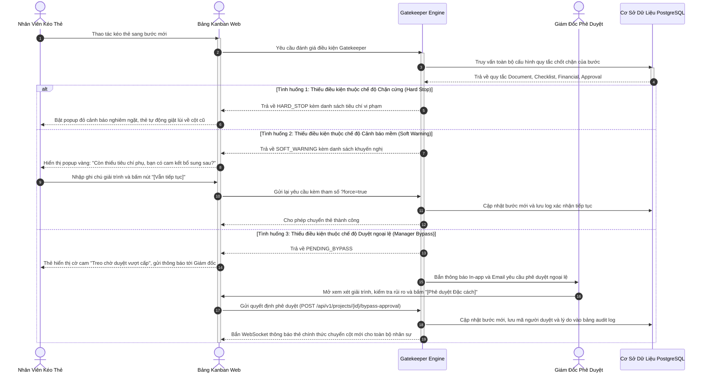
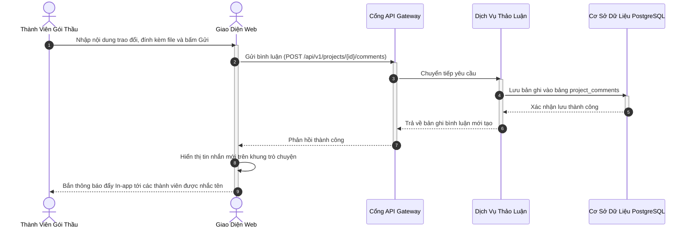

# ĐẶC TẢ YÊU CẦU PHẦN MỀM (SRS) — PHÂN HỆ 2
## WORKFLOW ENGINE VÀ CHỐT CHẶN CHUYỂN BƯỚC (TRANSITION GATEKEEPER)
### MÃ TÀI LIỆU: MIBID_SRS_MOD02_v1.0

---

## 1. TỔNG QUAN PHÂN HỆ VÀ BÀI TOÁN LINH HOẠT THỰC TẾ

Trong hoạt động thực tế của các doanh nghiệp Thương mại và Xuất nhập khẩu (XNK), mỗi gói thầu tham gia đều mang tính đặc thù sâu sắc, không có một quy trình cứng nhắc nào có thể áp dụng chung cho mọi tình huống:
* **Phụ thuộc vào Chủ đầu tư:** 
  * *Chủ đầu tư Khối Nhà nước / Tập đoàn Năng lượng (EVN, PVN, TKV):* Quy trình xét thầu bắt buộc tuân thủ Luật Đấu thầu, chia thành các bước độc lập nghiêm ngặt: Chuẩn bị Hồ sơ Mời thầu → Làm rõ Hồ sơ → Mở thầu Công khai → Đánh giá Hồ sơ Đề xuất Kỹ thuật → Mở Đề xuất Tài chính → Thương thảo & Ký kết Hợp đồng.
  * *Tổng thầu Quốc tế / Dự án FDI (Samsung, LG, Foxconn):* Đòi hỏi khắt khe về phê duyệt tài liệu kỹ thuật từ nhà sản xuất (Vendor Drawings, Mill Test Certificates, Catalog gốc), thẩm tra năng lực tài chính và bảo lãnh tạm ứng.
  * *Chủ đầu tư Khối Doanh nghiệp Tư nhân:* Yêu cầu tốc độ chào giá siêu nhanh (Fast-track Sourcing) với chu trình rút gọn chỉ 3 bước: Nhận yêu cầu → Hỏi giá vốn & Tính giá bán → Nộp báo giá cạnh tranh.
* **Phụ thuộc vào Loại hình Hàng hóa và Tính chất Gói thầu:** Gói thầu máy móc y tế cần Giấy phép nhập khẩu và Phân loại trang thiết bị; gói thầu hóa chất đòi hỏi Phiếu an toàn hóa chất MSDS; gói thầu khẩn cấp mua sắm vật tư thay thế cho nhà máy yêu cầu rút ngắn toàn bộ thời gian SLA.

Do đó, Phân hệ 2 của Mibid được thiết kế như một **Workflow Engine và Gatekeeper Engine tùy biến linh hoạt cao độ**, trao toàn quyền cho người quản trị và giám đốc dự án có thể:
1. **Khai báo đa dạng các Mẫu quy trình chuẩn (Workflow Templates)** theo từng nhóm chủ đầu tư hoặc ngành hàng.
2. **Tùy biến và ghi đè quy trình riêng cho từng gói thầu cụ thể (Project-level Workflow Tailoring)** mà không ảnh hưởng đến mẫu chung của toàn công ty.
3. **Thiết lập mô hình chuyển bước dạng đồ thị có hướng (Directed Acyclic Graph - DAG)** với các bước rẽ nhánh có điều kiện (`condition_expression`), bước quay đầu (Rework Loop) và bước kết thúc phân loại rõ ràng.
4. **Cấu hình đa tầng các điều kiện bảo đảm của mỗi bước (Gatekeeper Criteria Matrix):** Kết hợp chặt chẽ giữa Chốt chặn Chứng từ (Document Gate), Chốt chặn Tiêu chí Checklist (Checklist Gate), Chốt chặn Thương mại & Tài chính (Financial Gate) và Chốt chặn Phê duyệt Cấp bậc (Approval Gate).
5. **Thực thi nghiêm ngặt theo đúng khai báo:** Hệ thống bảo đảm vận hành chuẩn xác 100% theo các quy tắc người quản lý đã thiết lập, hỗ trợ 3 cơ chế kiểm soát: Chặn cứng (Hard Stop), Cảnh báo mềm (Soft Warning) và Phê duyệt ngoại lệ vượt cấp (Manager Approval Bypass).

---

## 2. ĐẶC TẢ CHI TIẾT CÁC CHỨC NĂNG NGHIỆP VỤ

### 2.1. Chức Năng F-2.1: Khai Báo Và Tùy Biến Luồng Quy Trình Cực Kỳ Linh Hoạt (Workflow Configuration & Tailoring)

#### 2.1.1. Thông Tin Chung Chức Năng
* **Mục tiêu:** Cung cấp giao diện trực quan cho phép ban quản lý khai báo không giới hạn số lượng mẫu quy trình chuẩn; đồng thời cho phép Quản lý dự án nhân bản và tùy biến riêng quy trình cho từng gói thầu cụ thể (Thêm bước, bớt bước, đổi thứ tự, cấu hình rẽ nhánh có điều kiện).
* **Tác nhân thực hiện:** Quản trị viên Toàn cục (System Admin), Giám đốc Doanh nghiệp (Company Manager), Quản lý Dự án (Project Owner).
* **Đường dẫn thao tác:** 
  * *Cấu hình mẫu công ty:* `Menu Hệ thống` → `Cấu hình Quy trình` → `Mẫu Luồng Workflow`.
  * *Tùy biến riêng cho gói thầu:* `Chi tiết Dự án` → `Cài đặt Dự án` → `Tùy biến Luồng Quy trình Gói thầu`.
* **Ghi nhật ký hệ thống:** Lưu vết mọi thao tác thêm/bớt/sửa bước hoặc thay đổi quy tắc chốt chặn vào `activity_logs`.

#### 2.1.2. Màn Hình Giao Diện
* **Bố cục màn hình:** Giao diện gồm 2 khu vực trực quan:
  * *Khu vực Thiết kế Sơ đồ Luồng (Workflow Visual Designer):* Hiển thị các bước quy trình dưới dạng thẻ trực quan trên lưới đồ thị. Hỗ trợ kéo thả chuột để tạo liên kết chuyển bước (Transitions) giữa các bước. Bấm vào mỗi đường liên kết cho phép cài đặt biểu thức điều kiện rẽ nhánh (ví dụ: `budget > 5_000_000_000` thì rẽ qua bước "Duyệt Ban Tổng Giám Đốc"; `has_bank_guarantee == true` thì kích hoạt bước "Mở bảo lãnh ngân hàng").
  * *Khu vực Cài đặt Thuộc tính Bước (Stage Properties Panel):* Panel trượt bên phải hiển thị khi nhấp vào một bước: Tên bước, Mã bước, Màu sắc nhận diện, Thời gian định mức SLA (giờ/ngày), Hành động khi quá hạn (Cảnh báo vàng, Bắn thông báo lên Manager, Khóa thẻ), Loại bước (Thao tác tay, Tự động chuyển khi đủ điều kiện, Bước phê duyệt, Mốc hoàn thành).
* **Trạng thái giao diện:**
  * *Chế độ Xem mẫu chuẩn:* Hiển thị nhãn "Mẫu chuẩn áp dụng toàn công ty".
  * *Chế độ Gói thầu tùy biến:* Hiển thị nhãn "Quy trình riêng của Gói thầu [Mã Dự Án] - Tùy biến từ mẫu [Tên Mẫu]" kèm nút `[Khôi phục về Mẫu Gốc]`.

#### 2.1.3. Mô Tả Chi Tiết Các Thành Phần Giao Diện
| STT | Tên trường * | Kiểu dữ liệu [Độ dài] | Input / Output | Giá trị khởi tạo | Mô tả & Mapping CSDL & Ràng buộc |
| :---: | :--- | :--- | :---: | :--- | :--- |
| 1 | Tên Mẫu quy trình * | String [100] | Input | Rỗng | Bắt buộc nhập. Ánh xạ `workflows.name`. |
| 2 | Nhóm áp dụng | Enum [50] | Input | 'GOVERNMENT' | Danh mục: `GOVERNMENT` (Nhà nước), `FDI_EPC` (Tổng thầu FDI), `PRIVATE` (Tư nhân), `FAST_TRACK` (Mua sắm nhanh). |
| 3 | Tên Bước quy trình * | String [100] | Input | Rỗng | Bắt buộc nhập. Ánh xạ `workflow_stages.name`. |
| 4 | Mã định danh bước * | String [50] | Input | Tự sinh theo tên | Viết hoa không dấu. Ánh xạ `workflow_stages.code`. |
| 5 | Thứ tự hiển thị * | Integer | Input | Tự tăng | Thứ tự cột Kanban (1, 2, 3...). Ánh xạ `workflow_stages.sequence`. |
| 6 | Loại bước (Stage Type) * | Enum [20] | Input | 'MANUAL' | Giá trị: `MANUAL` (Kéo thẻ tay), `AUTOMATIC` (Tự động chuyển khi thỏa điều kiện), `APPROVAL` (Bắt buộc phê duyệt), `MILESTONE` (Mốc kết thúc). Ánh xạ `workflow_stages.stage_type`. |
| 7 | Thời gian định mức SLA * | Integer | Input | 48 | Thời gian hoàn thành tiêu chuẩn tính bằng Giờ. Ánh xạ `workflow_stages.sla_hours`. |
| 8 | Biểu thức điều kiện rẽ nhánh | Text (JSONB) | Input | Rỗng | Cấu hình điều kiện chuyển bước (SPEL / JSON logic). Ánh xạ `workflow_transitions.condition_expression`. |
| 9 | Cờ cho phép tùy biến dự án | Boolean | Input | True | True: Quản lý dự án được phép chỉnh sửa riêng; False: Khóa cứng theo mẫu công ty. |

#### 2.1.4. Luồng Nghiệp Vụ Xử Lý

---

### 2.2. Chức Năng F-2.2: Bảng Kanban Theo Dõi Vòng Đời Gói Thầu Linh Hoạt (Dynamic Kanban Board)

#### 2.2.1. Thông Tin Chung Chức Năng
* **Mục tiêu:** Hiển thị trực quan toàn bộ các gói thầu trên bảng Kanban với các cột tương ứng chính xác theo quy trình đã khai báo của từng dự án; cho phép kéo thả thẻ dự án giữa các cột trạng thái hợp lệ và kiểm tra tức thời các chốt chặn Gatekeeper.
* **Tác nhân thực hiện:** Quản lý Dự án (Project Owner), Chuyên viên Đấu thầu, Chuyên viên Mua hàng, Giám đốc.
* **Đường dẫn thao tác:** `Màn hình Chính` → `Bảng Kanban Dự án`.
* **Ghi nhật ký hệ thống:** Tự động ghi vết toàn bộ sự kiện kéo thẻ vào `project_transition_logs`.

#### 2.2.2. Màn Hình Giao Diện
* **Bố cục màn hình:** Bám sát thiết kế thực tế tại `docs/assets/kanban_board_1781665975206.png`. Các cột thể hiện các bước theo quy trình của dự án. Mỗi thẻ dự án thể hiện đầy đủ: Mã gói thầu, Tên dự án, Tên chủ đầu tư, Giá trị ngân sách, Người phụ trách, Huy hiệu đếm ngược SLA (Màu xanh: Bình thường, Màu vàng: Sắp đến hạn, Màu đỏ: Quá hạn) và Thanh tiến độ điều kiện Gatekeeper (ví dụ: `Đủ 3/4 tài liệu`, `Hoàn thành 5/5 checklist`).
* **Trạng thái giao diện:**
  * *Kéo thẻ hợp lệ:* Khi kéo thả thẻ sang cột bước tiếp theo hợp lệ và thỏa mãn đầy đủ điều kiện chốt chặn, thẻ tiếp đất mượt mà tại cột mới.
  * *Kéo thẻ bị chặn:* Khi kéo thẻ sang bước vi phạm điều kiện, thẻ rung lắc và tự động giật lùi về vị trí ban đầu, đồng thời bật popup giải thích chi tiết các tiêu chí đang bị thiếu.

#### 2.2.3. Mô Tả Chi Tiết Các Thành Phần Giao Diện
| STT | Tên trường * | Kiểu dữ liệu [Độ dài] | Input / Output | Giá trị khởi tạo | Mô tả & Mapping CSDL & Ràng buộc |
| :---: | :--- | :--- | :---: | :--- | :--- |
| 1 | Mã gói thầu * | String [50] | Output | - | Mã hiển thị trên thẻ. Ánh xạ `projects.code`. |
| 2 | Tên gói thầu * | String [255] | Output | - | Tên dự án dự thầu. Ánh xạ `projects.name`. |
| 3 | Tên chủ đầu tư | String [255] | Output | - | Tên cơ quan / doanh nghiệp mời thầu. Ánh xạ `projects.client_name`. |
| 4 | Cột bước hiện tại * | UUID | Output | - | Cột Kanban hiện tại. Ánh xạ `projects.current_stage_id`. |
| 5 | Trạng thái chốt chặn Gatekeeper | String [50] | Output | - | Tỷ lệ hoàn thành điều kiện bước (Tài liệu, Checklist, Phê duyệt). |
| 6 | Trạng thái thời hạn SLA | Enum [20] | Output | 'NORMAL' | `NORMAL` (Còn hạn), `WARNING` (Sắp đến hạn), `OVERDUE` (Quá hạn). |

#### 2.2.4. Luồng Nghiệp Vụ Xử Lý

---

### 2.3. Chức Năng F-2.3: Bộ Kiểm Soát Chuyển Bước Đa Tầng (Multi-criteria Transition Gatekeeper Engine)

#### 2.3.1. Thông Tin Chung Chức Năng
* **Mục tiêu:** Cung cấp bộ máy đánh giá chốt chặn kỹ thuật tự động kiểm tra tính đầy đủ và hợp lệ của gói thầu trước khi cho phép rời bước hoặc vào bước mới, bảo đảm vận hành chuẩn xác 100% theo đúng các điều kiện mà ban quản lý đã khai báo.
* **Tác nhân thực hiện:** Gatekeeper Engine tự động; Giám đốc Doanh nghiệp (khi phê duyệt ngoại lệ bypass).
* **Đường dẫn thao tác:** Kích hoạt tự động ngầm khi có thao tác chuyển bước.
* **Ghi nhật ký hệ thống:** Lưu vết chi tiết toàn bộ quyết định cho qua, chặn lại hoặc phê duyệt ngoại lệ vào `project_transition_logs`.

#### 2.3.2. Cấu Trúc Ma Trận 4 Lớp Điều Kiện Bảo Đảm (Gatekeeper Criteria Matrix)
Người quản lý có thể khai báo kết hợp linh hoạt 4 lớp điều kiện bảo đảm tại mỗi bước quy trình:

#### 2.3.3. Mô Tả Chi Tiết Các Thành Phần Khai Báo Điều Kiện Chốt Chặn
| STT | Tên trường * | Kiểu dữ liệu [Độ dài] | Input / Output | Giá trị khởi tạo | Mô tả & Mapping CSDL & Ràng buộc |
| :---: | :--- | :--- | :---: | :--- | :--- |
| 1 | Nhóm điều kiện * | Enum [20] | Input | 'DOCUMENT' | Phân loại: `DOCUMENT`, `CHECKLIST`, `FINANCIAL`, `APPROVAL`. |
| 2 | Loại chứng từ yêu cầu | UUID | Input | - | Tham chiếu `doc_types.id`. Ánh xạ `stage_doc_rules.doc_type_id`. |
| 3 | Biểu thức logic chứng từ | Enum [10] | Input | 'AND' | `AND`: Bắt buộc đủ toàn bộ; `OR`: Thỏa mãn ít nhất 1 chứng từ trong nhóm. |
| 4 | Yêu cầu trạng thái chứng từ | Enum [20] | Input | 'APPROVED' | `APPROVED`: Phải được cấp quản lý duyệt; `UPLOADED`: Chỉ cần có file tải lên. |
| 5 | Nội dung tiêu chí Checklist | String [255] | Input | Rỗng | Nội dung câu hỏi kiểm tra nghiệp vụ. Ánh xạ `stage_checklist_items.title`. |
| 6 | Bắt buộc hoàn thành | Boolean | Input | True | True: Phải tích chọn hoàn thành mới cho chuyển bước. |
| 7 | Chế độ thực thi kiểm soát * | Enum [20] | Input | 'HARD_STOP' | `HARD_STOP` (Chặn đứng), `SOFT_WARNING` (Cảnh báo vàng), `MANAGER_BYPASS` (Duyệt đặc cách). |
| 8 | Người có thẩm quyền đặc cách | UUID | Input | Vai trò Manager | Chỉ định người dùng hoặc vai trò có quyền duyệt bỏ qua chốt chặn. |

#### 2.3.4. Luồng Nghiệp Vụ Xử Lý Đánh Giá Chốt Chặn Và Duyệt Ngoại Lệ

---

### 2.4. Chức Năng F-2.4: Nhật Ký Kiểm Toán Chuyển Bước Và Trao Đổi Dự Án (Audit Trail & Collaboration)

#### 2.4.1. Thông Tin Chung Chức Năng
* **Mục tiêu:** Ghi nhận lịch sử kiểm toán minh bạch, không thể xóa sửa về mọi biến động trạng thái của gói thầu (Thời điểm chuyển, người thực hiện, bước xuất phát, bước đến, các điều kiện được đáp ứng, trường hợp duyệt đặc cách kèm lý do); cung cấp không gian trao đổi nghiệp vụ theo thời gian thực gắn chặt theo ngữ cảnh của gói thầu.
* **Tác nhân thực hiện:** Tất cả thành viên tham gia gói thầu.
* **Đường dẫn thao tác:** `Chi tiết Dự án` → `Tab Nhật ký & Trao đổi`.
* **Ghi nhật ký hệ thống:** Lưu dữ liệu vào `project_transition_logs` và `project_comments`.

#### 2.4.2. Màn Hình Giao Diện
* **Bố cục màn hình:** Giao diện 2 cột:
  * Cột bên trái là Dòng thời gian Kiểm toán (Audit Timeline): Hiển thị từng mốc chuyển bước với dấu thời gian chính xác, ảnh đại diện người thực hiện, huy hiệu trạng thái (Thành công, Cảnh báo mềm, Duyệt ngoại lệ kèm ghi chú giải trình của Giám đốc).
  * Cột bên phải là Khung Thảo luận Dự án (Contextual Discussion Box): Cho phép các thành viên mua hàng, kỹ thuật, đấu thầu trò chuyện, đính kèm tài liệu và nhắc tên đồng nghiệp (`@mention`).

#### 2.4.3. Mô Tả Chi Tiết Các Thành Phần Giao Diện
| STT | Tên trường * | Kiểu dữ liệu [Độ dài] | Input / Output | Giá trị khởi tạo | Mô tả & Mapping CSDL & Ràng buộc |
| :---: | :--- | :--- | :---: | :--- | :--- |
| 1 | Nội dung bình luận * | Text | Input | Rỗng | Bắt buộc nhập. Ánh xạ `project_comments.content`. |
| 2 | Tệp đính kèm | Array [UUID] | Input | Trống | Tải lên tài liệu minh chứng trong khi thảo luận. |
| 3 | Bước chuyển xuất phát | String [100] | Output | - | Tên bước trước khi chuyển. Ánh xạ `project_transition_logs.from_stage_name`. |
| 4 | Bước chuyển đích | String [100] | Output | - | Tên bước sau khi chuyển. Ánh xạ `project_transition_logs.to_stage_name`. |
| 5 | Loại chuyển bước | Enum [20] | Output | 'STANDARD' | `STANDARD` (Đạt chuẩn), `SOFT_FORCED` (Bỏ qua cảnh báo), `BYPASS_APPROVED` (Duyệt ngoại lệ). |
| 6 | Ghi chú / Lý do đặc cách | Text | Output | - | Nội dung giải trình khi chuyển bước. Ánh xạ `project_transition_logs.note`. |

#### 2.4.4. Luồng Nghiệp Vụ Xử Lý

