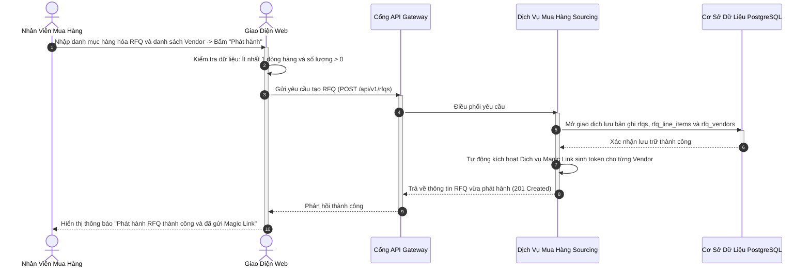
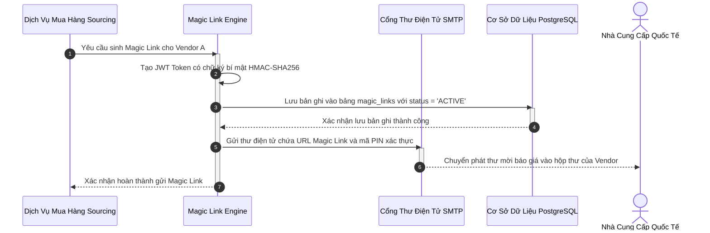
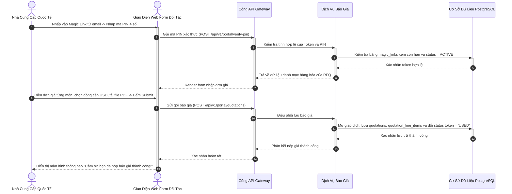
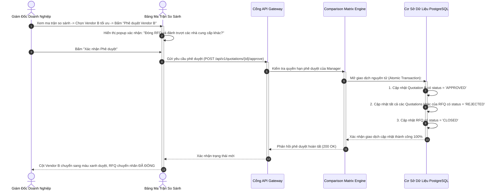

# ĐẶC TẢ YÊU CẦU PHẦN MỀM (SRS) — PHÂN HỆ 3
## MUA HÀNG, BÁO GIÁ VÀ CỔNG KHÔNG CHẠM MAGIC LINK
### MÃ TÀI LIỆU: MIBID_SRS_MOD03_v1.0

---

## 1. TỔNG QUAN PHÂN HỆ

Phân hệ 3 là vũ khí đột phá cốt lõi của nền tảng Mibid, giải quyết triệt để điểm nghẽn lớn nhất trong chuỗi cung ứng XNK: thu thập báo giá từ các nhà cung cấp quốc tế. Phân hệ cho phép nhân viên mua hàng lập yêu cầu báo giá RFQ bóc tách chi tiết từng dòng hàng (Part Number, HS Code, quy cách kỹ thuật, điều kiện Incoterms), tự động phát hành liên kết truy cập một lần Magic Link mã hóa JWT có thời hạn và bảo vệ bằng mã PIN gửi thẳng tới hộp thư của đối tác. Nhà cung cấp nộp báo giá trên giao diện web di động mà không cần đăng nhập tài khoản. Dữ liệu nộp lên được Comparison Matrix Engine tự động quy đổi ngoại tệ về cùng một đồng tiền cơ sở để ban giám đốc phê duyệt báo giá tối ưu.

---

## 2. ĐẶC TẢ CHI TIẾT CÁC CHỨC NĂNG NGHIỆP VỤ

### 2.1. Chức Năng F-3.1: Lập Và Quản Lý Yêu Cầu Báo Giá (RFQ Management & Line Items)

#### 2.1.1. Thông Tin Chung Chức Năng
* **Mục tiêu:** Cho phép nhân viên mua hàng khởi tạo yêu cầu báo giá (RFQ) gắn liền với dự án cụ thể, bóc tách danh mục hàng hóa thành từng dòng hàng (Line Items) chi tiết và chỉ định danh sách nhà cung cấp cần hỏi giá.
* **Tác nhân thực hiện:** Trưởng nhóm Mua hàng (Sourcing Lead), Nhân viên Mua hàng (Purchaser).
* **Đường dẫn thao tác:** `Chi tiết Dự án` → `Tab Yêu cầu Báo giá RFQ` → `[+ Tạo mới RFQ]`.
* **Ghi nhật ký hệ thống:** Lưu thông tin tạo mới, chỉnh sửa trạng thái RFQ vào `activity_logs`.

#### 2.1.2. Màn Hình Giao Diện
* **Bố cục màn hình:** Biểu mẫu 2 phần. Phần thông tin chung gồm Tiêu đề gói mua, Điều kiện Incoterms (FOB, CIF, EXW, DDP), Địa điểm giao nhận, Hạn chót nhận giá. Phần chi tiết là bảng động cho phép thêm/bớt các dòng hàng với các cột: Mô tả hàng hóa, Mã SKU/Part Number, Mã HS Code, Số lượng, Đơn vị tính, Trọng lượng dự kiến (Gross Weight) và Thể tích (CBM).
* **Trạng thái giao diện:**
  * *Nút hành động:* `[Lưu Nháp]` (Lưu trạng thái DRAFT), `[Phát hành & Gửi Link]` (Chuyển sang trạng thái PUBLISHED và kích hoạt gửi Magic Link).

#### 2.1.3. Mô Tả Chi Tiết Các Thành Phần Giao Diện
| STT | Tên trường * | Kiểu dữ liệu [Độ dài] | Input / Output | Giá trị khởi tạo | Mô tả & Ràng buộc CSDL |
| :---: | :--- | :--- | :---: | :--- | :--- |
| 1 | Mã yêu cầu RFQ * | String [50] | Output | Tự sinh (RFQ-xxx) | Bắt buộc, duy nhất. Ánh xạ `rfqs.rfq_code`. |
| 2 | Tiêu đề gói mua * | String [255] | Input | Rỗng | Bắt buộc nhập. Ánh xạ `rfqs.title`. |
| 3 | Điều kiện Incoterms * | String [10] | Input | 'FOB' | Chọn danh mục: `EXW`, `FOB`, `CIF`, `DDP`, `CFR`. Ánh xạ `rfqs.incoterms`. |
| 4 | Hạn chót nộp giá * | DateTime | Input | Hiện tại + 3 ngày | Bắt buộc, phải lớn hơn thời điểm hiện tại. Ánh xạ `rfqs.deadline`. |
| 5 | Mô tả dòng hàng * | Text | Input | Rỗng | Bắt buộc nhập cho từng dòng. Ánh xạ `rfq_line_items.description`. |
| 6 | Số lượng cần mua * | Decimal [12,2] | Input | 1.00 | Bắt buộc, phải lớn hơn 0. Ánh xạ `rfq_line_items.quantity`. |
| 7 | Đơn vị tính (UOM) * | String [20] | Input | 'PCS' | Ví dụ: `PCS`, `SET`, `KG`, `METER`. Ánh xạ `rfq_line_items.uom`. |

#### 2.1.4. Luồng Nghiệp Vụ Xử Lý

---

### 2.2. Chức Năng F-3.2: Phát Hành Và Quản Lý Cổng Không Chạm Magic Link

#### 2.2.1. Thông Tin Chung Chức Năng
* **Mục tiêu:** Tự động sinh ra đường dẫn duy nhất chứa chuỗi mã hóa an toàn JWT và mã PIN bảo vệ 4 số cho từng nhà cung cấp, gửi thư mời báo giá và quản lý vòng đời của liên kết (Hoạt động, Đã sử dụng, Hết hạn).
* **Tác nhân thực hiện:** Tiến trình hệ thống tự động; Nhân viên Mua hàng (khi cần cấp lại link mới).
* **Đường dẫn thao tác:** `Chi tiết RFQ` → `Danh sách Nhà cung cấp & Trạng thái Magic Link`.
* **Ghi nhật ký hệ thống:** Lưu vết mọi lượt sinh token và lịch sử truy cập vào `magic_links`.

#### 2.2.2. Màn Hình Giao Diện
* **Bố cục màn hình:** Danh sách các nhà cung cấp được mời gồm: Tên công ty, Email đại diện, Thời điểm gửi link, Huy hiệu trạng thái link (Xanh: Đang hoạt động, Tím: Đã nộp báo giá, Đỏ: Đã hết hạn) và nút `[Gửi lại Link mới]`.

#### 2.2.3. Mô Tả Chi Tiết Các Thành Phần Giao Diện
| STT | Tên trường * | Kiểu dữ liệu [Độ dài] | Input / Output | Giá trị khởi tạo | Mô tả & Ràng buộc CSDL |
| :---: | :--- | :--- | :---: | :--- | :--- |
| 1 | Thư điện tử đối tác * | String [100] | Input | Rỗng | Bắt buộc nhập. Ánh xạ `magic_links.vendor_email`. |
| 2 | Chuỗi mã hóa Token * | String [500] | Output | Tự sinh | Chuỗi JWT chứa RFQ_ID, Tenant_ID, Vendor_Email. Ánh xạ `magic_links.token`. |
| 3 | Mã bảo vệ PIN | String [4] | Output | Ngẫu nhiên | Mã số 4 chữ số gửi kèm trong thư để xác thực lớp 2. |
| 4 | Thời điểm hết hạn * | DateTime | Output | Deadline RFQ | Tự động hết hạn khi quá thời hạn nộp. Ánh xạ `magic_links.expires_at`. |
| 5 | Trạng thái liên kết * | Enum [20] | Output | 'ACTIVE' | Các trạng thái: `ACTIVE`, `USED`, `EXPIRED`. Ánh xạ `magic_links.status`. |

#### 2.2.4. Luồng Nghiệp Vụ Xử Lý

---

### 2.3. Chức Năng F-3.3: Cổng Đối Tác Nộp Báo Giá Không Cần Đăng Nhập (Vendor Portal)

#### 2.3.1. Thông Tin Chung Chức Năng
* **Mục tiêu:** Cung cấp giao diện web đơn giản, tối ưu hóa cho màn hình di động, cho phép nhà cung cấp mở liên kết từ thư điện tử, nhập mã PIN 4 số, điền đơn giá cho từng dòng hàng, tải tệp catalog/báo giá PDF và bấm gửi trong vòng 60 giây mà không cần tài khoản.
* **Tác nhân thực hiện:** Nhà cung cấp (Vendor - Guest User).
* **Đường dẫn thao tác:** Truy cập trực tiếp qua đường dẫn công khai: `https://portal.mibid.vn/quote/{token}`.
* **Ghi nhật ký hệ thống:** Lưu thông tin nộp báo giá, địa chỉ IP đối tác vào `quotations`.

#### 2.3.2. Màn Hình Giao Diện
* **Bố cục màn hình:** Bám sát thiết kế thực tế tại `docs/assets/magic_link_form_1781665957533.png`. Màn hình chia làm 3 khối trực quan: Khối tiêu đề gói mua và hạn chót; Khối danh mục sản phẩm cho phép gõ trực tiếp đơn giá từng dòng hàng (hệ thống tự động tính thành tiền); Khối chi phí bổ sung gồm cước vận chuyển (Freight), phí bảo hiểm, cảng đi dự kiến, thời gian sản xuất (Lead Time) và vùng tải tệp báo giá chính thức.
* **Trạng thái giao diện:**
  * *Trạng thái link hết hạn:* Nếu liên kết đã quá hạn hoặc đã sử dụng, hiển thị màn hình thông báo: *"Liên kết báo giá này đã hết hiệu lực. Vui lòng liên hệ cán bộ mua hàng để nhận liên kết mới"*.

#### 2.3.3. Mô Tả Chi Tiết Các Thành Phần Giao Diện
| STT | Tên trường * | Kiểu dữ liệu [Độ dài] | Input / Output | Giá trị khởi tạo | Mô tả & Ràng buộc CSDL |
| :---: | :--- | :--- | :---: | :--- | :--- |
| 1 | Mã bảo vệ PIN * | String [4] | Input | Rỗng | Bắt buộc nhập để mở khóa form báo giá. |
| 2 | Đơn giá dòng hàng * | Decimal [15,2] | Input | 0.00 | Bắt buộc nhập cho từng dòng hàng, giá trị $\ge 0$. Ánh xạ `quotation_line_items.unit_price`. |
| 3 | Đồng tiền báo giá * | String [10] | Input | 'USD' | Chọn loại tiền tệ: `USD`, `EUR`, `VND`, `CNY`. Ánh xạ `quotations.currency`. |
| 4 | Cước vận chuyển | Decimal [15,2] | Input | 0.00 | Nhập nếu báo giá theo điều kiện CIF/DDP. Ánh xạ `quotations.freight_cost`. |
| 5 | Thời gian giao hàng dự kiến | Date | Input | Rỗng | Ngày dự kiến hoàn thành đơn hàng. Ánh xạ `quotations.eta_date`. |
| 6 | Tệp báo giá đính kèm | File Binary | Input | Trống | Định dạng PDF/JPG tối đa 20 MB. Ánh xạ `quotations.file_url`. |

#### 2.3.4. Luồng Nghiệp Vụ Xử Lý

---

### 2.4. Chức Năng F-3.4: Ma Trận So Sánh Báo Giá Đa Ngoại Tệ (Comparison Matrix Engine)

#### 2.4.1. Thông Tin Chung Chức Năng
* **Mục tiêu:** Tự động gom toàn bộ báo giá của các nhà cung cấp gửi về thành một bảng so sánh dạng lưới (Grid Matrix), tự động quy đổi ngoại tệ về cùng một đồng tiền cơ sở của dự án theo tỷ giá cấu hình, làm nổi bật báo giá rẻ nhất trên từng dòng hàng và hỗ trợ ban giám đốc phê duyệt nhà cung cấp chiến thắng.
* **Tác nhân thực hiện:** Trưởng nhóm Mua hàng (Sourcing Lead), Giám đốc Phê duyệt (Manager).
* **Đường dẫn thao tác:** `Chi tiết RFQ` → `Tab Bảng So Sánh Báo Giá (Matrix)`.
* **Ghi nhật ký hệ thống:** Lưu vết quyết định phê duyệt hoặc từ chối vào `quotations` và `activity_logs`.

#### 2.4.2. Màn Hình Giao Diện
* **Bố cục màn hình:** Cột bên trái cố định hiển thị danh mục các dòng hàng kèm số lượng. Các cột bên phải hiển thị báo giá của từng nhà cung cấp (Vendor A, Vendor B, Vendor C). Tại mỗi ô giao thoa hiển thị Đơn giá gốc (kèm đồng tiền ngoại tệ) và Đơn giá sau quy đổi VND. Dòng có giá thấp nhất được tô màu xanh lá mạ nổi bật. Phía trên mỗi cột nhà cung cấp có nút `[Phê duyệt Chọn Vendor Này]`.

#### 2.4.3. Mô Tả Chi Tiết Các Thành Phần Giao Diện
| STT | Tên trường * | Kiểu dữ liệu [Độ dài] | Input / Output | Giá trị khởi tạo | Mô tả & Ràng buộc CSDL |
| :---: | :--- | :--- | :---: | :--- | :--- |
| 1 | Tỷ giá quy đổi cơ sở * | Decimal [15,4] | Input | Tỷ giá dự án | Tỷ giá chuyển đổi sang đồng tiền cơ sở (VD: 1 USD = 25.400 VND). |
| 2 | Tổng giá trị sau quy đổi | Decimal [15,2] | Output | - | Tự động tính: $\sum (\text{Đơn giá quy đổi} \times \text{Số lượng}) + \text{Phí vận tải quy đổi}$. |
| 3 | Trạng thái báo giá * | Enum [20] | Output | 'SUBMITTED' | Khi bấm duyệt: Chuyển thành `APPROVED`, các bên khác thành `REJECTED`. |

#### 2.4.4. Luồng Nghiệp Vụ Xử Lý

