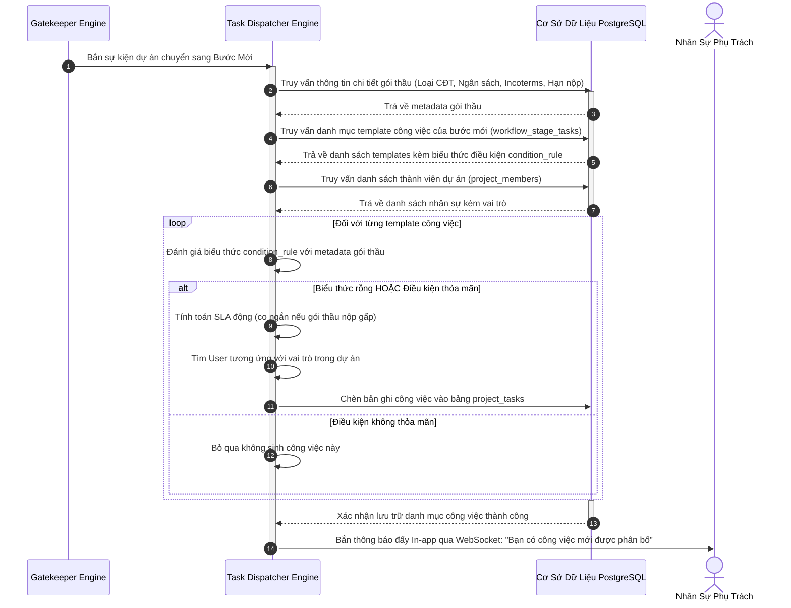
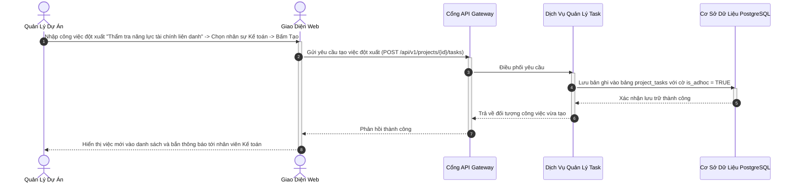
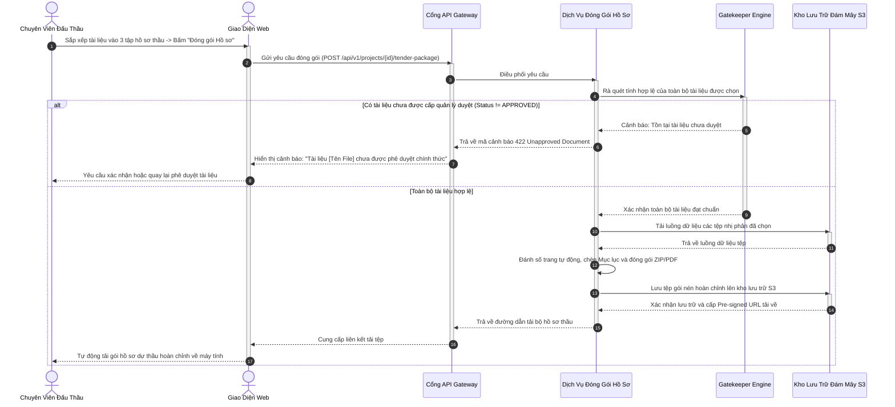

# ĐẶC TẢ YÊU CẦU PHẦN MỀM (SRS) — PHÂN HỆ 4
## QUẢN TRỊ CÔNG VIỆC VI MÔ VÀ HỒ SƠ DỰ THẦU (BIDDING OPERATIONS & TASKS)
### MÃ TÀI LIỆU: MIBID_SRS_MOD04_v1.0

---

## 1. TỔNG QUAN PHÂN HỆ VÀ NĂNG LỰC TÙY BIẾN CÔNG VIỆC ĐỘNG

Trong các dự án đấu thầu và cung ứng XNK, việc thực thi công việc thực tế tại mỗi bước quy trình không bao giờ là một danh sách tĩnh cố định. Khối lượng và tính chất công việc thay đổi liên tục theo từng gói thầu cụ thể:
* **Theo yêu cầu của Chủ đầu tư:** 
  * Gói thầu Nhà nước (EVN, PVN) đòi hỏi các công việc pháp lý đặc thù: Mua HSMT trên Hệ thống mạng đấu thầu quốc gia VNEPS, nộp Thư bảo lãnh dự thầu ngân hàng trước giờ đóng thầu, chứng thực hợp đồng tương tự.
  * Gói thầu Tổng thầu EPC / FDI đòi hỏi các công việc kỹ thuật chuyên sâu: Dịch thuật công chứng Catalog sang tiếng Anh, yêu cầu Vendor làm việc với cơ quan kiểm định (SGS, TÜV), tính toán rủi ro biến động tỷ giá ngoại tệ.
* **Theo áp lực thời gian:** Gói thầu chuẩn bị gấp trong 3 ngày đòi hỏi co ngắn SLA từ 48 giờ xuống còn 4 giờ – 8 giờ; người quản lý phải có khả năng giao việc khẩn cấp (Ad-hoc tasks) và phân công chéo nhân sự ngay lập tức.

Vì vậy, Phân hệ 4 của Mibid được trang bị **Dynamic Task Dispatcher Engine kết hợp Chốt Chặn Hoàn Thành Công Việc (Task Completion Gate)** mang lại các năng lực vượt trội:
1. **Khai báo Mẫu công việc gắn Quy tắc Điều kiện Tự động (Conditional Task Rules):** Cho phép hệ thống tự động nhận diện thuộc tính của gói thầu (Loại chủ đầu tư, Ngành hàng, Giá trị ngân sách, Điều kiện Incoterms) để sinh đúng và đủ danh mục công việc cần làm khi dự án chuyển sang bước mới.
2. **Thiết lập Thời hạn SLA Động (Dynamic SLA):** Thời hạn hoàn thành của từng đầu việc được tính toán tự động dựa trên thời gian đếm ngược tới hạn nộp thầu chính thức.
3. **Trao quyền Tùy biến Cao độ cho Quản lý Dự án (Project Manager Empowerment):** Quản lý có thể trực tiếp thêm mới việc đột xuất, xóa bớt việc không cần thiết, chuyển giao việc chéo phòng ban (Kỹ thuật, Mua hàng, Logistics, Tài chính) trực tiếp trên giao diện của dự án tại thời gian thực mà không làm thay đổi mẫu chung.
4. **Chốt chặn Hoàn thành Công việc (Task Completion Gate):** Cung cấp cơ chế ràng buộc: "Bắt buộc 100% các công việc có mức ưu tiên Cao/Khẩn cấp phải hoàn thành mới thỏa mãn điều kiện chuyển bước trên bảng Kanban".
5. **Lắp ráp & Đóng gói Hồ sơ Dự thầu Tự động:** Tự động rà soát trạng thái phê duyệt của tài liệu, đóng gói tệp ZIP hoàn chỉnh có chèn Mục lục hồ sơ thầu đánh số trang tự động.

---

## 2. ĐẶC TẢ CHI TIẾT CÁC CHỨC NĂNG NGHIỆP VỤ

### 2.1. Chức Năng F-4.1: Tự Động Sinh Công Việc Vi Mô Động Theo Thuộc Tính Gói Thầu (Dynamic Task Dispatcher)

#### 2.1.1. Thông Tin Chung Chức Năng
* **Mục tiêu:** Tự động kích hoạt cơ chế sinh hàng loạt công việc vi mô dựa trên mẫu cấu hình kết hợp biểu thức điều kiện thuộc tính gói thầu ngay khi dự án chuyển bước thành công; tự động gán người phụ trách theo vai trò và tính hạn SLA động.
* **Tác nhân thực hiện:** Task Dispatcher Engine tự động.
* **Đường dẫn thao tác:** Kích hoạt ngầm khi có sự kiện chuyển bước `Project_Stage_Changed`.
* **Ghi nhật ký hệ thống:** Lưu danh mục công việc mới vào `project_tasks` và gửi thông báo đẩy in-app.

#### 2.1.2. Màn Hình Giao Diện
* **Bố cục màn hình:** Hiển thị danh mục công việc trong thẻ dự án trên bảng Kanban hoặc trong `Tab Công việc` của màn hình chi tiết dự án. Danh sách được phân nhóm rõ ràng theo từng bước quy trình với huy hiệu nguồn gốc (Màu xanh dương: Tự động sinh theo mẫu; Màu tím: Sinh theo điều kiện đặc thù; Màu cam: Quản lý thêm đột xuất). Có cờ ưu tiên (Khẩn cấp, Cao, Trung bình) và đồng hồ đếm ngược SLA.

#### 2.1.3. Mô Tả Chi Tiết Các Thành Phần Khai Báo Mẫu Công Việc Điều Kiện
| STT | Tên trường * | Kiểu dữ liệu [Độ dài] | Input / Output | Giá trị khởi tạo | Mô tả & Mapping CSDL & Ràng buộc |
| :---: | :--- | :--- | :---: | :--- | :--- |
| 1 | Tên công việc * | String [255] | Input | Rỗng | Tiêu đề công việc cần thực hiện. Ánh xạ `workflow_stage_tasks.task_name`. |
| 2 | Bước quy trình áp dụng * | UUID | Input | - | Tham chiếu `workflow_stages.id`. |
| 3 | Biểu thức điều kiện kích hoạt | Text (JSONB) | Input | Rỗng | Điều kiện logic (ví dụ: `client_type == 'STATE'`, `budget > 5_000_000_000`, `incoterms == 'CIF'`). Ánh xạ `workflow_stage_tasks.condition_rule`. |
| 4 | Vai trò chịu trách nhiệm * | String [50] | Input | 'SALES_EXEC' | Vai trò mặc định: `SOURCING_LEAD`, `SALES_EXEC`, `LOGISTICS`, `FINANCE`. |
| 5 | Thời gian định mức SLA (giờ) *| Integer | Input | 24 | Số giờ hoàn thành chuẩn. Ánh xạ `workflow_stage_tasks.sla_hours`. |
| 6 | Mức độ ưu tiên * | Enum [20] | Input | 'MEDIUM' | `LOW`, `MEDIUM`, `HIGH`, `URGENT`. Ánh xạ `workflow_stage_tasks.priority`. |
| 7 | Bắt buộc hoàn thành để qua bước | Boolean | Input | False | True: Bắt buộc status = DONE mới được qua bước kế tiếp trên Kanban. Ánh xạ `workflow_stage_tasks.is_mandatory_gate`. |

#### 2.1.4. Luồng Nghiệp Vụ Xử Lý

---

### 2.2. Chức Năng F-4.2: Quản Trị Công Việc Linh Hoạt Cho Quản Lý Dự Án (Flexible Task Board & Ad-hoc Tasks)

#### 2.2.1. Thông Tin Chung Chức Năng
* **Mục tiêu:** Trao quyền cho Quản lý dự án có thể chủ động theo dõi, điều phối lại công việc, thêm mới các đầu việc đột xuất (Ad-hoc tasks), giao việc chéo phòng ban và gia hạn thời gian; đồng thời kích hoạt chốt chặn Task Completion Gate ngăn chặn chuyển bước khi còn công việc trọng yếu chưa hoàn thành.
* **Tác nhân thực hiện:** Quản lý Dự án (Project Owner), Thành viên dự án.
* **Đường dẫn thao tác:** `Chi tiết Dự án` → `Tab Công việc` hoặc `Menu Cá nhân` → `Việc của Tôi`.
* **Ghi nhật ký hệ thống:** Lưu vết mọi thao tác thêm việc đột xuất, đổi trạng thái vào `activity_logs`.

#### 2.2.2. Màn Hình Giao Diện
* **Bố cục màn hình:** Bảng danh sách công việc dạng lưới hoặc bảng Kanban Task (Cần làm → Đang làm → Đã xong). Phía trên có nút `[+ Thêm Công việc Đột xuất]` mở popup nhanh trong 5 giây. Mỗi dòng công việc có nút đổi trạng thái nhanh, cờ ưu tiên (Đỏ: Khẩn cấp), huy hiệu "Bắt buộc chuyển bước" (Khóa màu vàng nếu là Mandatory Gate) và danh sách tệp đính kèm kết quả.

#### 2.2.3. Mô Tả Chi Tiết Các Thành Phần Giao Diện
| STT | Tên trường * | Kiểu dữ liệu [Độ dài] | Input / Output | Giá trị khởi tạo | Mô tả & Mapping CSDL & Ràng buộc |
| :---: | :--- | :--- | :---: | :--- | :--- |
| 1 | Tiêu đề công việc * | String [255] | Input | Rỗng | Bắt buộc nhập khi thêm việc đột xuất. Ánh xạ `project_tasks.title`. |
| 2 | Người phụ trách * | UUID | Input | Tùy chọn | Chọn từ danh sách nhân viên công ty (hỗ trợ giao chéo). Ánh xạ `project_tasks.assignee_id`. |
| 3 | Hạn hoàn thành (Due date) * | DateTime | Input | Hiện tại + 24h | Bắt buộc nhập, phải trước hạn nộp thầu. Ánh xạ `project_tasks.due_date`. |
| 4 | Mức độ ưu tiên * | Enum [20] | Input | 'MEDIUM' | `LOW`, `MEDIUM`, `HIGH`, `URGENT`. Ánh xạ `project_tasks.priority`. |
| 5 | Đánh dấu việc bắt buộc qua bước | Boolean | Input | False | Nếu bật, bước không thể chuyển nếu việc này chưa DONE. Ánh xạ `project_tasks.is_mandatory_gate`. |
| 6 | Trạng thái công việc * | Enum [20] | Input | 'TODO' | `TODO`, `DOING`, `DONE`, `OVERDUE`. Ánh xạ `project_tasks.status`. |
| 7 | Tệp đính kèm kết quả | Array [UUID] | Input | Trống | Tải lên biên bản, file báo cáo hoàn thành. |

#### 2.2.4. Luồng Nghiệp Vụ Xử Lý

---

### 2.3. Chức Năng F-4.3: Lắp Ráp Và Đóng Gói Hồ Sơ Dự Thầu (Tender Assembly & Packaging)

#### 2.3.1. Thông Tin Chung Chức Năng
* **Mục tiêu:** Hỗ trợ chuyên viên đấu thầu tổng hợp toàn bộ tài liệu pháp lý, năng lực, kỹ thuật và tài chính từ kho DMS; tự động kiểm tra chốt chặn tài liệu hợp lệ; sắp xếp theo cây mục lục hồ sơ thầu và đóng gói thành tệp nén ZIP hoặc PDF hợp nhất có đánh số trang liên tục.
* **Tác nhân thực hiện:** Chuyên viên Đấu thầu (Sales / Bidding Exec), Quản lý Dự án.
* **Đường dẫn thao tác:** `Chi tiết Dự án` → `Tab Đóng gói Hồ sơ Dự thầu`.
* **Ghi nhật ký hệ thống:** Lưu vết lượt xuất bản hồ sơ dự thầu vào `activity_logs`.

#### 2.3.2. Màn Hình Giao Diện
* **Bố cục màn hình:** Giao diện 2 cột kéo thả:
  * Cột bên trái: Danh mục toàn bộ các tài liệu hiện có trong dự án, hiển thị rõ huy hiệu trạng thái (Màu xanh lá: Đã duyệt APPROVED; Màu cam: Chờ duyệt PENDING - có cảnh báo không nên đóng gói).
  * Cột bên phải: Cây cấu trúc hồ sơ mời thầu (Tập 1: Hồ sơ Năng lực Pháp lý, Tập 2: Đề xuất Kỹ thuật, Tập 3: Đề xuất Tài chính & Giá dự thầu). Hỗ trợ kéo thả tài liệu vào từng tập hồ sơ và thay đổi thứ tự trang.
* **Trạng thái giao diện:**
  * *Nút hành động:* `[Kiểm tra Tính Hợp lệ]` (Rà quét Gatekeeper trước khi nộp), `[Đóng gói Tệp ZIP]` và `[Xuất Tệp PDF Hợp nhất]`.

#### 2.3.3. Mô Tả Chi Tiết Các Thành Phần Giao Diện
| STT | Tên trường * | Kiểu dữ liệu [Độ dài] | Input / Output | Giá trị khởi tạo | Mô tả & Mapping CSDL & Ràng buộc |
| :---: | :--- | :--- | :---: | :--- | :--- |
| 1 | Tên bộ hồ sơ thầu * | String [255] | Input | Tự sinh theo mã | Ví dụ: `DA-2026-XNK01_HoSoDuThau_ChinhThuc`. |
| 2 | Danh sách tài liệu chọn * | Array [UUID] | Input | - | Danh sách các khóa chính `project_documents.id` được chọn. |
| 3 | Tự động đánh số trang | Boolean | Input | True | Tự động đánh số trang liên tục toàn bộ hồ sơ (Page 1 of N). |
| 4 | Tự động tạo trang Mục lục | Boolean | Input | True | Chèn trang Mục lục bảng kê tài liệu ở trang đầu tiên. |
| 5 | Định dạng đóng gói * | Enum [20] | Input | 'ZIP_ARCHIVE' | `ZIP_ARCHIVE` (Tệp nén chia theo thư mục), `MERGED_PDF` (Tệp PDF hợp nhất). |

#### 2.3.4. Luồng Nghiệp Vụ Xử Lý

