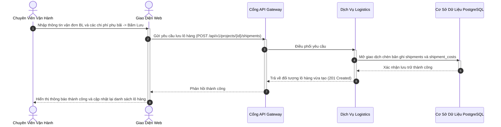
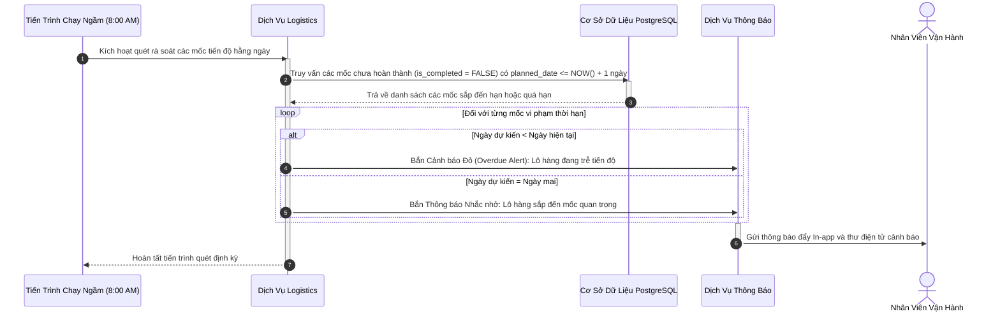
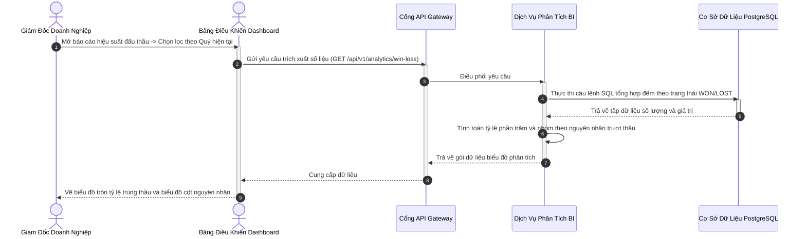
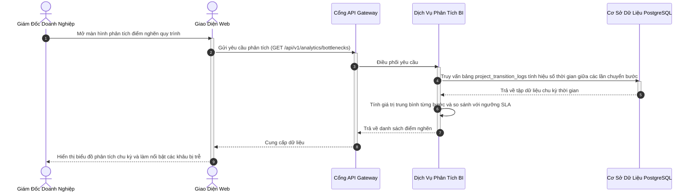

# ĐẶC TẢ YÊU CẦU PHẦN MỀM (SRS) — PHÂN HỆ 5
## THEO DÕI LÔ HÀNG VẬN TẢI VÀ BÁO CÁO PHÂN TÍCH KINH DOANH (LOGISTICS & BI ANALYTICS)
### MÃ TÀI LIỆU: MIBID_SRS_MOD05_v1.0

---

## 1. TỔNG QUAN PHÂN HỆ

Phân hệ 5 đảm nhiệm việc quản trị giai đoạn thực thi hợp đồng sau khi trúng thầu và cung cấp hệ thống phân tích dữ liệu kinh doanh phục vụ công tác điều hành của ban giám đốc. Phân hệ cho phép bộ phận Logistics theo dõi chi tiết từng lô hàng, số vận đơn đường biển/hàng không, chi phí vận tải, giám sát các mốc thời gian giao nhận cam kết với chủ đầu tư (ETA/ETD), tích hợp tiến trình chạy ngầm quét kiểm tra định kỳ 8:00 AM hằng ngày để tự động gửi cảnh báo khi phát hiện nguy cơ trễ hạn. Đồng thời, hệ thống trực quan hóa các chỉ số hiệu suất kinh doanh then chốt gồm tỷ lệ trúng/trượt thầu và phân tích thời gian nằm lại ở từng bước để phát hiện điểm nghẽn quy trình.

---

## 2. ĐẶC TẢ CHI TIẾT CÁC CHỨC NĂNG NGHIỆP VỤ

### 2.1. Chức Năng F-5.1: Quản Lý Lô Hàng, Vận Đơn Và Chi Phí Vận Chuyển (Shipments & Costs)

#### 2.1.1. Thông Tin Chung Chức Năng
* **Mục tiêu:** Quản lý thông tin chi tiết các lô hàng nhập khẩu/xuất khẩu của dự án trúng thầu, bao gồm số vận đơn Bill of Lading (BL), thông tin đơn vị vận tải (Forwarder/Hãng tàu), cảng đi, cảng đến và các khoản mục chi phí vận chuyển phát sinh.
* **Tác nhân thực hiện:** Chuyên viên Vận hành (Logistics Exec).
* **Đường dẫn thao tác:** `Chi tiết Dự án` → `Tab Quản lý Giao nhận & Vận đơn`.
* **Ghi nhật ký hệ thống:** Lưu thông tin lô hàng vào `shipments` và chi phí vào `shipment_costs`.

#### 2.1.2. Màn Hình Giao Diện
* **Bố cục màn hình:** Danh sách các lô hàng thuộc dự án. Khi bấm vào một lô hàng, mở màn hình chi tiết gồm thông tin vận đơn, hải quan và bảng kê chi phí vận chuyển (Cước biển, phí chứng từ, phí nâng hạ bãi, phí xếp dỡ THC, thuế nhập khẩu).

#### 2.1.3. Mô Tả Chi Tiết Các Thành Phần Giao Diện
| STT | Tên trường * | Kiểu dữ liệu [Độ dài] | Input / Output | Giá trị khởi tạo | Mô tả & Ràng buộc CSDL |
| :---: | :--- | :--- | :---: | :--- | :--- |
| 1 | Mã vận đơn (BL) * | String [100] | Input | Rỗng | Bắt buộc nhập, duy nhất. Ánh xạ `shipments.bl_number`. |
| 2 | Đơn vị vận chuyển * | String [255] | Input | Rỗng | Tên hãng tàu hoặc đại lý forwarder. Ánh xạ `shipments.forwarder_name`. |
| 3 | Cảng bốc hàng (POL) * | String [100] | Input | Rỗng | Ví dụ: `Shanghai Port`, `Busan Port`. Ánh xạ `shipments.origin_port`. |
| 4 | Cảng dỡ hàng (POD) * | String [100] | Input | Rỗng | Ví dụ: `Hai Phong Port`, `Cat Lai Port`. Ánh xạ `shipments.destination_port`. |
| 5 | Loại chi phí vận tải | String [100] | Input | 'Ocean Freight' | Hạng mục chi phí phát sinh. Ánh xạ `shipment_costs.cost_type`. |
| 6 | Số tiền chi phí | Decimal [15,2] | Input | 0.00 | Giá trị chi phí chi trả. Ánh xạ `shipment_costs.amount`. |

#### 2.1.4. Luồng Nghiệp Vụ Xử Lý

---

### 2.2. Chức Năng F-5.2: Theo Dõi Mốc Tiến Độ Và Cảnh Báo Tự Động 8:00 AM (Milestones Tracking)

#### 2.2.1. Thông Tin Chung Chức Năng
* **Mục tiêu:** Thiết lập các mốc thời gian kiểm soát hành trình giao nhận hàng hóa (Hàng rời xưởng, Bốc lên tàu ETD, Cập cảng ETA, Thông quan, Giao kho khách hàng); tiến trình chạy ngầm tự động quét kiểm tra vào 8:00 AM mỗi sáng để cảnh báo quá hạn hoặc sắp đến hạn.
* **Tác nhân thực hiện:** Chuyên viên Vận hành; Tiến trình chạy ngầm (ShedLock Cronjob).
* **Đường dẫn thao tác:** `Chi tiết Lô hàng` → `Dòng thời gian Mốc tiến độ (Milestones)`.
* **Ghi nhật ký hệ thống:** Cập nhật trạng thái hoàn thành vào `shipment_milestones`.

#### 2.2.2. Màn Hình Giao Diện
* **Bố cục màn hình:** Bám sát thiết kế thực tế tại `docs/assets/dashboard_ui_1781665934940.png` (Khu vực "Active Shipments Timeline"). Dòng thời gian ngang thể hiện các mốc tiến độ với các chấm tròn màu sắc: Xanh lục (Đã hoàn thành), Xanh dương (Mốc kế tiếp), Đỏ (Đã quá hạn so với ngày dự kiến). Có nút tick chọn `[Đánh dấu Đã Hoàn Thành]`.

#### 2.2.3. Mô Tả Chi Tiết Các Thành Phần Giao Diện
| STT | Tên trường * | Kiểu dữ liệu [Độ dài] | Input / Output | Giá trị khởi tạo | Mô tả & Ràng buộc CSDL |
| :---: | :--- | :--- | :---: | :--- | :--- |
| 1 | Loại mốc tiến độ * | String [50] | Input | 'ETA' | Các mốc: `FACTORY_OUT`, `ETD`, `ETA`, `CUSTOMS`, `DELIVERED`. |
| 2 | Ngày kế hoạch * | Date | Input | Rỗng | Ngày dự kiến diễn ra. Ánh xạ `shipment_milestones.planned_date`. |
| 3 | Ngày thực tế | Date | Input | Rỗng | Ngày thực tế diễn ra. Ánh xạ `shipment_milestones.actual_date`. |
| 4 | Trạng thái hoàn thành * | Boolean | Input | False | True: Đã xong; False: Đang chờ. Ánh xạ `shipment_milestones.is_completed`. |

#### 2.2.4. Luồng Nghiệp Vụ Xử Lý

---

### 2.3. Chức Năng F-5.3: Báo Cáo Hiệu Suất Đấu Thầu Và Tỷ Lệ Trúng/Trượt (Win/Loss Analytics)

#### 2.3.1. Thông Tin Chung Chức Năng
* **Mục tiêu:** Cung cấp cho ban giám đốc cái nhìn toàn diện về hiệu quả tham gia dự thầu của doanh nghiệp: Biểu đồ tỷ lệ trúng thầu (Win Rate), giá trị trúng thầu lũy kế, thống kê nguyên nhân trượt thầu (do giá cao, do thiếu chứng chỉ kỹ thuật, do thời gian giao hàng dài).
* **Tác nhân thực hiện:** Giám đốc Doanh nghiệp (Company Manager), Trưởng phòng Kinh doanh.
* **Đường dẫn thao tác:** `Báo cáo & Thống kê` → `Báo cáo Hiệu suất Đấu thầu`.
* **Ghi nhật ký hệ thống:** Truy vấn tổng hợp dữ liệu từ bảng `projects`.

#### 2.3.2. Màn Hình Giao Diện
* **Bố cục màn hình:** Bám sát biểu đồ tròn tại `docs/assets/dashboard_ui_1781665934940.png`. Biểu đồ tròn hiển thị tỷ lệ gói thầu Trúng thầu (Won) so với Trượt thầu (Lost). Biểu đồ cột phân tích lý do trượt thầu. Bộ lọc thời gian cho phép xem theo tháng, quý hoặc năm.

#### 2.3.3. Mô Tả Chi Tiết Các Thành Phần Giao Diện
| STT | Tên trường * | Kiểu dữ liệu [Độ dài] | Input / Output | Giá trị khởi tạo | Mô tả & Ràng buộc CSDL |
| :---: | :--- | :--- | :---: | :--- | :--- |
| 1 | Khoảng thời gian lọc * | Date Range | Input | 30 ngày gần nhất | Chọn ngày bắt đầu và ngày kết thúc. |
| 2 | Tỷ lệ trúng thầu (Win Rate) | Decimal [5,2] | Output | - | Tự động tính: $(\text{Số dự án WON} / \text{Tổng dự án đã có kết quả}) \times 100\%$. |
| 3 | Tổng giá trị trúng thầu | Decimal [15,2] | Output | - | Tổng ngân sách các dự án có trạng thái `WON`. |

#### 2.3.4. Luồng Nghiệp Vụ Xử Lý

---

### 2.4. Chức Năng F-5.4: Báo Cáo Phân Tích Điểm Nghẽn Quy Trình (Bottleneck Cycle Time)

#### 2.4.1. Thông Tin Chung Chức Năng
* **Mục tiêu:** Đo lường thời gian nằm lại trung bình (Average Dwell Time) của các gói thầu tại từng bước trên bảng Kanban (Khâu chuẩn bị mất bao nhiêu ngày, khâu hỏi giá mất bao nhiêu ngày, khâu giao nhận mất bao nhiêu ngày) nhằm xác định khâu nào đang gây chậm trễ tiến độ toàn công ty.
* **Tác nhân thực hiện:** Giám đốc Doanh nghiệp (Company Manager).
* **Đường dẫn thao tác:** `Báo cáo & Thống kê` → `Phân tích Điểm nghẽn Chu trình`.
* **Ghi nhật ký hệ thống:** Truy vấn tổng hợp từ `project_transition_logs`.

#### 2.4.2. Màn Hình Giao Diện
* **Bố cục màn hình:** Biểu đồ cột ngang thể hiện số ngày trung bình ở mỗi bước. Các cột có thời gian vượt quá cam kết chuẩn (SLA Benchmark) được tô màu đỏ cảnh báo. Bảng chi tiết bên dưới liệt kê danh sách các dự án đang bị tắc nghẽn lâu nhất.

#### 2.4.3. Mô Tả Chi Tiết Các Thành Phần Giao Diện
| STT | Tên trường * | Kiểu dữ liệu [Độ dài] | Input / Output | Giá trị khởi tạo | Mô tả & Ràng buộc CSDL |
| :---: | :--- | :--- | :---: | :--- | :--- |
| 1 | Tên bước quy trình | String [100] | Output | - | Tên các bước trong mẫu quy trình. |
| 2 | Thời gian chu kỳ trung bình | Decimal [8,2] | Output | - | Số ngày trung bình: $\text{Avg}(\text{Thời điểm rời bước} - \text{Thời điểm vào bước})$. |
| 3 | Ngưỡng cam kết SLA chuẩn | Integer | Output | - | Định mức thời gian tối đa cho phép của bước. |

#### 2.4.4. Luồng Nghiệp Vụ Xử Lý

