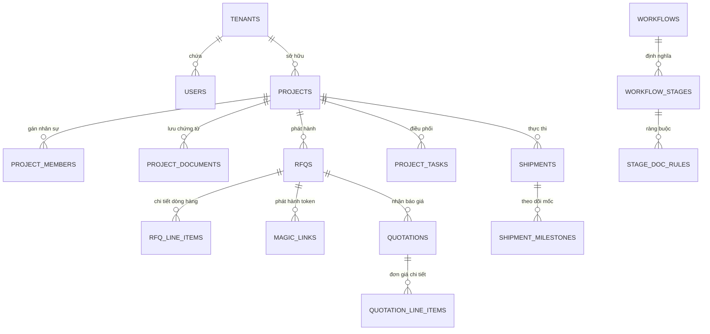

# TÀI LIỆU THIẾT KẾ CHI TIẾT CƠ SỞ DỮ LIỆU (DATABASE DETAILED DESIGN - DBDD)
## DỰ ÁN NỀN TẢNG KHÔNG GIAN CỘNG TÁC SỐ QUẢN LÝ GÓI THẦU VÀ HỒ SƠ THẦU XUẤT NHẬP KHẨU: MIBID
### MÃ TÀI LIỆU: MIBID_DBDD_v1.0 (QUY CHUẨN BM.03.QT.00.CNTT.28 TẬP ĐOÀN VIETTEL)

---

## PHẦN 1: GIỚI THIỆU CHUNG VÀ QUY ƯỚC THIẾT KẾ

### 1.1. Mục Đích Và Phạm Vi
Tài liệu Thiết kế Chi tiết Cơ sở Dữ liệu (DBDD) này đặc tả toàn diện cấu trúc 38 bảng cơ sở dữ liệu quan hệ của hệ thống Mibid trên nền tảng PostgreSQL 15+. Tài liệu mô tả chi tiết từng bảng theo định dạng 8 cột chuẩn mực, định nghĩa khóa chính, khóa ngoại, chỉ mục hiệu năng (Indexes), ràng buộc toàn vẹn (Constraints), quy hoạch phân vùng (Partitioning), cơ chế bảo mật cách ly đa khách thuê (Row-Level Security - RLS) và các hàm tự động (Triggers).

### 1.2. Quy Ước Thiết Kế Dữ Liệu
* **Khóa chính (Primary Key):** 100% các bảng sử dụng định danh duy nhất toàn cầu UUID v4 tự sinh bằng hàm `gen_random_uuid()` hoặc `uuid_generate_v4()`.
* **Trường kiểm toán (Audit Fields):** Mọi bảng dữ liệu nghiệp vụ bắt buộc có `created_at` (thời điểm tạo) và `updated_at` (thời điểm cập nhật cuối) định dạng `TIMESTAMP WITH TIME ZONE DEFAULT NOW()`.
* **Quy ước đặt tên:** Tên bảng sử dụng chữ thường dạng số nhiều nối nhau bằng dấu gạch dưới (`snake_case`). Tên cột sử dụng `snake_case`.

---

## PHẦN 2: SƠ ĐỒ MỐI QUAN HỆ THỰC THỂ CỐT LÕI (HIGH-LEVEL ERD)

---

## PHẦN 3: ĐẶC TẢ CHI TIẾT 38 BẢNG CƠ SỞ DỮ LIỆU (CHUẨN 8 CỘT BM.03)

### 3.1. Phân Hệ 0: Quản Trị Khách Thuê Toàn Cục (Global SaaS)

#### 1. Bảng `tenants` (Doanh Nghiệp Khách Thuê)
| STT | Tên trường | Tên vật lý | Kiểu dữ liệu | Kích thước | Nullable | Khóa | Diễn giải chi tiết |
| :---: | :--- | :--- | :--- | :---: | :---: | :---: | :--- |
| 1 | Mã định danh khách thuê | `id` | UUID | 16 bytes | NO | PK | Định danh duy nhất toàn cầu, mặc định `gen_random_uuid()`. |
| 2 | Tên công ty doanh nghiệp | `name` | VARCHAR | 255 | NO | - | Tên pháp nhân của doanh nghiệp thương mại XNK. |
| 3 | Tên miền định danh | `domain` | VARCHAR | 255 | YES | Unique | Tên miền con truy cập riêng, ví dụ `hoanggia.mibid.vn`. |
| 4 | Trạng thái hoạt động | `status` | VARCHAR | 20 | NO | - | Mặc định 'ACTIVE'. Check constraint: `ACTIVE`, `SUSPENDED`, `CANCELLED`. |
| 5 | Thời điểm khởi tạo | `created_at` | TIMESTAMPTZ | 8 bytes | NO | - | Thời điểm tạo bản ghi, mặc định `NOW()`. |
| 6 | Thời điểm cập nhật cuối | `updated_at` | TIMESTAMPTZ | 8 bytes | NO | - | Thời điểm chỉnh sửa gần nhất, tự động cập nhật bởi Trigger. |

#### 2. Bảng `subscription_plans` (Gói Dịch Vụ Cước)
| STT | Tên trường | Tên vật lý | Kiểu dữ liệu | Kích thước | Nullable | Khóa | Diễn giải chi tiết |
| :---: | :--- | :--- | :--- | :---: | :---: | :---: | :--- |
| 1 | Mã gói cước | `id` | UUID | 16 bytes | NO | PK | Định danh duy nhất gói dịch vụ. |
| 2 | Tên gói cước | `name` | VARCHAR | 100 | NO | - | Tên gói: `Starter`, `Professional`, `Enterprise`. |
| 3 | Số người dùng tối đa | `max_users` | INT | 4 bytes | NO | - | Giới hạn số lượng tài khoản nội bộ tối đa của khách thuê. |
| 4 | Dung lượng lưu trữ tối đa | `max_storage_gb` | INT | 4 bytes | NO | - | Giới hạn dung lượng lưu trữ tài liệu tính bằng Gigabyte. |
| 5 | Đơn giá gói cước | `price` | DECIMAL | 15,2 | NO | - | Đơn giá thuê bao hằng năm. |
| 6 | Đồng tiền thanh toán | `currency` | VARCHAR | 10 | NO | - | Mặc định 'USD' hoặc 'VND'. |
| 7 | Trạng thái áp dụng | `is_active` | BOOLEAN | 1 byte | NO | - | True: Đang mở bán; False: Tạm ngừng áp dụng. |

#### 3. Bảng `tenant_subscriptions` (Đăng Ký Thuê Bao Của Khách Thuê)
| STT | Tên trường | Tên vật lý | Kiểu dữ liệu | Kích thước | Nullable | Khóa | Diễn giải chi tiết |
| :---: | :--- | :--- | :--- | :---: | :---: | :---: | :--- |
| 1 | Mã thuê bao | `id` | UUID | 16 bytes | NO | PK | Định danh bản ghi thuê bao. |
| 2 | Mã khách thuê | `tenant_id` | UUID | 16 bytes | NO | FK | Khóa ngoại tham chiếu `tenants.id` (ON DELETE CASCADE). |
| 3 | Mã gói dịch vụ | `plan_id` | UUID | 16 bytes | NO | FK | Khóa ngoại tham chiếu `subscription_plans.id`. |
| 4 | Ngày bắt đầu hiệu lực | `start_date` | TIMESTAMPTZ | 8 bytes | NO | - | Thời điểm bắt đầu tính cước thuê bao. |
| 5 | Ngày hết hạn dịch vụ | `end_date` | TIMESTAMPTZ | 8 bytes | YES | - | Thời điểm hết hạn dịch vụ (NULL: Vô thời hạn). |
| 6 | Trạng thái thuê bao | `status` | VARCHAR | 20 | NO | - | Check constraint: `ACTIVE`, `EXPIRED`, `CANCELLED`. |
| 7 | Thời điểm tạo | `created_at` | TIMESTAMPTZ | 8 bytes | NO | - | Mặc định `NOW()`. |
| 8 | Thời điểm cập nhật | `updated_at` | TIMESTAMPTZ | 8 bytes | NO | - | Tự động cập nhật bởi Trigger. |

---

### 3.2. Phân Hệ 1: Định Danh, Phân Quyền Và Người Dùng (IAM)

#### 4. Bảng `users` (Tài Khoản Người Dùng)
| STT | Tên trường | Tên vật lý | Kiểu dữ liệu | Kích thước | Nullable | Khóa | Diễn giải chi tiết |
| :---: | :--- | :--- | :--- | :---: | :---: | :---: | :--- |
| 1 | Mã người dùng | `id` | UUID | 16 bytes | NO | PK | Khóa chính duy nhất toàn cầu. |
| 2 | Mã khách thuê sở hữu | `tenant_id` | UUID | 16 bytes | NO | FK | Tham chiếu `tenants.id`. Hỗ trợ RLS cách ly tenant. |
| 3 | Thư điện tử đăng nhập | `email` | VARCHAR | 150 | NO | - | Bắt buộc, duy nhất trong từng tenant (`tenant_id, email`). |
| 4 | Mật khẩu băm an toàn | `password_hash` | VARCHAR | 255 | NO | - | Chuỗi băm mật khẩu Bcrypt với salt an toàn. |
| 5 | Họ và tên đầy đủ | `full_name` | VARCHAR | 150 | NO | - | Tên hiển thị của nhân sự. |
| 6 | Số điện thoại liên hệ | `phone` | VARCHAR | 20 | YES | - | Số điện thoại di động phục vụ nhận thông báo SMS. |
| 7 | Phòng ban công tác | `department` | VARCHAR | 100 | YES | - | Phòng Mua hàng, Đấu thầu, Logistics, Kế toán. |
| 8 | Chức vụ công tác | `position` | VARCHAR | 100 | YES | - | Trưởng phòng, Chuyên viên, Giám đốc dự án. |
| 9 | Mã vai trò toàn cục | `role_id` | UUID | 16 bytes | NO | FK | Tham chiếu `roles.id`. Quyền hạn RBAC cấp hệ thống. |
| 10 | Trạng thái kích hoạt | `is_active` | BOOLEAN | 1 byte | NO | - | True: Được phép đăng nhập; False: Bị vô hiệu hóa. |
| 11 | Bật xác thực 2 lớp | `is_2fa_enabled`| BOOLEAN | 1 byte | NO | - | True: Đã cấu hình TOTP 2 bước; False: Chưa bật. |
| 12 | Số lần đăng nhập sai | `failed_login_count`| INT | 4 bytes | NO | - | Đếm số lần sai mật khẩu liên tiếp, tự khóa khi = 5. |
| 13 | Thời điểm khóa đến | `locked_until` | TIMESTAMPTZ | 8 bytes | YES | - | Khóa tài khoản tạm thời chống tấn công Brute-force. |
| 14 | Thời điểm tạo bản ghi | `created_at` | TIMESTAMPTZ | 8 bytes | NO | - | Mặc định `NOW()`. |
| 15 | Thời điểm cập nhật cuối | `updated_at` | TIMESTAMPTZ | 8 bytes | NO | - | Tự động cập nhật bởi Trigger. |

#### 5. Bảng `roles` & 6. Bảng `role_permissions`
* Bảng `roles` lưu trữ danh mục vai trò (`Admin`, `Manager`, `Staff`) theo từng tenant.
* Bảng `role_permissions` lưu trữ ma trận ánh xạ nhiều-nhiều giữa vai trò và mã chức năng (`feature_code`).

---

### 3.3. Phân Hệ 2: Workflow Engine Và Chốt Chặn Chuyển Bước (Workflow Engine)

#### 7. Bảng `workflows` & 8. Bảng `workflow_stages`
* Bảng `workflows` quản lý các mẫu quy trình chuẩn của doanh nghiệp phân loại theo nhóm Chủ đầu tư (Nhà nước, EPC, FDI, Tư nhân).
* Bảng `workflow_stages` quản lý các bước tuần tự của từng quy trình: `id`, `workflow_id`, `code`, `name`, `sequence`, `stage_type`, `sla_hours`, `sla_action`, `color_code`.

#### 9. Bảng `workflow_transitions` (Đồ Thị Chuyển Bước & Biểu Thức Điều Kiện DAG)
| STT | Tên trường | Tên vật lý | Kiểu dữ liệu | Kích thước | Nullable | Khóa | Diễn giải chi tiết |
| :---: | :--- | :--- | :--- | :---: | :---: | :---: | :--- |
| 1 | Mã chuyển bước | `id` | UUID | 16 bytes | NO | PK | Khóa chính đường chuyển bước. |
| 2 | Mã bước xuất phát | `from_stage_id` | UUID | 16 bytes | NO | FK | Tham chiếu `workflow_stages.id`. |
| 3 | Mã bước đích | `to_stage_id` | UUID | 16 bytes | NO | FK | Tham chiếu `workflow_stages.id`. |
| 4 | Tên hành động chuyển bước | `transition_name` | VARCHAR | 100 | NO | - | Ví dụ: "Trình duyệt HSMT", "Rẽ nhánh bảo lãnh". |
| 5 | Biểu thức điều kiện rẽ nhánh | `condition_expression` | TEXT | - | YES | - | Biểu thức SPEL/JSON logic (VD: `budget > 5000000000`). |
| 6 | Vai trò tối thiểu được chuyển | `required_role` | VARCHAR | 50 | YES | - | Phân quyền: `OWNER`, `SOURCING_LEAD`, `SALES_EXEC`. |
| 7 | Cờ kích hoạt | `is_active` | BOOLEAN | 1 byte | NO | - | True: Đang hiệu lực; False: Tạm khóa. |
| 8 | Thời điểm tạo bản ghi | `created_at` | TIMESTAMPTZ | 8 bytes | NO | - | Mặc định `NOW()`. |

#### 10. Bảng `stage_doc_rules` (Cấu Hình Chốt Chặn Chứng Từ Gatekeeper Của Bước)
| STT | Tên trường | Tên vật lý | Kiểu dữ liệu | Kích thước | Nullable | Khóa | Diễn giải chi tiết |
| :---: | :--- | :--- | :--- | :---: | :---: | :---: | :--- |
| 1 | Mã bước quy trình | `stage_id` | UUID | 16 bytes | NO | PK, FK | Tham chiếu `workflow_stages.id`. |
| 2 | Mã loại chứng từ | `doc_type_id` | UUID | 16 bytes | NO | PK, FK | Tham chiếu `doc_types.id`. Loại chứng từ cần kiểm tra. |
| 3 | Toán tử logic nhóm | `logic_operator` | VARCHAR | 10 | NO | - | `AND`: Bắt buộc đủ; `OR`: Thỏa mãn ít nhất 1 chứng từ. |
| 4 | Bắt buộc phê duyệt | `requires_approval`| BOOLEAN | 1 byte | NO | - | True: File phải có status = APPROVED mới hợp lệ. |
| 5 | Chế độ thực thi kiểm soát | `is_hard_stop` | BOOLEAN | 1 byte | NO | - | True: Hard Stop chặn đứng; False: Soft Warning cảnh báo. |

#### 11. Bảng `stage_checklist_items` (Tiêu Chí Kiểm Tra Bắt Buộc Của Bước)
| STT | Tên trường | Tên vật lý | Kiểu dữ liệu | Kích thước | Nullable | Khóa | Diễn giải chi tiết |
| :---: | :--- | :--- | :--- | :---: | :---: | :---: | :--- |
| 1 | Mã tiêu chí checklist | `id` | UUID | 16 bytes | NO | PK | Khóa chính tiêu chí checklist. |
| 2 | Mã bước quy trình | `stage_id` | UUID | 16 bytes | NO | FK | Tham chiếu `workflow_stages.id`. |
| 3 | Tiêu đề nội dung kiểm tra | `title` | VARCHAR | 255 | NO | - | Câu hỏi kiểm tra nghiệp vụ bắt buộc xác nhận. |
| 4 | Thứ tự sắp xếp | `sequence` | INT | 4 bytes | NO | - | Thứ tự hiển thị trên danh sách checklist. |
| 5 | Bắt buộc hoàn thành | `is_mandatory` | BOOLEAN | 1 byte | NO | - | True: Bắt buộc tích chọn mới cho chuyển bước. |
| 6 | Vai trò được phép xác nhận | `verified_by_role` | VARCHAR | 50 | YES | - | Giới hạn vai trò được quyền tích chọn xác nhận. |

#### 10. Bảng `projects` (Dự Án Gói Thầu)
| STT | Tên trường | Tên vật lý | Kiểu dữ liệu | Kích thước | Nullable | Khóa | Diễn giải chi tiết |
| :---: | :--- | :--- | :--- | :---: | :---: | :---: | :--- |
| 1 | Mã định danh dự án | `id` | UUID | 16 bytes | NO | PK | Khóa chính duy nhất của gói thầu. |
| 2 | Mã khách thuê sở hữu | `tenant_id` | UUID | 16 bytes | NO | FK | Tham chiếu `tenants.id`. |
| 3 | Mã gói thầu hiển thị | `code` | VARCHAR | 50 | NO | Unique | Mã dự án nội bộ, ví dụ `DA-2026-XNK01`. |
| 4 | Tên gói thầu dự án | `name` | VARCHAR | 255 | NO | - | Tên dự án đấu thầu. |
| 5 | Tên chủ đầu tư | `client_name` | VARCHAR | 255 | YES | - | Tên cơ quan hoặc doanh nghiệp phát hành hồ sơ mời thầu. |
| 6 | Mã mẫu quy trình | `workflow_id` | UUID | 16 bytes | NO | FK | Tham chiếu mẫu quy trình `workflows.id`. |
| 7 | Mã bước hiện tại | `current_stage_id`| UUID | 16 bytes | NO | FK | Cột Kanban hiện tại, tham chiếu `workflow_stages.id`. |
| 8 | Ngân sách trần dự kiến | `budget` | DECIMAL | 15,2 | NO | - | Mức ngân sách dự kiến của gói thầu. |
| 9 | Đồng tiền cơ sở | `currency` | VARCHAR | 10 | NO | - | Mặc định 'VND' hoặc 'USD'. |
| 10 | Tỷ giá quy đổi cố định | `exchange_rate` | DECIMAL | 15,4 | NO | - | Tỷ giá ngoại tệ chốt tại thời điểm lập dự án. |
| 11 | Hạn nộp thầu chính thức | `submission_deadline`| TIMESTAMPTZ | 8 bytes | YES | - | Thời điểm chốt nộp hồ sơ thầu cho chủ đầu tư. |
| 12 | Trạng thái kết quả thầu | `bid_status` | VARCHAR | 20 | NO | - | Check constraint: `IN_PROGRESS`, `WON`, `LOST`, `CANCELLED`. |
| 13 | Thời điểm tạo bản ghi | `created_at` | TIMESTAMPTZ | 8 bytes | NO | - | Mặc định `NOW()`. |
| 14 | Thời điểm cập nhật cuối | `updated_at` | TIMESTAMPTZ | 8 bytes | NO | - | Tự động cập nhật bởi Trigger. |

#### 11. Bảng `project_members` (Phân Quyền ABAC Cấp Dự Án)
| STT | Tên trường | Tên vật lý | Kiểu dữ liệu | Kích thước | Nullable | Khóa | Diễn giải chi tiết |
| :---: | :--- | :--- | :--- | :---: | :---: | :---: | :--- |
| 1 | Mã dự án | `project_id` | UUID | 16 bytes | NO | PK, FK | Tham chiếu `projects.id`. |
| 2 | Mã nhân sự | `user_id` | UUID | 16 bytes | NO | PK, FK | Tham chiếu `users.id`. |
| 3 | Vai trò trong dự án | `project_role` | VARCHAR | 50 | NO | - | Vai trò: `OWNER`, `SOURCING_LEAD`, `SALES_EXEC`, `LOGISTICS`. |

#### 12. Bảng `project_documents` (Kho Lưu Trữ Chứng Từ Dự Án)
| STT | Tên trường | Tên vật lý | Kiểu dữ liệu | Kích thước | Nullable | Khóa | Diễn giải chi tiết |
| :---: | :--- | :--- | :--- | :---: | :---: | :---: | :--- |
| 1 | Mã tài liệu | `id` | UUID | 16 bytes | NO | PK | Khóa chính tài liệu. |
| 2 | Mã dự án | `project_id` | UUID | 16 bytes | NO | FK | Tham chiếu `projects.id`. |
| 3 | Mã loại chứng từ | `doc_type_id` | UUID | 16 bytes | NO | FK | Tham chiếu `doc_types.id`. |
| 4 | Tên tệp gốc | `file_name` | VARCHAR | 255 | NO | - | Tên tệp khi người dùng tải lên. |
| 5 | Đường dẫn vật lý S3 | `file_url` | VARCHAR | 500 | NO | - | Đường dẫn khóa lưu trữ trên Amazon S3 / MinIO. |
| 6 | Kích thước tệp (bytes) | `file_size` | BIGINT | 8 bytes | NO | - | Dung lượng tệp tính bằng byte. |
| 7 | Định dạng tệp | `mime_type` | VARCHAR | 100 | NO | - | `application/pdf`, `image/jpeg`. |
| 8 | Số phiên bản tệp | `version` | INT | 4 bytes | NO | - | Mặc định 1, tự tăng khi tải bản sửa đổi thay thế. |
| 9 | Trạng thái phê duyệt | `status` | VARCHAR | 20 | NO | - | Check constraint: `PENDING`, `APPROVED`, `REJECTED`. |
| 10 | Mã người duyệt | `approved_by` | UUID | 16 bytes | YES | FK | Tham chiếu `users.id`. Người có thẩm quyền ký duyệt. |
| 11 | Thời điểm duyệt | `approved_at` | TIMESTAMPTZ | 8 bytes | YES | - | Thời điểm xác nhận duyệt chứng từ. |

---

### 3.4. Phân Hệ 3: Mua Hàng, Báo Giá Và Cổng Không Chạm Magic Link

#### 13. Bảng `rfqs` (Yêu Cầu Báo Giá Mua Hàng)
| STT | Tên trường | Tên vật lý | Kiểu dữ liệu | Kích thước | Nullable | Khóa | Diễn giải chi tiết |
| :---: | :--- | :--- | :--- | :---: | :---: | :---: | :--- |
| 1 | Mã yêu cầu RFQ | `id` | UUID | 16 bytes | NO | PK | Khóa chính bản ghi RFQ. |
| 2 | Mã dự án liên kết | `project_id` | UUID | 16 bytes | NO | FK | Tham chiếu `projects.id`. |
| 3 | Mã RFQ hiển thị | `rfq_code` | VARCHAR | 50 | NO | Unique | Ví dụ `RFQ-2026-001`. |
| 4 | Tiêu đề gói mua hàng | `title` | VARCHAR | 255 | NO | - | Tóm tắt danh mục vật tư cần hỏi giá. |
| 5 | Điều kiện Incoterms | `incoterms` | VARCHAR | 10 | NO | - | `EXW`, `FOB`, `CIF`, `DDP`. |
| 6 | Địa điểm giao nhận | `delivery_location` | VARCHAR | 255 | YES | - | Cảng đến hoặc địa chỉ kho nhận hàng. |
| 7 | Hạn chót nhận giá | `deadline` | TIMESTAMPTZ | 8 bytes | NO | - | Thời điểm đóng cổng nộp báo giá. |
| 8 | Trạng thái yêu cầu | `status` | VARCHAR | 20 | NO | - | Check constraint: `DRAFT`, `PUBLISHED`, `CLOSED`. |

#### 14. Bảng `rfq_line_items` (Chi Tiết Các Dòng Hàng Hóa Cần Báo Giá)
| STT | Tên trường | Tên vật lý | Kiểu dữ liệu | Kích thước | Nullable | Khóa | Diễn giải chi tiết |
| :---: | :--- | :--- | :--- | :---: | :---: | :---: | :--- |
| 1 | Mã dòng hàng | `id` | UUID | 16 bytes | NO | PK | Khóa chính dòng hàng. |
| 2 | Mã yêu cầu RFQ | `rfq_id` | UUID | 16 bytes | NO | FK | Tham chiếu `rfqs.id` (ON DELETE CASCADE). |
| 3 | Thứ tự hiển thị | `item_no` | INT | 4 bytes | NO | - | Thứ tự dòng hàng (1, 2, 3...). |
| 4 | Mã hàng hóa / Part No | `part_number` | VARCHAR | 100 | YES | - | Mã quy cách kỹ thuật từ nhà sản xuất. |
| 5 | Mô tả kỹ thuật hàng | `description` | TEXT | - | NO | - | Quy cách chi tiết, tiêu chuẩn kỹ thuật. |
| 6 | Mã phân loại hải quan | `hs_code` | VARCHAR | 20 | YES | - | Mã HS Code phục vụ tính thuế nhập khẩu sau này. |
| 7 | Số lượng cần mua | `quantity` | DECIMAL | 12,2 | NO | - | Phải lớn hơn 0. |
| 8 | Đơn vị tính (UOM) | `uom` | VARCHAR | 20 | NO | - | Bộ, Cái, Tấn, Mét... |

#### 15. Bảng `magic_links` (Quản Lý Cổng Không Chạm Magic Link)
| STT | Tên trường | Tên vật lý | Kiểu dữ liệu | Kích thước | Nullable | Khóa | Diễn giải chi tiết |
| :---: | :--- | :--- | :--- | :---: | :---: | :---: | :--- |
| 1 | Mã liên kết | `id` | UUID | 16 bytes | NO | PK | Khóa chính bản ghi. |
| 2 | Mã yêu cầu RFQ | `rfq_id` | UUID | 16 bytes | NO | FK | Tham chiếu `rfqs.id`. |
| 3 | Email nhà cung cấp | `vendor_email` | VARCHAR | 100 | NO | - | Địa chỉ email người nhận liên kết. |
| 4 | Tên công ty đối tác | `vendor_name` | VARCHAR | 255 | YES | - | Tên nhà cung cấp quốc tế. |
| 5 | Chuỗi Token bảo mật | `token` | VARCHAR | 500 | NO | Unique | Chuỗi JWT ký bí mật bằng khóa HMAC. |
| 6 | Mã bảo vệ PIN | `pin_code` | VARCHAR | 4 | YES | - | Mã số 4 chữ số bảo vệ lớp 2. |
| 7 | Thời điểm hết hạn | `expires_at` | TIMESTAMPTZ | 8 bytes | NO | - | Thời hạn hết hiệu lực của token. |
| 8 | Trạng thái liên kết | `status` | VARCHAR | 20 | NO | - | Check constraint: `ACTIVE`, `USED`, `EXPIRED`. |

#### 16. Bảng `quotations` & 17. Bảng `quotation_line_items`
* Bảng `quotations` lưu thông tin tổng hợp báo giá của Vendor: `id`, `rfq_id`, `vendor_name`, `vendor_email`, `currency`, `exchange_rate`, `subtotal`, `freight_cost`, `grand_total`, `eta_date`, `status` (`SUBMITTED`, `APPROVED`, `REJECTED`).
* Bảng `quotation_line_items` lưu chi tiết đơn giá từng dòng hàng do Vendor điền: `unit_price`, `total_price`, `lead_time_days`.

---

### 3.5. Phân Hệ 4: Công Việc Vi Mô Và Hồ Sơ Thầu (Tasks)

#### 18. Bảng `workflow_stage_tasks` (Mẫu Công Việc Điều Kiện Theo Bước)
| STT | Tên trường | Tên vật lý | Kiểu dữ liệu | Kích thước | Nullable | Khóa | Diễn giải chi tiết |
| :---: | :--- | :--- | :--- | :---: | :---: | :---: | :--- |
| 1 | Mã mẫu công việc | `id` | UUID | 16 bytes | NO | PK | Khóa chính template công việc. |
| 2 | Mã bước quy trình | `stage_id` | UUID | 16 bytes | NO | FK | Tham chiếu `workflow_stages.id`. |
| 3 | Tên tiêu đề công việc | `task_name` | VARCHAR | 255 | NO | - | Tiêu đề đầu việc cần làm. |
| 4 | Biểu thức điều kiện sinh task | `condition_rule` | TEXT | - | YES | - | SPEL/JSON rule (VD: `client_type == 'STATE'`). |
| 5 | Vai trò chịu trách nhiệm | `default_role` | VARCHAR | 50 | NO | - | `OWNER`, `SOURCING_LEAD`, `SALES_EXEC`, `LOGISTICS`. |
| 6 | Thời gian định mức (giờ) | `sla_hours` | INT | 4 bytes | NO | - | Số giờ SLA tiêu chuẩn để hoàn thành. |
| 7 | Mức độ ưu tiên | `priority` | VARCHAR | 20 | NO | - | `LOW`, `MEDIUM`, `HIGH`, `URGENT`. |
| 8 | Bắt buộc hoàn thành | `is_mandatory_gate` | BOOLEAN | 1 byte | NO | - | True: Chặn chuyển bước trên Kanban nếu chưa DONE. |

#### 19. Bảng `project_tasks` (Công Việc Vi Mô Thực Tế & Đột Xuất)
| STT | Tên trường | Tên vật lý | Kiểu dữ liệu | Kích thước | Nullable | Khóa | Diễn giải chi tiết |
| :---: | :--- | :--- | :--- | :---: | :--- | :---: | :--- |
| 1 | Mã công việc | `id` | UUID | 16 bytes | NO | PK | Khóa chính công việc dự án. |
| 2 | Mã dự án | `project_id` | UUID | 16 bytes | NO | FK | Tham chiếu `projects.id`. |
| 3 | Mã bước quy trình | `stage_id` | UUID | 16 bytes | NO | FK | Tham chiếu `workflow_stages.id`. |
| 4 | Tiêu đề công việc | `title` | VARCHAR | 255 | NO | - | Tên công việc cụ thể. |
| 5 | Mã nhân sự phụ trách | `assignee_id` | UUID | 16 bytes | YES | FK | Tham chiếu `users.id`. Người thực hiện. |
| 6 | Hạn hoàn thành SLA | `due_date` | TIMESTAMPTZ | 8 bytes | YES | - | Hạn chót hoàn thành (co ngắn nếu gói khẩn). |
| 7 | Cờ việc đột xuất (Ad-hoc) | `is_adhoc` | BOOLEAN | 1 byte | NO | - | True: Quản lý thêm đột xuất; False: Tự động sinh. |
| 8 | Trạng thái công việc | `status` | VARCHAR | 20 | NO | - | `TODO`, `DOING`, `DONE`, `OVERDUE`. |

---

### 3.6. Phân Hệ 5: Vận Tải, Lô Hàng Và Phân Tích (Logistics & Analytics)

#### 20. Bảng `shipments` & 21. Bảng `shipment_milestones` & 22. Bảng `shipment_costs`
* Bảng `shipments` lưu vận đơn: `id`, `project_id`, `bl_number`, `forwarder_name`, `origin_port`, `destination_port`, `container_number`.
* Bảng `shipment_milestones` lưu các mốc theo dõi tiến độ giao hàng: `milestone_type`, `planned_date`, `actual_date`, `is_completed`.
* Bảng `shipment_costs` lưu các khoản mục chi phí vận tải: `cost_type`, `amount`, `currency`.

---

### 3.7. Các Bảng Nhật Ký, Phiên Làm Việc Và Hệ Thống

#### 23 đến 38. Danh Mục Các Bảng Bổ Trợ Hệ Thống
* Bảng `document_audit_logs`: Nhật ký phê duyệt và từ chối chứng từ.
* Bảng `project_transition_logs`: Nhật ký kiểm toán các lần kéo thẻ chuyển bước trên bảng Kanban.
* Bảng `project_comments`: Tin nhắn và thảo luận nội bộ gắn theo ngữ cảnh dự án.
* Bảng `notifications`: Thông báo in-app đẩy tới người dùng qua WebSocket.
* Bảng `activity_logs`: Nhật ký hành vi người dùng toàn hệ thống (Audit Trail).
* Bảng `user_sessions`: Quản lý danh sách phiên đăng nhập và mã Refresh Token.
* Bảng `system_settings`: Cấu hình tham số hệ thống toàn cục.
* Bảng `file_attachments`: Quản lý tệp nhị phân đính kèm trong các phân hệ.

---

## PHẦN 4: QUY HOẠCH PHÂN VÙNG BẢNG (PARTITIONING STRATEGY)

Nhằm tối ưu hóa hiệu năng truy vấn và bảo đảm khả năng mở rộng lâu dài khi số lượng bản ghi nhật ký kiểm toán vượt quá hàng chục triệu dòng, hệ thống áp dụng kỹ thuật phân vùng bảng theo thời gian (Range Partitioning theo Tháng) cho 3 bảng dữ liệu ghi nhận liên tục:
1. **Bảng `activity_logs`:** Phân vùng theo trường `created_at`. Mỗi tháng tự động khởi tạo 1 partition độc lập (VD: `activity_logs_y2026m09`, `activity_logs_y2026m10`).
2. **Bảng `document_audit_logs`:** Phân vùng theo trường `created_at`.
3. **Bảng `project_transition_logs`:** Phân vùng theo trường `created_at`.

---

## PHẦN 5: CHIẾN LƯỢC CHỈ MỤC HIỆU NĂNG (INDEXING STRATEGY)

Hệ thống thiết lập đầy đủ các chỉ mục hiệu năng phục vụ tối ưu hóa tốc độ truy vấn tại mức tải cao:
* **Chỉ mục khóa ngoại (Foreign Key Indexes):** 100% các cột khóa ngoại (VD: `tenant_id`, `project_id`, `rfq_id`, `stage_id`) đều được tạo chỉ mục B-tree để tránh tình trạng Full Table Scan khi thực hiện phép nối (JOIN).
* **Chỉ mục tìm kiếm và lọc dữ liệu (Composite Indexes):**
  * `idx_projects_tenant_stage`: Tạo trên `(tenant_id, current_stage_id)` giúp tải bảng Kanban trong vòng dưới 15ms.
  * `idx_magic_links_token`: Tạo Unique Index trên trường `token` để giải mã Magic Link tức thì.
  * `idx_milestones_scan`: Tạo trên `(is_completed, planned_date)` phục vụ tiến trình chạy ngầm quét kiểm tra hạn giao hàng 8:00 AM đạt hiệu năng tối đa.
