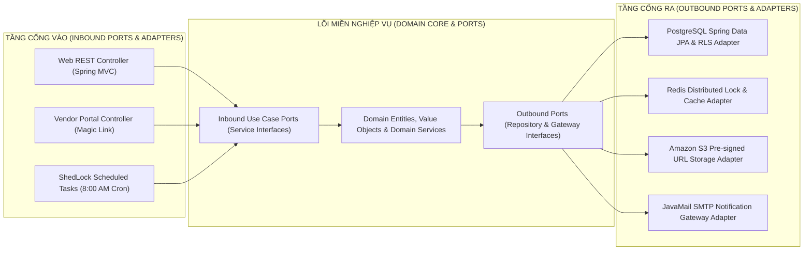
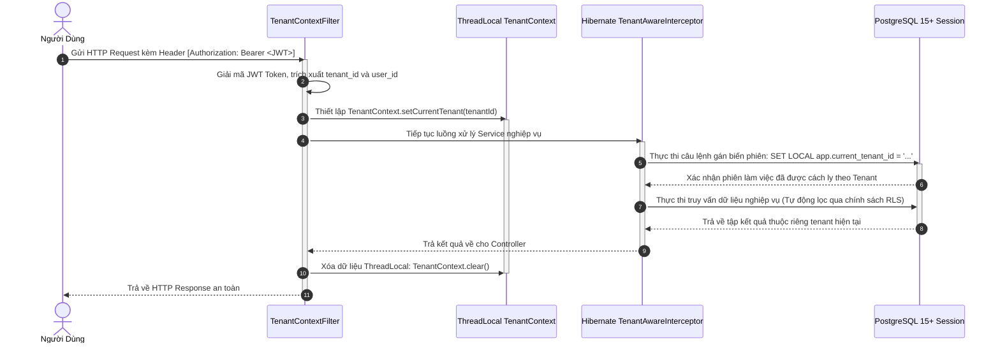
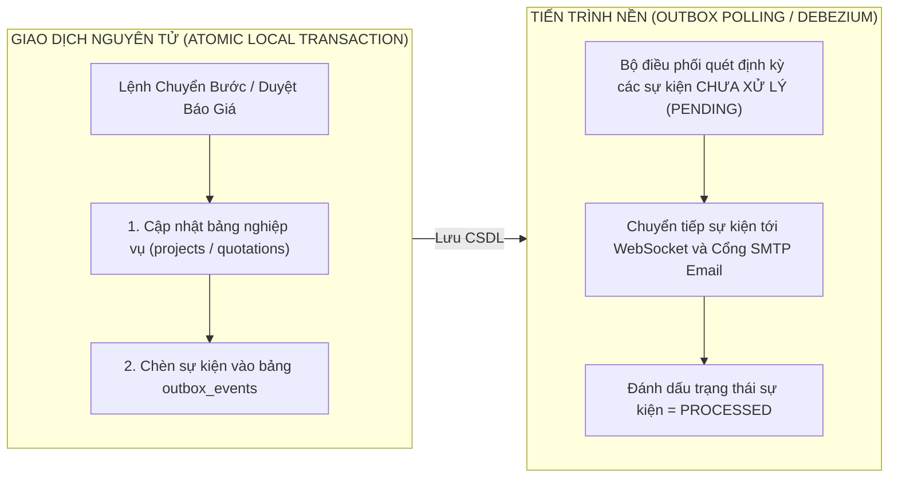

# THIẾT KẾ CHI TIẾT CẤP THẤP (LOW-LEVEL DESIGN - LLD) — PHẦN TỔNG QUAN
## KIẾN TRÚC LỤC GIÁC CORE, NỀN TẢNG ĐA KHÁCH THUÊ VÀ OUTBOX PATTERN
### MÃ TÀI LIỆU: MIBID_LLD_CORE_v1.0

---

## 1. TỔNG QUAN VÀ MÔ HÌNH KIẾN TRÚC LỤC GIÁC (HEXAGONAL ARCHITECTURE)

Hệ thống Backend Mibid được xây dựng trên nền tảng Java 17 và Spring Boot 3 theo mô hình Kiến trúc Lục giác (Hexagonal Architecture / Ports and Adapters) kết hợp thiết kế hướng miền (Domain-Driven Design - DDD). Mô hình này cô lập tuyệt đối lõi nghiệp vụ (Domain Core) khỏi các phụ thuộc bên ngoài như cơ sở dữ liệu quan hệ, bộ nhớ đệm Redis, giao thức HTTP hoặc các cổng dịch vụ bên thứ ba.



---

## 2. CƠ CHẾ CÁCH LY ĐA KHÁCH THUÊ (MULTI-TENANCY CONTEXT)

Hệ thống áp dụng mô hình chia sẻ cơ sở dữ liệu và chia sẻ bảng (Shared Database, Shared Schema) nhưng cách ly tuyệt đối dữ liệu bằng khóa ngoại `tenant_id` kết hợp cơ chế Row-Level Security (RLS) của PostgreSQL.



---

## 3. LỚP THỰC THỂ NỀN TẢNG DÙNG CHUNG (BASE ENTITIES)

Tất cả các thực thể nghiệp vụ trong hệ thống đều kế thừa từ lớp `BaseEntity` dùng chung nhằm đảm bảo tính thống nhất về quản lý khóa chính UUID v4 và thời gian kiểm toán:

```java
@MappedSuperclass
@EntityListeners(AuditingEntityListener.class)
public abstract class BaseEntity {

    @Id
    @GeneratedValue(strategy = GenerationType.UUID)
    @Column(name = "id", updatable = false, nullable = false)
    private UUID id;

    @Column(name = "tenant_id", updatable = false, nullable = false)
    private UUID tenantId;

    @CreatedDate
    @Column(name = "created_at", updatable = false, nullable = false)
    private Instant createdAt;

    @LastModifiedDate
    @Column(name = "updated_at", nullable = false)
    private Instant updatedAt;

    @Version
    @Column(name = "version", nullable = false)
    private Long version; // Khóa lạc quan (Optimistic Locking) chống Lost Update

    // Getters and Setters tiêu chuẩn
}
```

---

## 4. MÔ HÌNH BẢO ĐẢM TOÀN VẸN SỰ KIỆN PHÂN TÁN (TRANSACTIONAL OUTBOX PATTERN)

Khi một giao dịch nghiệp vụ làm thay đổi trạng thái gói thầu thành công (ví dụ: chuyển bước dự án hoặc phê duyệt báo giá), hệ thống không gọi trực tiếp các dịch vụ thông báo hoặc gửi email trong cùng tiến trình để tránh rủi ro treo giao dịch khi mạng chập chờn. Thay vào đó, sự kiện được ghi vào bảng `outbox_events` trong cùng một giao dịch nguyên tử cơ sở dữ liệu:



---

## 5. CƠ CHẾ CHỊU LỖI VÀ KHÓA PHÂN TÁN (RESILIENCE4J & REDIS LOCK)

1. **Khóa phân tán (Redis Distributed Lock):** Sử dụng thư viện Redisson để khóa định danh tài nguyên nhạy cảm (ví dụ `lock:project:transition:{projectId}`) với thời gian sống TTL tối đa 10 giây. Ngăn chặn triệt để 2 nhân viên cùng kéo 1 thẻ dự án sang 2 bước khác nhau đồng thời.
2. **Khả năng chịu lỗi và ngắt mạch (Resilience4j Circuit Breaker):**
   * Đối với các cổng dịch vụ bên ngoài như cổng gửi thư điện tử SMTP hoặc kho lưu trữ S3, hệ thống cấu hình bộ ngắt mạch: Nếu tỷ lệ lỗi vượt quá 50% trong 20 yêu cầu liên tiếp, Circuit Breaker sẽ chuyển sang trạng thái `OPEN`, tự động kích hoạt cơ chế thử lại (Retry with Exponential Backoff) và chuyển vào hàng đợi chờ xử lý sau.
