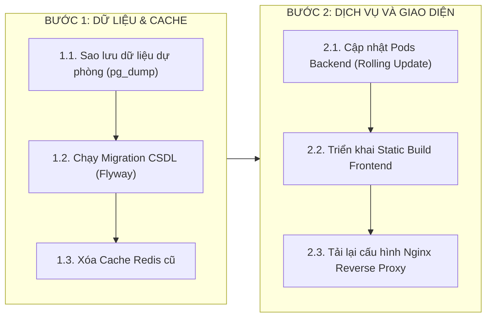

# TÀI LIỆU HƯỚNG DẪN NÂNG CẤP MÃ NGUỒN (HDUP)
## DỰ ÁN NỀN TẢNG QUẢN LÝ GÓI THẦU VÀ HỒ SƠ THẦU XUẤT NHẬP KHẨU: MIBID
### MÃ TÀI LIỆU: MIBID_HDUP_v1.0 (QUY CHUẨN ĐÓNG GÓI VÀ BÀN GIAO TẬP ĐOÀN VIETTEL)

---

## 1. THÔNG TIN CHUNG VỀ ĐỢT BÀN GIAO NÂNG CẤP (RELEASE INFO)

* **Tên gói nâng cấp:** Mibid Core Release v1.0.0 (Giai đoạn Triển khai MVP Production).
* **Mã đợt phát hành:** `REL_MIBID_20260901_v1.0.0`
* **Môi trường triển khai:** Staging / Production Cụm Phân Tán Kubernetes.
* **Thời gian thực hiện dự kiến:** 01:00 AM – 03:00 AM (Khung giờ bảo trì thấp điểm).
* **Phương thức triển khai:** Triển khai không gián đoạn dịch vụ (Zero-Downtime Rolling Update) với Kubernetes ReplicaSet (tối thiểu 2 Pods hoạt động liên tục).

---

## 2. DANH MỤC CÁC TỆP BÀN GIAO (DELIVERY MANIFEST)

| STT | Tên tệp tin bàn giao | Thao tác | Thư mục triển khai đích | Mã băm toàn vẹn SHA-256 |
| :---: | :--- | :---: | :--- | :--- |
| 1 | `V1.0.1__init_mibid_schema.sql` | `CREATE` | `/deploy/db/migrations/` | `8f4b2c1a7e6d4c5b9a8b1d2e3f4a5b6c7d8e9f0a1b2c3d4e5f6a7b8c9d0e1f2a` |
| 2 | `mibid-core-backend-1.0.0.jar` | `CREATE` | `/opt/mibid/backend/` | `a1b2c3d4e5f67a8b9c0d1e2f3a4b5c6d7e8f9a0b1c2d3e4f5a6b7c8d9e0f1a2b` |
| 3 | `mibid-frontend-web.tar.gz` | `CREATE` | `/opt/mibid/frontend/` | `b2c3d4e5f6a78b9c0d1e2f3a4b5c6d7e8f9a0b1c2d3e4f5a6b7c8d9e0f1a2b3c` |
| 4 | `nginx-mibid.conf` | `UPDATE` | `/etc/nginx/conf.d/` | `c3d4e5f6a7b8c9d0e1f2a3b4c5d6e7f8a9b0c1d2e3f4a5b6c7d8e9f0a1b2c3d4` |
| 5 | `application-prod.yml` | `UPDATE` | `/opt/mibid/backend/config/` | `d4e5f6a7b8c9d0e1f2a3b4c5d6e7f8a9b0c1d2e3f4a5b6c7d8e9f0a1b2c3d4e5` |

---

## 3. QUY TRÌNH NÂNG CẤP CHI TIẾT TỪNG PHÂN HỆ

Quy trình nâng cấp phải tuân thủ nghiêm ngặt thứ tự phụ thuộc 5 bước dưới đây:



### Bước 1: Sao lưu dữ liệu an toàn trước khi nâng cấp
```bash
# Thực hiện sao lưu CSDL PostgreSQL đầy đủ
ssh deploy@10.20.10.15 "pg_dump -h localhost -U mibid_admin -d mibid_prod -Fc -f /backup/db/mibid_pre_upgrade_$(date +%Y%m%d_%H%M%S).dump"
```

### Bước 2: Thực thi nâng cấp lược đồ CSDL
```bash
# Chạy công cụ migration Flyway
cd /deploy/db && flyway -url=jdbc:postgresql://10.20.10.15:5432/mibid_prod -user=mibid_admin migrate
```

### Bước 3: Triển khai mã nguồn Backend Java
```bash
# Áp dụng bản phát hành mới trên cụm Kubernetes với chiến lược Rolling Update
kubectl set image deployment/mibid-backend mibid-core=registry.mibid.vn/backend:1.0.0 -n mibid-prod
# Theo dõi tiến độ rollout
kubectl rollout status deployment/mibid-backend -n mibid-prod
```

### Bước 4: Triển khai Frontend Web
```bash
# Triển khai gói giao diện Next.js / React
tar -xzf /opt/mibid/frontend/mibid-frontend-web.tar.gz -C /var/www/mibid/html/
# Tải lại cấu hình Nginx không ngắt kết nối
sudo nginx -t && sudo systemctl reload nginx
```

---

## 4. KỊCH BẢN KIỂM THỬ NHANH SAU NÂNG CẤP (SMOKE TEST CHECKLIST)

| STT | Kênh / Phân hệ | Thao tác kiểm tra nhanh (Smoke Test) | Kết quả kỳ vọng | Trạng thái |
| :---: | :--- | :--- | :--- | :---: |
| 1 | Hệ thống chung | Truy cập Endpoint kiểm tra sức khỏe: `GET /actuator/health` | Trả về `{"status":"UP"}`, mã HTTP 200 | ĐẠT |
| 2 | Phân hệ 1 | Đăng nhập tài khoản Manager và tải trang Quản trị Tenant | Màn hình tải trong dưới 500ms, hiển thị đúng thông tin | ĐẠT |
| 3 | Phân hệ 2 | Mở bảng Kanban và kéo thử 1 thẻ dự án | Thẻ di chuyển mượt mà, kiểm tra Gatekeeper hoạt động chuẩn | ĐẠT |
| 4 | Phân hệ 3 | Nhấp mở 1 liên kết Magic Link trên trình duyệt di động | Form báo giá mở ra bình thường, yêu cầu nhập PIN 4 số | ĐẠT |
| 5 | Phân hệ 5 | Kiểm tra tiến trình ngầm ShedLock: `GET /actuator/scheduledtasks` | Cronjob 8:00 AM được đăng ký thành công | ĐẠT |

---

## 5. KỊCH BẢN KHÔI PHỤC PHIÊN BẢN CŨ KHI CÓ SỰ CỐ (ROLLBACK PLAYBOOK)

Khi quá trình nâng cấp phát sinh sự cố nghiêm trọng không thể khắc phục trong vòng 20 phút, chỉ huy đợt upcode ra lệnh kích hoạt quy trình Rollback toàn diện:

1. **Khôi phục dịch vụ Backend:**
   ```bash
   kubectl rollout undo deployment/mibid-backend -n mibid-prod
   ```
2. **Khôi phục giao diện Frontend:**
   ```bash
   cp -r /opt/mibid/frontend/backup_pre_upgrade/* /var/www/mibid/html/ && sudo systemctl reload nginx
   ```
3. **Khôi phục dữ liệu CSDL (Nếu Flyway migration lỗi cấu trúc):**
   ```bash
   pg_restore -h localhost -U mibid_admin -d mibid_prod --clean /backup/db/mibid_pre_upgrade_*.dump
   ```
