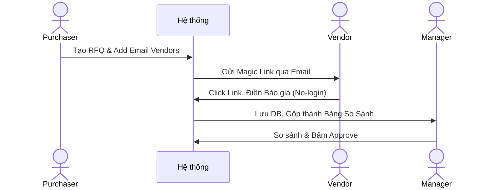

# ĐẶC TẢ YÊU CẦU PHẦN MỀM TOÀN DIỆN (FULL-STACK SRS)
**Hệ thống Quản lý Gói thầu và Hồ sơ thầu XNK (Mibid)**

Tài liệu này tổng hợp toàn bộ Đặc tả Chức năng (FS - Functional Specification) và Đặc tả Kỹ thuật (SRS - Software Requirements Specification) thành một khối thống nhất. Tài liệu này cung cấp đầu vào tiêu chuẩn cho:
- **Frontend Developer:** Bố cục UI (Wireframe), Quy tắc nhập liệu (Validations).
- **Backend Developer:** Từ điển dữ liệu (DB Schema), Sơ đồ trạng thái, Logic API, Quản lý quyền.
- **QA/Tester:** Luồng nghiệp vụ chuẩn (Happy path) và Luồng ngoại lệ (Exceptions) để lên Test Cases.

---

## 1. KIẾN TRÚC HỆ THỐNG & PHÂN QUYỀN (ARCHITECTURE & RBAC)

Hệ thống áp dụng mô hình **Hybrid Access Control**: RBAC (Quyền hệ thống) kết hợp ABAC (Quyền theo dự án).

### 1.1 Quyền cấp Hệ thống (System Roles)
| Resource / Action | System Admin | Company Manager | Staff / Employee |
| :--- | :---: | :---: | :---: |
| **User Account** | CRUD | R | None |
| **Workflow Template**| CRUD | CRU | R |
| **All Projects** | R | R | None |

### 1.2 Quyền cấp Dự án (Project-based Roles)
Một nhân sự có thể làm `OWNER` ở Dự án A, nhưng chỉ là `MEMBER` ở Dự án B.

| Resource / Action | OWNER (PM) | SOURCING LEAD | SALES EXEC | LOGISTICS EXEC |
| :--- | :--- | :--- | :--- | :--- |
| **Project Details** | CRUD | R | R | R |
| **Project Stage** | Cập nhật (Kéo thẻ) | Kéo tới/lui bước Sourcing | Kéo bước Bidding | Kéo bước Logistics |
| **Document Approve**| Duyệt/Từ chối | None | None | None |

---

## 2. PHÂN HỆ 1: QUẢN TRỊ NỀN TẢNG, WORKFLOW ENGINE & DMS

### 2.1 Tổng quan Phân hệ
- **Mục tiêu:** Quản lý tài khoản, thiết lập luồng công việc động (Dynamic Workflow) thay vì fix cứng bằng code, và quản lý kho tài liệu số (DMS) tập trung.
- **State Machine:**
  - **Tài liệu (Document):** `PENDING_APPROVAL` (Chờ duyệt) -> `APPROVED` (Đã duyệt) hoặc `REJECTED` (Bị trả lại -> Bắt buộc upload bản V2).
  - **Dự án (Project):** `PREPARING` -> `SOURCING` -> `BIDDING` -> `WON/LOST` -> `OPERATIONS`.

### 2.2 Đặc tả Chức năng: Transition Gatekeeper (Chuyển bước Dự án)
- **Luồng xử lý (UI/UX):** Màn hình Kanban Board. User kéo thẻ dự án từ Cột A sang Cột B.
- **Business Logic & Validations:**
  - Hệ thống kiểm tra bảng `stage_doc_rules` xem Bước B yêu cầu tài liệu gì.
  - Nếu thiếu tài liệu (hoặc có tài liệu nhưng bị Reject): Báo lỗi `422 Unprocessable Entity`. Kéo thẻ thất bại, thẻ tự giật về chỗ cũ.
  - Exception: Nếu thiếu tài liệu nhưng rule là "Soft Warning" -> Hiện Popup UI *"Dự án đang thiếu [Tên tài liệu], bạn có chắc muốn đi tiếp?"*. Bấm OK thì cho qua (`?force=true`).
- **Data Dictionary mapping:** `projects`, `workflow_stages`, `stage_doc_rules`, `project_documents`.

### 2.3 Từ điển Dữ liệu Phân hệ 1
| Tên Bảng | Thuộc tính chính (Constraints) | Mô tả |
| :--- | :--- | :--- |
| `users` | `id` (PK), `email` (Unique), `password_hash`, `system_role` | Quản lý tài khoản login. |
| `project_members` | `project_id` (PK), `user_id` (PK), `project_role` | Gắn User vào Dự án kèm Role. |
| `workflow_stages` | `id` (PK), `workflow_id` (FK), `sequence` (INT) | Định nghĩa các bước. |
| `stage_doc_rules` | `stage_id` (PK), `doc_type_id` (PK), `requires_approval` (BOOL) | Cấu hình Gatekeeper. |
| `project_documents`| `id` (PK), `project_id` (FK), `file_url`, `status` | File vật lý tải lên S3. |

---

## 3. PHÂN HỆ 2: SOURCING & MAGIC LINK

### 3.1 Tổng quan Phân hệ
- **Mục tiêu:** Thu thập báo giá từ Vendor mà không bắt họ tạo tài khoản.
- **Sơ đồ Tương tác:**

### 3.2 Đặc tả Màn hình 1: Quản lý & Tạo Yêu cầu (RFQ)
- **Wireframe Mockup:** Bảng danh sách các RFQ. Nút `[+ Tạo mới]`.
- **UI Validations (Form Tạo RFQ):**
  - `Dự án`: Dropdown Select (Bắt buộc).
  - `Hạn chót`: Datetime Picker (Bắt buộc, > Thời gian hiện tại).
  - `Line Items`: Dynamic Table (Mô tả, Số lượng > 0, Đơn vị).
- **Logic / Storage:** Lưu trạng thái `DRAFT` (Lưu nháp) hoặc `PUBLISHED` (Xuất bản - Để gửi link).

### 3.3 Đặc tả Màn hình 2: Vendor Portal (Magic Link)
- **UI & Flow:** Vendor click link -> Mở Form nhập liệu (Chỉ thấy số lượng hàng).
- **Validations (Web Form):**
  - `Đơn giá`: Number (>= 0).
  - `File đính kèm`: Drag & Drop (Chỉ nhận PDF/JPG/PNG, Max 10MB).
- **Backend API Exceptions:** 
  - Token được mã hóa JWT. Nếu `expires_at < NOW()` hoặc Token đã bị đổi `status = 'USED'` -> Trả về lỗi 403/410, giao diện báo "Link đã hết hạn".

### 3.4 Đặc tả Màn hình 3: Comparison Matrix (Duyệt giá)
- **UI & Flow:** Màn hình lưới Grid, cột bên trái là Danh sách Hàng hóa, các cột bên phải là báo giá của Vendor A, Vendor B, Vendor C.
- **Logic:** Nút `[Duyệt Vendor A]` -> Bật Modal Confirm -> Chuyển Status Quote A = `APPROVED`, các Quotes khác = `REJECTED`. Hệ thống đóng RFQ (`CLOSED`).

### 3.5 Từ điển Dữ liệu Phân hệ 2
| Tên Bảng | Thuộc tính chính (Constraints) | Mô tả |
| :--- | :--- | :--- |
| `rfqs` | `id` (PK), `project_id` (FK), `deadline`, `status` | Bản ghi Yêu cầu báo giá. |
| `rfq_line_items` | `id` (PK), `rfq_id` (FK), `description`, `qty` | Hàng hóa cần mua. |
| `magic_links` | `id` (PK), `token` (Unique), `status`, `expires_at` | Quản lý Link mã hóa JWT. |
| `quotations` | `id` (PK), `rfq_id` (FK), `grand_total`, `status` | Báo giá Vendor gửi. |

---

## 4. PHÂN HỆ 3: BIDDING, OPERATIONS & REPORTING

### 4.1 Tổng quan Phân hệ
- **Mục tiêu:** Quản lý công việc vi mô (Tasks), Theo dõi tiến độ Lô hàng (Shipment Tracking) và Thống kê các chỉ số báo cáo kinh doanh.

### 4.2 Đặc tả Chức năng: Task Management
- **Luồng Sinh Task tự động:** Ngay khi hệ thống chuyển bước Dự án (Kéo thẻ Kanban), Backend tự động chọc vào bảng cấu hình `workflow_stage_tasks` -> Sinh ra các tasks cho bước mới -> Gắn `assignee_id` cho nhân sự phụ trách -> Gửi In-app Notification.
- **Validations:** Màn hình Detail Dự án liệt kê danh sách Task (To-do, Doing, Done). Có thể cấu hình Gatekeeper: "Phải hoàn thành 100% Task mới được chuyển dự án qua bước tiếp theo".

### 4.3 Đặc tả Chức năng: Shipment & Operations Tracking
- **UI & Flow:** Màn hình Logistics nhập thông tin Vận đơn (BL), chọn Đơn vị vận chuyển (Forwarder), và nhập các mốc ETA/ETD (Ngày giao hàng dự kiến).
- **Backend Cronjob:** Mỗi 8:00 AM, hệ thống quét bảng `shipment_milestones`. Nếu Ngày dự kiến = Ngày mai -> Gửi thông báo nhắc nhở. Nếu Ngày dự kiến < Hôm nay mà chưa hoàn thành (`is_completed = FALSE`) -> Đánh dấu Overdue đỏ chót trên bảng điều khiển.

### 4.4 Đặc tả Chức năng: Báo cáo & Dashboard
- **Win/Loss Ratio:** Biểu đồ tròn hiển thị số lượng dự án Trúng thầu vs Trượt thầu. (Query: Đếm số Projects theo Enum Status WON/LOST trong khoảng thời gian).
- **Bottleneck Report:** Tính trung bình Cycle Time (Thời gian nằm lại ở mỗi bước Kanban). Biểu đồ cột giúp Manager phát hiện khâu nào (Sourcing hay Logistics) đang làm chậm tiến độ toàn công ty.

### 4.5 Từ điển Dữ liệu Phân hệ 3
| Tên Bảng | Thuộc tính chính (Constraints) | Mô tả |
| :--- | :--- | :--- |
| `project_tasks` | `id` (PK), `project_id` (FK), `assignee_id`, `status` | Các công việc vi mô. |
| `shipments` | `id` (PK), `project_id` (FK), `forwarder_id`, `bl_number`| Mã vận đơn. |
| `shipment_milestones`| `id` (PK), `shipment_id` (FK), `planned_date`, `is_completed`| Mốc thời gian theo dõi. |
