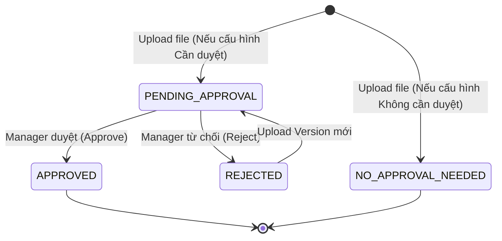
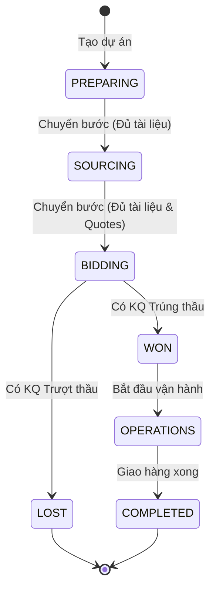

# Formal SRS: Hệ thống Quản trị, IAM & Workflow Engine

Tài liệu này đặc tả các yêu cầu kỹ thuật chi tiết nhất cho Phân hệ Quản trị nền tảng. Các chuẩn mực áp dụng: Sơ đồ trạng thái (State Machine), Ma trận phân quyền (RBAC Matrix), Từ điển dữ liệu chuẩn và Đặc tả Use Case nghiêm ngặt.

---

## 1. MA TRẬN PHÂN QUYỀN (PERMISSION & RBAC MATRIX)

Hệ thống áp dụng mô hình Hybrid Access Control: RBAC (Quyền cấp hệ thống) kết hợp ABAC (Quyền cấp dự án).

### 1.1 Quyền cấp Hệ thống (System Roles)
Chỉ định những hành động User được làm ở cấp toàn cục.

| Resource / Action | System Admin | Company Manager | Staff / Employee |
| :--- | :---: | :---: | :---: |
| **User Account** | CRUD | R | None |
| **Workflow Template**| CRUD | CRU | R |
| **All Projects** | R | R | None |

*(Ghi chú: CRUD = Create, Read, Update, Delete)*

### 1.2 Quyền cấp Dự án (Project-based Roles)
Chỉ định hành động trong phạm vi 1 Gói thầu / Dự án cụ thể. Một Staff có thể là `OWNER` ở Dự án A, nhưng chỉ là `MEMBER` ở Dự án B.

| Resource / Action | OWNER (PM) | SOURCING LEAD | SALES EXEC | LOGISTICS EXEC |
| :--- | :---: | :---: | :---: | :---: |
| **Project Details** | CRUD | R | R | R |
| **Project Stage (Kéo thẻ)**| U | U (Only to/from Sourcing) | U (Only Bidding) | U (Only Logistics) |
| **RFQ & Magic Link**| CRUD | CRUD | R | None |
| **Document Upload** | C | C | C | C |
| **Document Approve**| U (Approve/Reject) | None | None | None |

---

## 2. STATE MACHINE (SƠ ĐỒ TRẠNG THÁI)

### 2.1 State Machine của Hồ sơ tài liệu (Document)

### 2.2 State Machine của Gói thầu / Dự án

---

## 3. TỪ ĐIỂN DỮ LIỆU (DATA DICTIONARY)

### 3.1 Bảng `users`
| Field Name | Data Type | Constraint | Default | Description |
| :--- | :--- | :--- | :--- | :--- |
| `id` | UUID | PK, Not Null | (Auto) | Định danh nội bộ |
| `email` | VARCHAR(100) | Unique, Not Null | | Validate Format Email. |
| `password_hash` | VARCHAR(255) | Not Null | | Thuật toán Bcrypt. |
| `system_role` | ENUM | Not Null | 'STAFF' | ['ADMIN', 'MANAGER', 'STAFF'] |
| `status` | ENUM | Not Null | 'ACTIVE'| ['ACTIVE', 'INACTIVE', 'SUSPENDED'] |

### 3.2 Bảng `project_members` (Phân quyền ABAC)
| Field Name | Data Type | Constraint | Default | Description |
| :--- | :--- | :--- | :--- | :--- |
| `project_id` | UUID | PK, FK | | Foreign Key -> `projects.id` |
| `user_id` | UUID | PK, FK | | Foreign Key -> `users.id` |
| `project_role`| ENUM | Not Null | | ['OWNER', 'SOURCING', 'SALES', 'LOGISTICS'] |

### 3.3 Bảng `workflow_stages`
| Field Name | Data Type | Constraint | Default | Description |
| :--- | :--- | :--- | :--- | :--- |
| `id` | UUID | PK, Not Null | (Auto) | |
| `workflow_id` | UUID | FK, Not Null | | FK -> `workflows.id` |
| `stage_name` | VARCHAR(50) | Not Null | | VD: 'Sourcing', 'Bidding' |
| `sequence` | INT | Not Null, > 0 | | Thứ tự bước (1, 2, 3...) |
| `sla_hours` | INT | Nullable, >=0 | NULL | Giới hạn thời gian (Tạo SLA) |

### 3.4 Bảng `stage_doc_rules` (Quy tắc Gatekeeper của 1 Bước)
| Field Name | Data Type | Constraint | Default | Description |
| :--- | :--- | :--- | :--- | :--- |
| `stage_id` | UUID | PK, FK | | Bước cần chặn |
| `doc_type_id` | UUID | PK, FK | | Loại tài liệu bắt buộc |
| `requires_approval`| BOOLEAN | Not Null | FALSE | Bắt buộc phải được Manager duyệt? |
| `is_hard_stop` | BOOLEAN | Not Null | TRUE | TRUE: Cấm qua bước; FALSE: Cảnh báo |

---

## 4. USE CASE SPECIFICATION CHI TIẾT (ĐẶC TẢ USE CASE)

### UC_01: Chuyển bước Dự án (Transition Gatekeeper)
*Luồng nghiệp vụ cốt lõi khi User kéo thẻ Kanban Dự án sang Bước tiếp theo.*

**1. Pre-conditions (Điều kiện tiên quyết):**
- System Role: Bất kỳ (ACTIVE).
- Project Role: User phải có trong `project_members` của Dự án này.
- Current State: Dự án không ở trạng thái `WON`, `LOST` hoặc `COMPLETED`.

**2. Triggers (Kích hoạt):**
- Thao tác: Kéo & Thả (Drag & Drop) thẻ trên UI.
- API Endpoint: `PUT /api/v1/projects/{project_id}/transition`
- Payload: `{"target_stage_id": "UUID_Stage_B"}`

**3. Normal Flow (Luồng chuẩn - Happy Path):**
1. System nhận request, lấy ra danh sách các `doc_type_id` bắt buộc của `target_stage_id` từ bảng `stage_doc_rules`.
2. System query bảng `project_documents` của dự án để đếm số tài liệu tương ứng.
3. Nếu cấu hình `requires_approval = TRUE`, System kiểm tra thêm điều kiện `status = 'APPROVED'`.
4. System xác nhận không thiếu tài liệu nào theo Rule.
5. System update bảng `projects`: `current_stage_id = target_stage_id`.
6. System insert log vào bảng `project_activities`.
7. System trả về `HTTP 200 OK` với Payload: `{"status": "success", "new_stage": "UUID_Stage_B"}`.

**4. Exception/Alternative Flow (Luồng lỗi / Ngoại lệ):**
- **E1: Thiếu quyền ABAC:** User không có trong `project_members` hoặc Role bị giới hạn. System trả về `HTTP 403 Forbidden`. Code không thực thi.
- **E2: Vi phạm Rule Hard Stop:** Thiếu tài liệu hoặc tài liệu đang ở dạng `PENDING_APPROVAL`, mà `is_hard_stop = TRUE`. 
  - System trả về `HTTP 422 Unprocessable Entity`.
  - Payload: `{"error_code": "MISSING_DOCS_HARD_STOP", "missing_docs": ["Báo giá Vendor"]}`.
- **E3: Vi phạm Rule Soft Warning:** Thiếu tài liệu nhưng `is_hard_stop = FALSE`.
  - System trả về `HTTP 409 Conflict`.
  - Payload: `{"error_code": "MISSING_DOCS_WARNING", "missing_docs": ["Biên bản họp"]}`.
  - UI hiện popup xác nhận "Vẫn muốn đi tiếp?". Nếu User bấm OK, UI gửi lại Request kèm flag `?force=true`. Trở lại Normal Flow (Bước 5).

**5. Post-conditions (Sau khi thực hiện):**
- Thẻ dự án được dời sang cột mới trên Kanban của toàn bộ User theo thời gian thực (Websocket).
- Trigger sinh Event: `PROJECT_STAGE_CHANGED` (Dành cho Auto-generate Task).
