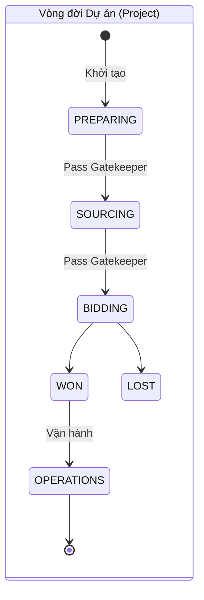
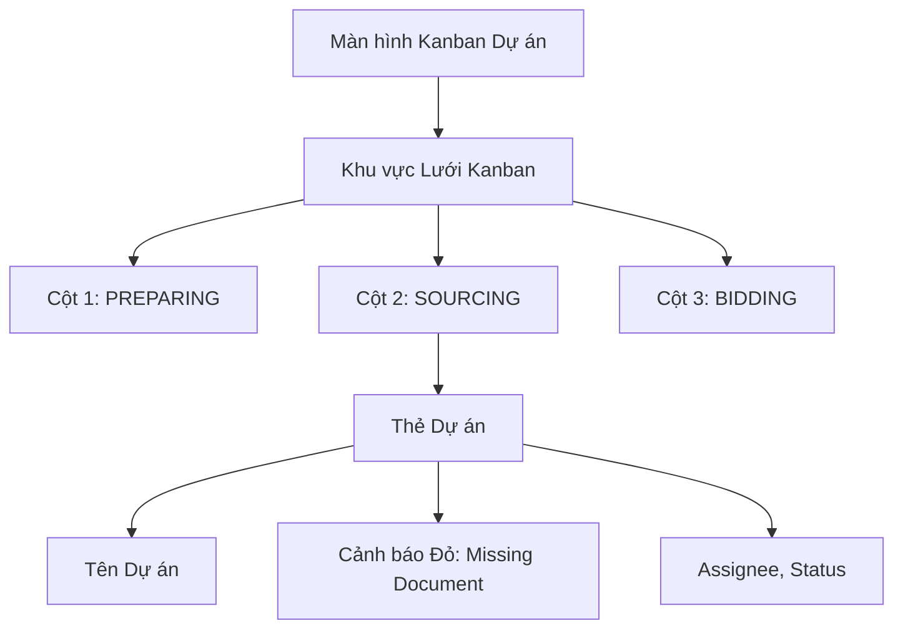
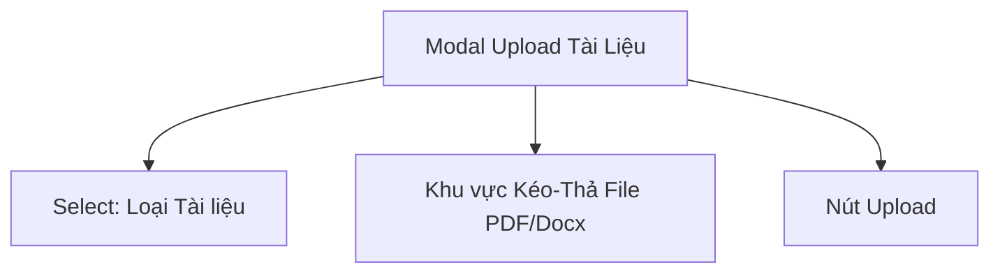
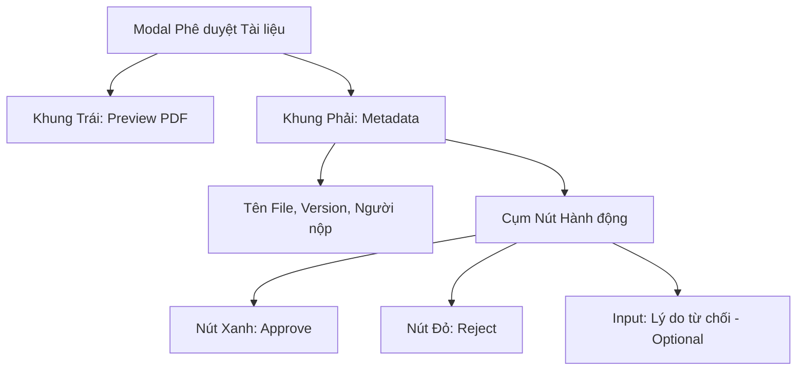

# TÀI LIỆU ĐẶC TẢ YÊU CẦU PHẦN MỀM (SRS)
**Phân hệ: Quản trị Nền tảng, Workflow Engine & DMS**

Tài liệu này áp dụng Chuẩn Đặc tả Toàn diện V2 (Golden Template), hợp nhất Sơ đồ cấu trúc giao diện (Mermaid Component Tree), Hình ảnh Giao diện trực quan (Visual UI Mockups), Từ điển dữ liệu và Đặc tả Use Case cạn kiệt cho từng luồng CRUD.

---

## 1. TỔNG QUAN PHÂN HỆ & VAI TRÒ

### 1.1 Mục tiêu
Cung cấp Core Engine cho toàn hệ thống Mibid: 
- Thiết lập Luồng công việc linh hoạt (Dynamic Workflow) thay vì hard-code các bước.
- Cơ chế **Gatekeeper**: Khóa chặt việc chuyển bước dự án nếu thiếu tài liệu bắt buộc.
- Hệ thống Quản lý Tài liệu (DMS): Upload, lưu trữ và quy trình Phê duyệt tài liệu.

### 1.2 Sơ đồ State Machine (Luồng Trạng thái)


### 1.3 Ma trận Phân quyền (Permission Matrix)
| Chức năng CRUD | SUPER_ADMIN | PROJECT_OWNER | SOURCING/LOGISTICS |
| :--- | :---: | :---: | :---: |
| **Workflow Rules - Quản lý** | CRUD | Chỉ Xem | Không |
| **Dự án - Kéo thẻ Kanban** | Có | Có | Chỉ kéo ở Cột mình phụ trách |
| **Tài liệu - Upload** | Có | Có | Có |
| **Tài liệu - Approve/Reject**| Có | Có | Không |

---

## 2. TỪ ĐIỂN DỮ LIỆU (DATA DICTIONARY)

### Bảng `projects` (Dự án)
| Tên Cột | Kiểu Dữ Liệu | Ràng buộc | Mặc định | Mô tả |
| :--- | :--- | :--- | :--- | :--- |
| `id` | UUID | PK, Not Null | (Auto) | |
| `name` | VARCHAR(255) | Not Null | | Tên Dự án |
| `workflow_id` | UUID | FK, Not Null | | Luồng áp dụng |
| `current_stage_id` | UUID | FK | | Bước hiện tại |

### Bảng `workflow_stages` (Các bước của Luồng)
| Tên Cột | Kiểu Dữ Liệu | Ràng buộc | Mặc định | Mô tả |
| :--- | :--- | :--- | :--- | :--- |
| `id` | UUID | PK, Not Null | (Auto) | |
| `workflow_id` | UUID | FK, Not Null | | |
| `name` | VARCHAR(100) | Not Null | | VD: SOURCING |
| `sequence` | INT | Not Null | | Thứ tự bước (1, 2, 3) |

### Bảng `stage_doc_rules` (Cấu hình Gatekeeper)
| Tên Cột | Kiểu Dữ Liệu | Ràng buộc | Mặc định | Mô tả |
| :--- | :--- | :--- | :--- | :--- |
| `stage_id` | UUID | PK, FK | | Bắt đầu chuyển vào bước này... |
| `doc_type_id` | UUID | PK, FK | | ...thì phải có loại tài liệu này. |
| `requires_approval` | BOOLEAN | Not Null | FALSE | Có cần status = APPROVED không? |
| `is_hard_stop` | BOOLEAN | Not Null | TRUE | False = Chỉ cảnh báo, True = Chặn cứng |

### Bảng `project_documents` (Kho Tài liệu DMS)
| Tên Cột | Kiểu Dữ Liệu | Ràng buộc | Mặc định | Mô tả |
| :--- | :--- | :--- | :--- | :--- |
| `id` | UUID | PK, Not Null | (Auto) | |
| `project_id` | UUID | FK, Not Null | | |
| `doc_type_id` | UUID | FK, Not Null | | |
| `file_url` | VARCHAR(500) | Not Null | | Đường dẫn S3 |
| `status` | VARCHAR(20) | Not Null | 'PENDING' | ['PENDING', 'APPROVED', 'REJECTED'] |

---

## 3. ĐẶC TẢ CRUD: WORKFLOW ENGINE & KANBAN

### 3.1 Màn hình Danh sách Cấu hình Luồng (Workflow Rules Config)
**Hình ảnh Giao diện (Mockup UI):**


**Cấu trúc Component (Mermaid):**
```mermaid
flowchart TD
    Config[Màn hình Cấu hình Luồng]
    Config --> Toolbar[Thanh điều hướng]
    Toolbar --> BtnAddStage[Nút '+ Add New Stage']
    Config --> StageList[Danh sách các Bước (Stages)]
    StageList --> StageItem[Dòng: Tên Bước]
    StageItem --> DocTags[Các Tag Tài liệu yêu cầu]
    StageItem --> TglApprove[Toggle: Requires Approval]
    StageItem --> TglHardStop[Toggle: Hard Stop]
    StageItem --> BtnEdit[Nút Sửa/Xóa]
```
**UI Validations & Logic:** 
- Khi bật Toggle `Requires Approval` -> Hệ thống sẽ bắt buộc Tài liệu nộp lên phải được Manager duyệt.
- `Toggle Hard Stop`: Quyết định tính chất chặn của Gatekeeper.

### 3.2 Màn hình Quản lý Dự án (Kanban Board)
**Hình ảnh Giao diện (Mockup UI):**


**Cấu trúc Component (Mermaid):**

**Đặc tả Use Case: Transition Gatekeeper (Kéo thả thẻ Dự án)**
- **Pre-conditions:** User có quyền chuyển bước tương ứng với Cột đích.
- **Triggers:** Giao diện Drag & Drop thẻ dự án sang cột mới. API `PUT /api/v1/projects/{id}/transition`. Payload: `{"target_stage_id": "uuid"}`.
- **Normal Flow:**
  1. Backend quét bảng `stage_doc_rules` của Cột đích.
  2. Backend tra cứu `project_documents` xem Dự án đã nộp đủ tài liệu chưa. Nếu rule có `requires_approval = true` thì status tài liệu phải là `APPROVED`.
  3. Mọi điều kiện thỏa mãn -> Update `projects.current_stage_id`.
  4. Trả HTTP 200. Giao diện thả thẻ thành công.
- **Exception Flow:**
  - **Lỗi Hard Stop:** Thiếu tài liệu hoặc bị Reject, rule là Hard Stop -> Trả `HTTP 422 Unprocessable Entity` kèm Message mảng giấy tờ còn thiếu. Thẻ Kanban giật lùi lại cột cũ.
  - **Cảnh báo Soft Stop:** Thiếu tài liệu nhưng rule là Soft Stop -> Trả `HTTP 409 Conflict`. UI bật Popup Hỏi "Vẫn muốn đi tiếp?". Bấm Có -> Gửi lại request với param `?force=true`.

---

## 4. ĐẶC TẢ CRUD: DOCUMENT MANAGEMENT SYSTEM (DMS)

### 4.1 Màn hình Tải Tài liệu (Upload Modal)
**Cấu trúc Component (Mermaid):**

**Đặc tả Use Case: Nộp Tài liệu**
- **Triggers:** Click `[Upload]`. `POST /api/v1/projects/{id}/documents`.
- **Normal Flow:** Upload File lên S3. Insert Record vào `project_documents` với status `PENDING`. Trả HTTP 201.

### 4.2 Màn hình Phê duyệt Tài liệu (Document Approval Detail)
**Hình ảnh Giao diện (Mockup UI):**


**Cấu trúc Component (Mermaid):**


**UI Validations:**
- Nút `[Reject]` yêu cầu `Comment` (Lý do từ chối) phải được điền > 10 ký tự.

**Đặc tả Use Case: Duyệt/Từ chối Tài liệu**
- **Triggers:** Click `[Approve]` hoặc `[Reject]`. `PUT /api/v1/documents/{id}/status`.
- **Normal Flow:**
  1. Update `status` của record trong `project_documents`.
  2. Ghi Log vào bảng `document_audit_logs` (Bao gồm comment).
  3. Gửi Socket Notify cho người nộp. Trả HTTP 200.
- **Exception Flow:** User không có Role MANAGER/OWNER -> `HTTP 403 Forbidden`. User gửi trạng thái REJECT nhưng không truyền `comment` -> `HTTP 400 Bad Request`.
