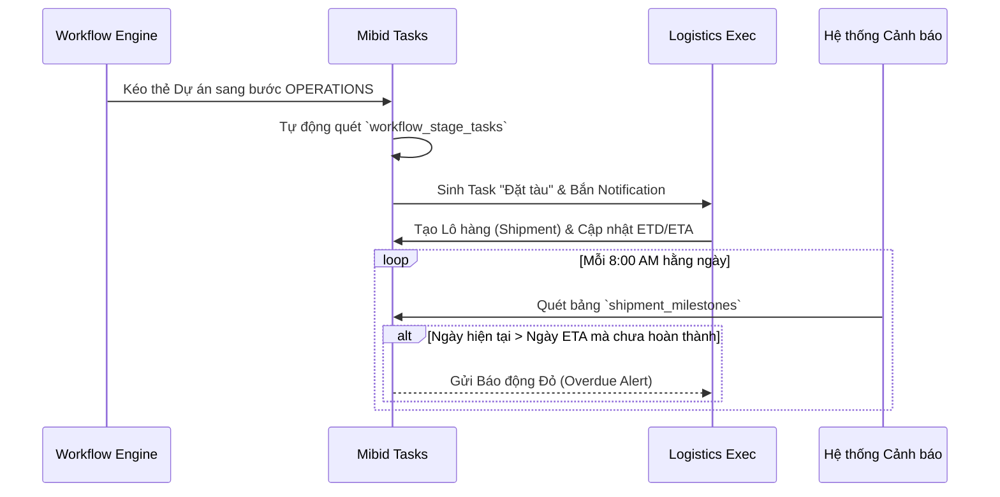
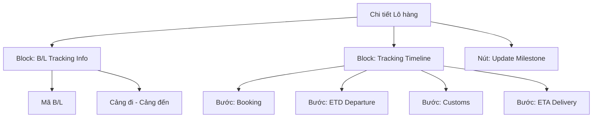

# TÀI LIỆU ĐẶC TẢ YÊU CẦU PHẦN MỀM (SRS)
**Phân hệ: Bidding, Operations & Reporting**

Tài liệu này áp dụng Chuẩn Đặc tả Toàn diện V2 (Golden Template), quy định chi tiết hoạt động tạo Task tự động, theo dõi Vận đơn (Shipments/Logistics) và Trực quan hóa Báo cáo Kinh doanh (Dashboards).

---

## 1. TỔNG QUAN PHÂN HỆ & VAI TRÒ

### 1.1 Mục tiêu
Quản trị công việc vi mô (Tasks) của từng nhân sự trong Dự án. Quản lý các mốc thời gian của Lô hàng (Shipment Milestones) tránh tình trạng trễ hẹn. Phân tích dữ liệu (Analytics) giúp Ban giám đốc ra quyết định.

### 1.2 Sơ đồ Tương tác Luồng Công việc (Workflow Sequence)


### 1.3 Ma trận Phân quyền (Permission Matrix)
| Chức năng CRUD | MANAGER | PROJECT_OWNER | ASSIGNEE (Nhân viên) |
| :--- | :---: | :---: | :---: |
| **Tasks - Cấu hình Task tự động** | CRUD | Chỉ Xem | Không |
| **Tasks - Cập nhật Status** | Có | Có | Chỉ cập nhật Task được giao |
| **Shipments - Milestone** | Phê duyệt | Quản lý | Thực thi (Update) |
| **Dashboards - Xem Báo cáo** | Toàn Công ty| Theo Dự án | Không |

---

## 2. TỪ ĐIỂN DỮ LIỆU (DATA DICTIONARY)

### Bảng `project_tasks` (Công việc Vi mô)
| Tên Cột | Kiểu Dữ Liệu | Ràng buộc | Mặc định | Mô tả |
| :--- | :--- | :--- | :--- | :--- |
| `id` | UUID | PK, Not Null | (Auto) | |
| `project_id` | UUID | FK, Not Null | | |
| `title` | VARCHAR(255) | Not Null | | Tiêu đề công việc |
| `assignee_id` | UUID | FK | | Người phụ trách (Nhân sự) |
| `due_date` | TIMESTAMP | Not Null | | Hạn chót hoàn thành |
| `priority` | VARCHAR(20) | Not Null | 'MEDIUM' | ['LOW', 'MEDIUM', 'HIGH'] |
| `status` | VARCHAR(20) | Not Null | 'TODO' | ['TODO', 'DOING', 'DONE', 'OVERDUE'] |

### Bảng `shipments` (Lô hàng / Vận đơn)
| Tên Cột | Kiểu Dữ Liệu | Ràng buộc | Mặc định | Mô tả |
| :--- | :--- | :--- | :--- | :--- |
| `id` | UUID | PK, Not Null | (Auto) | |
| `project_id` | UUID | FK, Not Null | | |
| `bl_number` | VARCHAR(100) | Unique | | Mã Bill of Lading |
| `forwarder_name`| VARCHAR(255) | | | Đơn vị vận chuyển |

### Bảng `shipment_milestones` (Các Mốc Thời gian Tracking)
| Tên Cột | Kiểu Dữ Liệu | Ràng buộc | Mặc định | Mô tả |
| :--- | :--- | :--- | :--- | :--- |
| `id` | UUID | PK, Not Null | (Auto) | |
| `shipment_id` | UUID | FK, Not Null | | |
| `milestone_type`| VARCHAR(50) | Not Null | | VD: 'ETD', 'CUSTOMS_CLEARANCE', 'ETA' |
| `planned_date` | DATE | Not Null | | Ngày dự kiến diễn ra |
| `is_completed` | BOOLEAN | Not Null | FALSE | Đã hoàn thành hay chưa? |

---

## 3. ĐẶC TẢ CRUD: GIAO VIỆC & TASK MANAGEMENT

### 3.1 Màn hình Danh sách Task Dashboard
**Hình ảnh Giao diện (Mockup UI):**


**Cấu trúc Component (Mermaid):**
```mermaid
flowchart TD
    TaskUI[Task Dashboard]
    TaskUI --> Filter[Thanh Lọc: Theo Assignee, Dự án, Status]
    TaskUI --> Grid[Bảng Task]
    Grid --> ColTitle[Cột: Tên Task]
    Grid --> ColAssignee[Cột: Assignee (Avatar)]
    Grid --> ColStatus[Cột: Badge Status]
    Grid --> ColPriority[Cột: Priority (Cờ màu)]
    Grid --> ColDueDate[Cột: Due Date (Chữ đỏ nếu trễ)]
    TaskUI --> QuickAction[Drag & Drop Status]
```
**UI Logic & Validations:**
- Cột `Due Date`: So sánh với `NOW()`. Nếu nhỏ hơn và `status != 'DONE'` thì đổi Text thành màu Đỏ cờ.
- **Auto-generation Logic:** Khi Backend nhận event `Project_Stage_Changed`, nó chọc vào bảng cấu hình `workflow_stage_tasks` -> Vòng lặp Insert hàng loạt vào `project_tasks` -> Bắn Push Notification cho các Assignees.

---

## 4. ĐẶC TẢ CRUD: LOGISTICS & SHIPMENT TRACKING

### 4.1 Màn hình Chi tiết Vận đơn (Shipment Timeline)
**Hình ảnh Giao diện (Mockup UI):**


**Cấu trúc Component (Mermaid):**


**Đặc tả Use Case: Cập nhật Milestone Lô hàng**
- **Triggers:** User bấm vào `[Update Milestone]`, chọn Milestone hiện tại (VD: Customs) và tick hoàn thành. `PUT /api/v1/shipments/{id}/milestones/{m_id}`.
- **Normal Flow:** 
  1. Cập nhật `is_completed = true`. 
  2. Ghi nhận thời gian thực tế (Actual Date).
  3. Gửi Notification cho Manager. Trả HTTP 200.
- **Exception Flow (Cronjob Alert):** Hệ thống có 1 cronjob chạy lúc 8AM. `SELECT * FROM shipment_milestones WHERE planned_date < NOW() AND is_completed = false`. Nếu có kết quả, gửi Email báo động "Lô hàng B/L xxx đang có nguy cơ trễ hạn ở khâu YYY".

---

## 5. ĐẶC TẢ CHỨC NĂNG: BÁO CÁO & PHÂN TÍCH (ANALYTICS)

### 5.1 Màn hình Dashboard Báo cáo Doanh nghiệp
**Hình ảnh Giao diện (Mockup UI):**


**Cấu trúc Component (Mermaid):**
```mermaid
flowchart TD
    Dash[Analytics Dashboard]
    Dash --> Filter[Lọc Theo Quý / Năm / Khu vực]
    Dash --> MetricCards[Các Thẻ KPI]
    MetricCards --> Total[Tổng số Dự án]
    MetricCards --> Overdue[Số Vận đơn Trễ (Báo Đỏ)]
    Dash --> Chart1[Biểu đồ Tròn: Win/Loss Ratio]
    Dash --> Chart2[Biểu đồ Cột: Cycle Time Bottleneck]
```

**Đặc tả Dữ liệu Báo cáo (Data Query Mapping):**
- **Win/Loss Ratio:** Tính tỷ lệ phần trăm các Dự án có trạng thái `WON` so với `LOST` trong khoảng thời gian lọc. Giúp đánh giá hiệu quả chốt thầu.
- **Cycle Time Bottleneck (Điểm nghẽn Quy trình):** Tính thời gian trung bình (Số ngày) một Dự án nằm lại tại mỗi Bước (Stage).
  - Thuật toán: Dựa trên bảng Log chuyển bước (Transitions_log).
  - Kết quả: Vẽ biểu đồ Bar Chart. Cột nào (Ví dụ: Logistics) có số ngày dài bất thường sẽ bị chuyển sang màu đỏ (Cảnh báo Bottleneck) để Manager biết bộ phận nào đang kéo chậm tiến độ toàn công ty.
