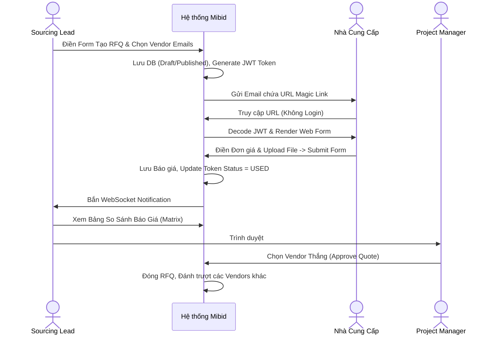
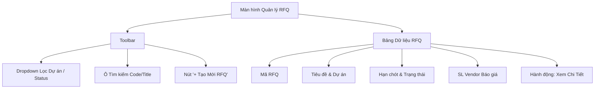
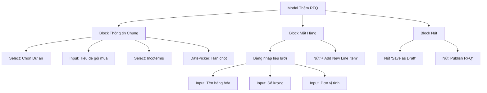
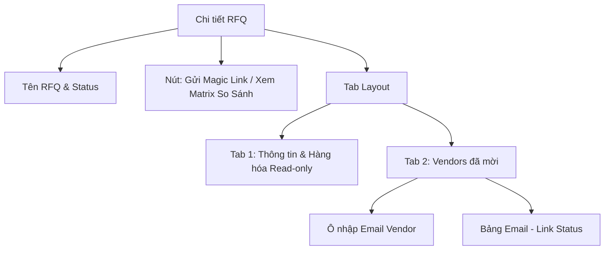
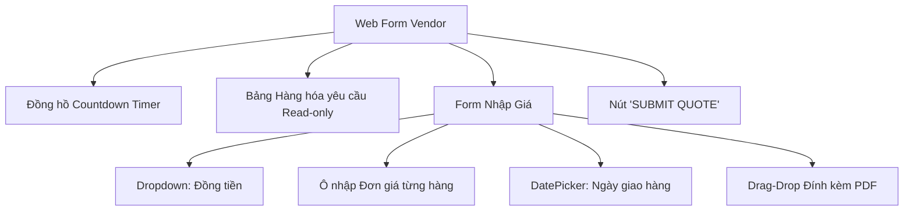
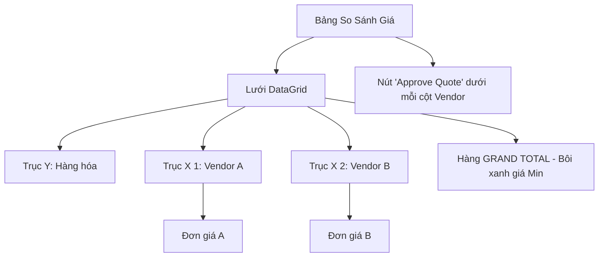

# TÀI LIỆU ĐẶC TẢ YÊU CẦU PHẦN MỀM (SRS)
**Phân hệ: Sourcing & Magic Link (Bản Hợp nhất Toàn diện)**

Tài liệu này hợp nhất toàn bộ Sơ đồ cấu trúc giao diện (Mermaid Component Tree), Hình ảnh Giao diện trực quan thực tế (Visual UI Mockups), Từ điển dữ liệu chuẩn hóa và Đặc tả Use Case cạn kiệt cho từng luồng CRUD.

---

## 1. TỔNG QUAN PHÂN HỆ & VAI TRÒ

### 1.1 Mục tiêu
Tự động hóa quy trình hỏi giá. Vendor không cần tài khoản, báo giá trực tiếp qua Magic Link (JWT). Dữ liệu được gom về Bảng so sánh Matrix tập trung.

### 1.2 Sơ đồ Tương tác (Interaction Sequence Diagram)

### 1.3 Ma trận Phân quyền (Permission Matrix)
| Chức năng CRUD | PROJECT_OWNER | SOURCING_LEAD | VENDOR (Guest) |
| :--- | :---: | :---: | :---: |
| **RFQ - Xem Danh sách** | Có | Có | Không |
| **RFQ - Thêm/Sửa** | Có | Có | Không |
| **RFQ - Xem Chi tiết** | Có | Có | Không |
| **Báo giá - Xem Matrix**| Có | Có | Không |
| **Báo giá - Submit** | Không | Không | Có (Chỉ Link của họ) |
| **Báo giá - Approve** | Có | Có | Không |

---

## 2. TỪ ĐIỂN DỮ LIỆU (DATA DICTIONARY)

### Bảng `rfqs` (Yêu cầu Báo giá)
| Tên Cột | Kiểu Dữ Liệu | Ràng buộc | Mặc định | Mô tả |
| :--- | :--- | :--- | :--- | :--- |
| `id` | UUID | PK, Not Null | (Auto) | |
| `project_id` | UUID | FK, Not Null | | Tham chiếu `projects` |
| `rfq_code` | VARCHAR(50) | Unique, Not Null | | VD: RFQ-001 |
| `title` | VARCHAR(255) | Not Null | | Tiêu đề gói mua |
| `incoterms` | VARCHAR(10) | Not Null | | VD: FOB, CIF, EXW |
| `deadline` | TIMESTAMP | Not Null | | Hạn chót nhận giá |
| `status` | VARCHAR(20) | Not Null | 'DRAFT' | ['DRAFT', 'PUBLISHED', 'CLOSED'] |

### Bảng `rfq_line_items` (Hàng hóa cần mua)
| Tên Cột | Kiểu Dữ Liệu | Ràng buộc | Mặc định | Mô tả |
| :--- | :--- | :--- | :--- | :--- |
| `id` | UUID | PK, Not Null | (Auto) | |
| `rfq_id` | UUID | FK, Not Null | | |
| `description` | TEXT | Not Null | | |
| `quantity` | DECIMAL(10,2)| Not Null | | Phải > 0 |
| `uom` | VARCHAR(20) | Not Null | | Đơn vị tính |

### Bảng `magic_links` (Quản lý Link gửi đi)
| Tên Cột | Kiểu Dữ Liệu | Ràng buộc | Mặc định | Mô tả |
| :--- | :--- | :--- | :--- | :--- |
| `id` | UUID | PK, Not Null | (Auto) | |
| `rfq_id` | UUID | FK, Not Null | | |
| `vendor_email` | VARCHAR(100) | Not Null | | |
| `token` | VARCHAR(500) | Unique, Not Null | | JWT Payload |
| `status` | VARCHAR(20) | Not Null | 'ACTIVE' | ['ACTIVE', 'USED', 'EXPIRED'] |

### Bảng `quotations` & `quotation_line_items` (Báo giá của Vendor)
| Tên Cột (Bảng) | Kiểu Dữ Liệu | Ràng buộc | Mô tả |
| :--- | :--- | :--- | :--- |
| `id` (quotations) | UUID | PK | |
| `rfq_id` (quotations) | UUID | FK | |
| `vendor_email` (quotations)| VARCHAR(100)| Not Null | Bóc tách từ JWT |
| `grand_total` (quotations) | DECIMAL(15,2)| Not Null | Tổng giá trị |
| `eta_date` (quotations) | DATE | Not Null | Ngày dự kiến giao hàng |
| `status` (quotations) | VARCHAR(20) | 'SUBMITTED'| ['SUBMITTED', 'APPROVED', 'REJECTED']|
| `unit_price` (line_items) | DECIMAL(15,2)| Not Null | Đơn giá vendor điền |

---

## 3. ĐẶC TẢ CRUD: YÊU CẦU BÁO GIÁ (RFQ)

### 3.1 Màn hình Danh sách (RFQ List Screen)
**Cấu trúc Component (Mermaid):**

**Data Mapping:** Query `SELECT * FROM rfqs WHERE project_id IN (...)`. Status badges: `DRAFT`, `PUBLISHED`, `CLOSED`.

### 3.2 Màn hình Thêm/Sửa (RFQ Form Screen)
**Hình ảnh Giao diện (Mockup UI):**

**Cấu trúc Component (Mermaid):**

**UI Validations:**
- `F_Project`: Required.
- `F_Title`: Required, MaxLength = 255.
- `F_Deadline`: Required, Date > (Now + 1h).
- `Line Items`: Mảng phải có ít nhất 1 dòng. `I_Qty` > 0.

**Đặc tả Use Case: Xuất Bản RFQ (Publish RFQ)**
- **Pre-conditions:** Mọi fields pass validation FE.
- **Triggers:** Click `[Publish RFQ]`. `POST /api/v1/rfqs`
- **Normal Flow:**
  1. Nhận JSON Payload chứa RFQ + Line Items.
  2. Bắt đầu Transaction DB.
  3. Insert bảng `rfqs` với status = `PUBLISHED`.
  4. Lặp insert vào `rfq_line_items`.
  5. Commit Transaction. Trả HTTP 201 Created.
- **Exception Flow:**
  - Hạn chót gửi lên là quá khứ: Trả `HTTP 400 Bad Request` - `{"error": "DEADLINE_MUST_BE_FUTURE"}`.

### 3.3 Màn hình Xem Chi tiết (RFQ Detail Screen)
**Cấu trúc Component:**

**Đặc tả Use Case: Gửi Magic Link**
- **Trigger:** Điền email và click gửi. `POST /api/v1/rfqs/{id}/magic-links`.
- **Normal Flow:**
  1. Sinh JWT Token.
  2. Insert bảng `magic_links`.
  3. Bắn Job gửi Email chứa link. Trả HTTP 200.

---

## 4. ĐẶC TẢ CRUD: VENDOR QUOTATIONS

### 4.1 Màn hình Thêm Mới Báo Giá (Vendor Portal qua Magic Link)
**Hình ảnh Giao diện (Mockup UI):**

**Cấu trúc Component:**

**UI Validations:**
- Bị khóa form nếu Token hết hạn hoặc Countdown = 0.
- `Đơn giá`: Number, min="0", Required.
- `File Upload`: Chỉ cho phép `.pdf, .jpg, .png`, Max `10MB`.

**Đặc tả Use Case: Vendor Submit Báo giá**
- **Triggers:** Click `[SUBMIT QUOTE]`. API `POST /api/v1/quotes/submit` kèm Bearer Token.
- **Normal Flow:**
  1. Decode JWT. Check `magic_links` `status == 'ACTIVE'`.
  2. Transaction: Insert `quotations`, Insert `quotation_line_items`.
  3. Update `magic_links.status = 'USED'`.
  4. Trả HTTP 200. Gửi Socket Notification cho Purchaser.
- **Exception Flow:** Token sai signature hoặc hết hạn -> `HTTP 401 Unauthorized`. Frontend show lỗi.

### 4.2 Màn hình Xem Danh sách Báo Giá (Comparison Matrix)
**Hình ảnh Giao diện (Mockup UI):**

**Cấu trúc Component:**

**Đặc tả Use Case: Duyệt Báo Giá (Approve Quotation)**
- **Pre-conditions:** RFQ đang `PUBLISHED`. Nút Approve bật modal double-confirm.
- **Triggers:** Xác nhận Approve. `PUT /api/v1/quotes/{id}/approve`.
- **Normal Flow:**
  1. Update Quotation A -> `APPROVED`.
  2. Update các Quotations khác -> `REJECTED`.
  3. Update RFQ -> `CLOSED`. Trả HTTP 200 OK.
- **Exception Flow:** Không có quyền (Chỉ PROJECT_OWNER mới được duyệt) -> `HTTP 403 Forbidden`.
