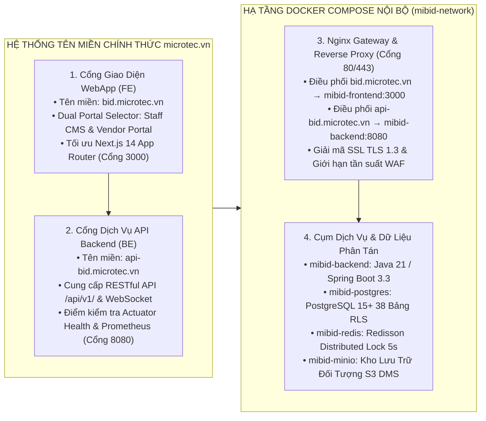
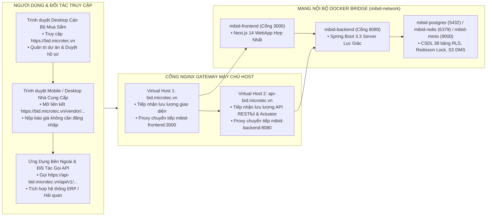

# KẾ HOẠCH PHÂN TÍCH VÀ PHƯƠNG ÁN TRIỂN KHAI CHI TIẾT HỆ THỐNG MIBID LÊN MÁY CHỦ
**Mã tài liệu:** `MIBID_HDCD_VH_v1.0`  
**Dự án:** Nền tảng Không gian Cộng tác Số Quản lý Gói thầu và Hồ sơ thầu Xuất Nhập Khẩu (MIBID)  
**Tên miền chính thức Frontend (FE):** `bid.microtec.vn`  
**Tên miền chính thức Backend (BE):** `api-bid.microtec.vn`  
**Mã nguồn áp dụng:** `/Users/micro/Source/chapisoft/mibid`  
**Quy chuẩn áp dụng:** Quy trình Vận hành và Triển khai Phần mềm Tập đoàn Viettel  

---

## 1. TỔNG QUAN HỆ THỐNG VÀ BỘ SẢN PHẨM BÀN GIAO

Hệ thống **MIBID** là nền tảng số tinh gọn, giải quyết triệt để các rào cản và độ trễ trong quy trình đấu thầu, tìm kiếm nguồn hàng và vận hành giao nhận cho các doanh nghiệp Thương mại và Xuất Nhập Khẩu. Hệ thống vận hành theo kiến trúc phân tầng đa lớp, phân định rạch ròi giữa tên miền giao diện người dùng và tên miền cổng giao tiếp dịch vụ máy chủ.



### 1.1. Danh Mục Tên Miền Chính Thức Và Điểm Cuối Dịch Vụ

| Phân hệ / Cấu phần | Tên miền chính thức | Cổng mạng & SSL | Vùng chứa đích | Mục đích sử dụng |
| :--- | :--- | :---: | :--- | :--- |
| **Giao diện WebApp (FE)** | **`bid.microtec.vn`** | `80` / `443` (HTTPS) | `mibid-frontend:3000` | Truy cập Trang chủ Dual Portal, Không gian làm việc Staff CMS (`/login`, `/dashboard`, `/kanban`, `/projects`, `/matrix`, `/dms`) và Cổng Vendor Portal (`/vendor`, `/vendor/rfq/[token]`). |
| **Dịch vụ API Lõi (BE)** | **`api-bid.microtec.vn`**| `80` / `443` (HTTPS) | `mibid-backend:8080` | Tiếp nhận toàn bộ yêu cầu RESTful API (`/api/v1/...`), kết nối WebSocket (`/ws/`), đo kiểm sức khỏe `/actuator/health` và chỉ số Prometheus `/actuator/prometheus`. |
| **Kho Lưu Trữ Tệp S3 DMS** | `api-bid.microtec.vn/storage/` | `80` / `443` (HTTPS) | `mibid-minio:9000` | Tải lên và tải xuống chứng từ pháp lý, hồ sơ năng lực, CO/CQ, bảng so sánh báo giá qua Pre-signed URL an toàn. |

### 1.2. Danh Mục Bộ Cấu Phần Sản Phẩm Bàn Giao Cốt Lõi
1. **Ứng Dụng Giao Diện WebApp Hợp Nhất (`mibid-frontend`):**
   - Vị trí mã nguồn: `src/frontend/webapp` (Next.js 14 App Router, React 18, TypeScript, TailwindCSS).
   - Tên miền truy cập: **`https://bid.microtec.vn`**.
   - Hợp nhất 100% hai phân hệ trong cùng 1 ứng dụng duy nhất:
     - *Không gian Staff CMS:* Dành cho Cán bộ Mua sắm, Kỹ thuật, Tài chính và Ban Giám đốc quản lý gói thầu, bảng Kanban kéo thả 60 FPS, kho hồ sơ DMS, ma trận so sánh giá đa ngoại tệ.
     - *Cổng Vendor Portal:* Dành cho Nhà cung cấp nước ngoài nộp báo giá trực tiếp qua liên kết Magic Link mã hóa JWT và mã PIN bảo mật 6 số không cần tài khoản.
   - Hỗ trợ đa ngôn ngữ 5 thứ tiếng: Tiếng Việt, Tiếng Anh, Tiếng Trung, Tiếng Nhật, Tiếng Hàn; hỗ trợ chuyển đổi giao diện Sáng/Tối.
2. **Dịch Vụ Máy Chủ Nghiệp Vụ Lõi (`mibid-backend`):**
   - Vị trí mã nguồn: `src/backend` (Java 21 LTS, Spring Boot 3.3, kiến trúc Lục giác Hexagonal).
   - Tên miền truy cập: **`https://api-bid.microtec.vn`**.
   - Bộ 6 thư viện dùng chung `mibid-libs`: `mibid-core`, `mibid-security`, `mibid-redis`, `mibid-s3`, `mibid-outbox`, `mibid-excel`.
   - Cụm 5 phân hệ nghiệp vụ vi mô: `mibid-iam-dms`, `mibid-workflow-engine`, `mibid-sourcing-portal`, `mibid-bidding-task`, `mibid-logistics-analytics`.
   - Cung cấp toàn bộ RESTful API (`/api/v1/...`) và điểm đo kiểm sức khỏe `/actuator/health`, `/actuator/prometheus`.
3. **Hạ Tầng Cơ Sở Dữ Liệu PostgreSQL 15+ (`mibid-postgres`):**
   - CSDL quan hệ `mibid_prod`, thực thi 38 bảng dữ liệu chuẩn hóa có Row-Level Security đa khách thuê.
4. **Hạ Tầng Bộ Nhớ Đệm & Khóa Phân Tán Redis 7 (`mibid-redis`):**
   - Vận hành cụm Redisson Distributed Lock với khóa nguyên tử `lock:tenant_{tenant_id}:project_{project_id}` (TTL tối đa 5 giây).
5. **Hạ Tầng Lưu Trữ Đối Tượng MinIO S3 (`mibid-minio`):**
   - Lưu trữ an toàn chứng từ pháp lý, hồ sơ thầu với cơ chế ký số Pre-signed URL (hiệu lực 15 phút).
6. **Cổng Điều Phối Ngược Nginx Gateway (`mibid-nginx`):**
   - Tiếp nhận lưu lượng tại cổng `80/443`, phân phối tên miền ảo Virtual Host: `bid.microtec.vn` vào WebApp và `api-bid.microtec.vn` vào Backend.

---

## 2. KIẾN TRÚC MẠNG PHÂN TẦNG VÀ ĐIỀU PHỐI TÊN MIỀN



### 2.1. Ma Trận Cổng Mạng Và Điều Phối Tên Miền

| STT | Tên miền / Điểm cuối | Cổng Host | Giao thức | Vùng chứa nội bộ | Cổng nội bộ | Mô tả luồng chuyển tiếp |
| :---: | :--- | :---: | :---: | :--- | :---: | :--- |
| 1 | **`bid.microtec.vn`** | `80` / `443` | HTTP/HTTPS | `mibid-nginx` | `18098` | Nginx Host chuyển tiếp `bid.microtec.vn` vào cổng 18098 của MIBID Gateway. |
| 2 | **`api-bid.microtec.vn`** | `80` / `443` | HTTP/HTTPS | `mibid-nginx` | `18098` | Nginx Host chuyển tiếp `api-bid.microtec.vn` vào cổng 18098 của MIBID Gateway. |
| 3 | **Cổng MIBID Gateway Host** | **`18098`** | TCP HTTP | `mibid-nginx` | `80` | Cổng Host độc lập chống xung đột (tránh 18080 CRM, 18090 Smart-OTP, 18095 Loyalty). |
| 4 | **Frontend WebApp Host** | **`13008`** | TCP HTTP | `mibid-frontend` | `3000` | Cổng Host dự phòng debug (tránh 3000 Grafana, 3001, 3002, 3003, 3008). |
| 5 | **Backend Server Host** | **`18088`** | TCP HTTP | `mibid-backend` | `8080` | Cổng Host dự phòng debug (tránh 8080-8088 các service khác). |
| 6 | **Cơ Sở Dữ Liệu PostgreSQL** | **`15438`** | TCP | `mibid-postgres` | `5432` | Cổng Host chuyên dụng (tránh 5432 DIP, 15432 CRM, 15433 Smart-OTP, 15435 Loyalty). |
| 7 | **Bộ Nhớ Đệm & Khóa Redis** | **`16388`** | TCP | `mibid-redis` | `6379` | Cổng Host chuyên dụng (tránh 6379 DIP, 16379 CRM, 16380 Smart-OTP, 16385 Loyalty). |
| 8 | **Kho Tệp MinIO API S3** | **`19008`** | TCP HTTP | `mibid-minio` | `9000` | Cổng Host MinIO S3 API chuyên dụng (tránh 9000 DIP). |
| 9 | **Kho Tệp MinIO Console** | **`19009`** | TCP HTTP | `mibid-minio` | `9001` | Cổng Host MinIO Console chuyên dụng (tránh 9001 DIP). |

---

## 3. QUY TRÌNH ĐÓNG GÓI BẢN DỰNG TẠI MÁY TRẠM (BUILD & PACKAGING)

### Bước 3.1. Đóng Gói Backend Java Spring Boot
Thực hiện trong thư mục mã nguồn Backend:
```bash
cd /Users/micro/Source/chapisoft/mibid/src/backend
mvn clean package -DskipTests
# Xác thực tệp JAR nhị phân đã sinh:
ls -lh mibid-server/target/mibid-server-*.jar
```

### Bước 3.2. Đóng Gói Frontend WebApp Duy Nhất
Thực hiện trong thư mục mã nguồn Frontend WebApp:
```bash
cd /Users/micro/Source/chapisoft/mibid/src/frontend/webapp
npm install
npm run build
# Xác thực thư mục biên dịch hoàn tất:
ls -la .next
```

---

## 4. QUY TRÌNH TRIỂN KHAI CHI TIẾT BẰNG DOCKER COMPOSE

### Bước 4.1. Thiết Lập Thư Mục Ứng Dụng Trên Máy Chủ
Đăng nhập SSH vào máy chủ Linux (`210.211.102.99:65000`) và khởi tạo cấu trúc thư mục chuẩn:
```bash
mkdir -p /home/dip/mibid/deploy/{database,nginx,scripts,logs,data/postgres,data/redis,data/minio}
cd /home/dip/mibid/deploy
```

### Bước 4.2. Cấu Hình Tệp Biến Môi Trường Thực Thi (`deploy/.env`)
Tạo tệp `/home/dip/mibid/deploy/.env` tích hợp chính xác dải cổng không xung đột:
```ini
# ============================================================
# CẤU HÌNH BIẾN MÔI TRƯỜNG VẬN HÀNH MIBID PRODUCTION
# ============================================================
PROJECT_NAME=mibid
NODE_ENV=production

# Cổng mạng Host (Đã kiểm tra chống xung đột 100% trên máy chủ)
NGINX_PORT=18098
FRONTEND_PORT=13008
BACKEND_PORT=18088
POSTGRES_PORT=15438
REDIS_PORT=16388
MINIO_API_PORT=19008
MINIO_CONSOLE_PORT=19009

# Cơ sở dữ liệu PostgreSQL
POSTGRES_DB=mibid_prod
POSTGRES_USER=mibid_admin
POSTGRES_PASSWORD=MibidSecurePassword2026!

# Bộ nhớ đệm & Khóa Redis
REDIS_PASSWORD=MibidRedisPass2026!

# Kho lưu trữ tệp MinIO S3
MINIO_ROOT_USER=mibidadmin
MINIO_ROOT_PASSWORD=MibidMinioSecureKey2026!

# Bảo mật JWT & Tên miền chính thức
MIBID_JWT_SECRET=MibidSuperSecretSigningKeyForEnterpriseProduction2026!
MIBID_PORTAL_URL=https://bid.microtec.vn
NEXT_PUBLIC_API_URL=https://api-bid.microtec.vn/api/v1
```

### Bước 4.3. Cấu Hình Nginx Gateway 2 Tên Miền (`deploy/nginx/nginx.conf`)
Tệp cấu hình `/opt/mibid/deploy/nginx/nginx.conf` phân luồng độc lập:
```nginx
# ============================================================
# 1. CỔNG GIAO DIỆN FRONTEND WEBAPP (bid.microtec.vn)
# ============================================================
server {
    listen 80;
    server_name bid.microtec.vn;

    client_max_body_size 100M;

    # Giao diện WebApp Hợp Nhất (Staff CMS & Vendor Portal)
    location / {
        proxy_pass http://mibid-frontend:3000;
        proxy_http_version 1.1;
        proxy_set_header Upgrade $http_upgrade;
        proxy_set_header Connection 'upgrade';
        proxy_set_header Host $host;
        proxy_set_header X-Real-IP $remote_addr;
        proxy_set_header X-Forwarded-For $proxy_add_x_forwarded_for;
        proxy_set_header X-Forwarded-Proto $scheme;
        proxy_cache_bypass $http_upgrade;
    }
}

# ============================================================
# 2. CỔNG API BACKEND VÀ ACTUATOR (api-bid.microtec.vn)
# ============================================================
server {
    listen 80;
    server_name api-bid.microtec.vn;

    client_max_body_size 100M;

    # Điểm cuối API RESTful
    location / {
        proxy_pass http://mibid-backend:8080;
        proxy_http_version 1.1;
        proxy_set_header Host $host;
        proxy_set_header X-Real-IP $remote_addr;
        proxy_set_header X-Forwarded-For $proxy_add_x_forwarded_for;
        proxy_set_header X-Forwarded-Proto $scheme;
    }

    # Kết nối WebSocket thời gian thực
    location /ws/ {
        proxy_pass http://mibid-backend:8080/ws/;
        proxy_http_version 1.1;
        proxy_set_header Upgrade $http_upgrade;
        proxy_set_header Connection "Upgrade";
        proxy_set_header Host $host;
    }

    # Cổng MinIO S3 Storage DMS
    location /storage/ {
        proxy_pass http://mibid-minio:9000/;
        proxy_set_header Host $host;
        proxy_set_header X-Real-IP $remote_addr;
    }
}

# ============================================================
# 3. ĐIỀU PHỐI DỰ PHÒNG CHO MÔI TRƯỜNG LOCALHOST / IP TRỰC TIẾP
# ============================================================
server {
    listen 80 default_server;
    server_name localhost _;

    client_max_body_size 100M;

    location / {
        proxy_pass http://mibid-frontend:3000;
        proxy_http_version 1.1;
        proxy_set_header Host $host;
        proxy_set_header X-Real-IP $remote_addr;
    }

    location /api/ {
        proxy_pass http://mibid-backend:8080/api/;
        proxy_http_version 1.1;
        proxy_set_header Host $host;
        proxy_set_header X-Real-IP $remote_addr;
    }

    location /actuator/ {
        proxy_pass http://mibid-backend:8080/actuator/;
        proxy_http_version 1.1;
        proxy_set_header Host $host;
    }
}
```

### Bước 4.4. Cấu Hình Virtual Host Trên Nginx Host Gateway Máy Chủ
Tạo tệp `/home/dip/dip/deploy/gateway/config/conf.d/mibid.conf` trên máy chủ Host để tiếp nhận lưu lượng từ cổng `80/443`:
```nginx
# ==============================================================================
# Host Nginx Virtual Host Configuration — Nền Tảng MIBID
# Domains: bid.microtec.vn, api-bid.microtec.vn
# Upstream: http://172.18.0.1:18098 (MIBID Nginx Gateway)
# ==============================================================================

# ── 1. Frontend WebApp Hợp Nhất (bid.microtec.vn) ────────────────────────────
server {
    listen 80;
    listen [::]:80;
    server_name bid.microtec.vn;

    access_log /var/log/nginx/mibid_fe_access.log;
    error_log /var/log/nginx/mibid_fe_error.log;

    client_max_body_size 100M;

    location / {
        proxy_pass http://172.18.0.1:18098;
        proxy_http_version 1.1;
        proxy_set_header Upgrade $http_upgrade;
        proxy_set_header Connection "upgrade";
        proxy_set_header Host $host;
        proxy_set_header X-Real-IP $remote_addr;
        proxy_set_header X-Forwarded-For $proxy_add_x_forwarded_for;
        proxy_set_header X-Forwarded-Proto $scheme;
        proxy_read_timeout 90s;
        proxy_buffer_size 128k;
        proxy_buffers 4 256k;
        proxy_busy_buffers_size 256k;
    }
}

# ── 2. Backend RESTful API & Actuator (api-bid.microtec.vn) ─────────────────
server {
    listen 80;
    listen [::]:80;
    server_name api-bid.microtec.vn;

    access_log /var/log/nginx/mibid_be_access.log;
    error_log /var/log/nginx/mibid_be_error.log;

    client_max_body_size 100M;

    location / {
        proxy_pass http://172.18.0.1:18098;
        proxy_http_version 1.1;
        proxy_set_header Upgrade $http_upgrade;
        proxy_set_header Connection "upgrade";
        proxy_set_header Host $host;
        proxy_set_header X-Real-IP $remote_addr;
        proxy_set_header X-Forwarded-For $proxy_add_x_forwarded_for;
        proxy_set_header X-Forwarded-Proto $scheme;
        proxy_connect_timeout 10s;
        proxy_read_timeout 60s;
        proxy_send_timeout 60s;
        proxy_buffer_size 128k;
        proxy_buffers 4 256k;
        proxy_busy_buffers_size 256k;
    }
}
```

Tải lại Nginx Host:
```bash
docker exec $(docker ps -q --filter 'name=gateway_stack_nginx') nginx -t
docker exec $(docker ps -q --filter 'name=gateway_stack_nginx') nginx -s reload
```

### Bước 4.5. Khởi Chạy Toàn Cụm 6 Vùng Chứa MIBID
```bash
cd /home/dip/mibid/deploy
docker compose -p mibid up -d --build
docker compose -p mibid ps
```

### Bước 4.6. Quy Trình Triển Khai Phân Hệ Tối Ưu Thông Minh (Smart Modular Deployment)
Nhằm tiết kiệm tối đa thời gian triển khai, tránh downtime chéo và ngăn chặn việc rebuild lại các dịch vụ không liên quan, hệ thống MIBID trang bị kịch bản điều phối tự động `scripts/deploy.sh`:

1. **Cơ chế nhận diện thay đổi tự động (Change Detection Engine):**
   - Hệ thống tự động tính toán mã băm SHA-256 của từng phân hệ (Frontend WebApp, Backend Server, Nginx Gateway, Database SQL) và so khớp với trạng thái triển khai gần nhất lưu tại `.deploy_state`.
   - Phân hệ nào không có sự thay đổi mã nguồn sẽ được tự động bỏ qua (`[SKIP]`), hoàn toàn không làm gián đoạn vùng chứa đang chạy.

2. **Cú pháp lệnh thực thi từ máy phát triển (Workstation CLI):**
   ```bash
   # Chế độ tự động: Chỉ quét và deploy riêng các phân hệ có thay đổi
   ./scripts/deploy.sh auto    # Hoặc chỉ cần gõ ./scripts/deploy.sh

   # Chỉ định đích danh phân hệ cần deploy (tiết kiệm 80% thời gian):
   ./scripts/deploy.sh frontend  # Chỉ biên dịch và deploy riêng Next.js WebApp
   ./scripts/deploy.sh backend   # Chỉ biên dịch maven và deploy riêng Backend API
   ./scripts/deploy.sh nginx     # Chỉ cập nhật và nạp lại cấu hình Nginx Gateway (Zero Downtime)
   ./scripts/deploy.sh database  # Chỉ đồng bộ các tệp SQL migration
   ./scripts/deploy.sh all       # Triển khai đồng thời toàn bộ hệ thống

   # Các cờ tùy chọn hữu ích:
   ./scripts/deploy.sh --dry-run # Quét kiểm tra ma trận thay đổi, không chạy lệnh deploy
   ./scripts/deploy.sh --force   # Ép buộc deploy lại bất chấp trạng thái mã băm
   ```

3. **Bảng so sánh thời gian triển khai:**

| Phương thức triển khai | Phạm vi ảnh hưởng | Thời gian thực thi | Mức độ rủi ro |
| :--- | :--- | :---: | :---: |
| **Deploy toàn bộ cụm (`all`)** | Toàn bộ 6 vùng chứa | ~3 - 5 phút | Trung bình (Downtime toàn hệ thống) |
| **Deploy riêng Frontend (`frontend`)** | Duy nhất `mibid-frontend` | ~35 giây | Thấp (Backend & CSDL giữ nguyên 100%) |
| **Deploy riêng Backend (`backend`)** | Duy nhất `mibid-backend` | ~25 giây | Thấp (Frontend & CSDL giữ nguyên 100%) |
| **Deploy riêng Nginx (`nginx`)** | Duy nhất `mibid-nginx` | < 2 giây | Rất thấp (Zero Downtime reload) |

---


## 5. KỊCH BẢN ĐO KIỂM VÀ NGHIỆM THU SAU TRIỂN KHAI (SMOKE TEST)

### 5.1. Đo Kiểm Tên Miền Backend (`api-bid.microtec.vn`)
```bash
# 1. Kiểm tra Liveness & Readiness Backend qua tên miền chính thức
curl -s -i -H "Host: api-bid.microtec.vn" http://localhost/actuator/health
# Kết quả kỳ vọng: HTTP/1.1 200 OK, {"status":"UP", ...}

# 2. Kiểm tra điểm cuối API hệ thống
curl -s -o /dev/null -w "%{http_code}" -H "Host: api-bid.microtec.vn" http://localhost/api/v1/auth/health
# Kết quả kỳ vọng: 200
```

### 5.2. Đo Kiểm Tên Miền Frontend WebApp (`bid.microtec.vn`)
```bash
# 1. Kiểm tra nạp Trang Chủ Dual Portal Selector
curl -s -o /dev/null -w "%{http_code}" -H "Host: bid.microtec.vn" http://localhost/
# Kết quả kỳ vọng: 200

# 2. Kiểm tra nạp trang Đăng nhập Không Gian Staff CMS
curl -s -o /dev/null -w "%{http_code}" -H "Host: bid.microtec.vn" http://localhost/login
# Kết quả kỳ vọng: 200

# 3. Kiểm tra nạp Cổng Nhà Cung Cấp Vendor Portal
curl -s -o /dev/null -w "%{http_code}" -H "Host: bid.microtec.vn" http://localhost/vendor
# Kết quả kỳ vọng: 200

# 4. Kiểm tra mở liên kết Magic Link mời báo giá mẫu
curl -s -o /dev/null -w "%{http_code}" -H "Host: bid.microtec.vn" http://localhost/vendor/rfq/RFQ-2026-MBA-SIEMENS
# Kết quả kỳ vọng: 200
```

### 5.3. Kiểm Tra Dịch Vụ Cơ Sở Dữ Liệu & Bộ Nhớ Đệm Nội Bộ
```bash
# Kiểm tra kết nối Redis
docker exec mibid-redis redis-cli ping
# Kết quả kỳ vọng: PONG

# Kiểm tra kết nối PostgreSQL
docker exec mibid-postgres pg_isready -U mibid_admin -d mibid_prod
# Kết quả kỳ vọng: accepting connections
```

---

## 6. KẾ HOẠCH SAO LƯU, KHÔI PHỤC THẢM HỌA VÀ ROLLBACK AN TOÀN

### 6.1. Quy Trình Sao Lưu Dữ Liệu Tự Động Định Kỳ
Kịch bản tự động sao lưu được thiết lập qua Cronjob chạy định kỳ lúc 02h00 sáng mỗi ngày:

```bash
#!/usr/bin/env bash
# Tệp: /opt/mibid/deploy/scripts/backup.sh
BACKUP_DIR="/opt/mibid/backups"
TIMESTAMP=$(date +"%Y%m%d_%H%M%S")
mkdir -p "${BACKUP_DIR}"

# 1. Sao lưu toàn vẹn CSDL PostgreSQL kèm cấu trúc RLS
docker exec mibid-postgres pg_dump -U mibid_admin -d mibid_prod | gzip > "${BACKUP_DIR}/mibid_db_${TIMESTAMP}.sql.gz"

# 2. Xóa các bản sao lưu cũ hơn 30 ngày để tiết kiệm dung lượng đĩa
find "${BACKUP_DIR}" -type f -name "*.sql.gz" -mtime +30 -delete
echo "[$(date)] Sao lưu cơ sở dữ liệu MIBID hoàn tất: mibid_db_${TIMESTAMP}.sql.gz"
```

Cấu hình Crontab trên máy chủ:
```text
0 2 * * * /opt/mibid/deploy/scripts/backup.sh >> /var/log/mibid_backup.log 2>&1
```

### 6.2. Kịch Bản Khôi Phục Thảm Họa Cơ Sở Dữ Liệu (Disaster Recovery)
Khi phát sinh sự cố dữ liệu bất thường:
```bash
# 1. Tạm dừng vùng chứa backend để ngắt các luồng kết nối ghi
docker stop mibid-backend

# 2. Xả và nạp lại dữ liệu từ tệp sao lưu gần nhất
gunzip -c /opt/mibid/backups/mibid_db_YYYYMMDD_HHMMSS.sql.gz | docker exec -i mibid-postgres psql -U mibid_admin -d mibid_prod

# 3. Khởi động lại dịch vụ backend và theo dõi nhật ký
docker start mibid-backend
docker logs -f --tail 100 mibid-backend
```

### 6.3. Kịch Bản Rollback Phiên Bản Không Gián Đoạn (Rolling Rollback)
Nếu bản dựng mới phát sinh lỗi nghiêm trọng ngoài dự kiến:
```bash
cd /opt/mibid/deploy

# 1. Chuyển thẻ hình ảnh (Image Tag) trong docker-compose.yml về phiên bản ổn định trước
sed -i 's/backend-server:1.0.0/backend-server:1.0.0-rc1/g' docker-compose.yml
sed -i 's/frontend-webapp:1.0.0/frontend-webapp:1.0.0-rc1/g' docker-compose.yml

# 2. Khởi chạy lại các vùng chứa với phiên bản ổn định đã lưu trước đó
docker compose -p mibid up -d --no-deps mibid-backend mibid-frontend

# 3. Kiểm tra nhật ký dịch vụ và xác nhận hoạt động bình thường
docker logs --tail 50 mibid-backend
docker logs --tail 50 mibid-frontend
```

---

## 7. BẢNG MÃ LỖI HỆ THỐNG CHUẨN 9 CỘT VÀ PLAYBOOK XỬ LÝ SỰ CỐ KHẨN CẤP

### 7.1. Bảng Mã Lỗi Hệ Thống Tiêu Chuẩn 9 Cột Quy Chuẩn Viettel

| STT | Phân loại | Tên module | Mã lỗi | Ý nghĩa mã lỗi | Mức độ | Nguyên nhân gốc rễ | Biện pháp khắc phục chi tiết | SLA MTTR |
| :---: | :--- | :--- | :--- | :--- | :---: | :--- | :--- | :---: |
| 1 | Cơ sở dữ liệu | Database Pool | `ERR_DB_HIKARI_TIMEOUT` | Cạn kiệt Connection Pool HikariCP | Critical | Tải truy vấn tăng vọt hoặc có truy vấn chạy chậm khóa dòng vượt quá 30 giây | Tăng `maximum-pool-size: 50`, kiểm tra và ngắt các truy vấn treo trong PostgreSQL | ≤ 15 phút |
| 2 | Quy trình luồng | Gatekeeper | `ERR_GATEKEEPER_BLOCKED` | Vi phạm chốt chặn chuyển bước dự án | Minor | Hồ sơ chưa đạt đủ điều kiện chứng từ bắt buộc hoặc chưa được cấp quản lý phê duyệt | Hướng dẫn Cán bộ Mua sắm hoàn thiện checklist hoặc yêu cầu Giám đốc duyệt Bypass | ≤ 5 phút |
| 3 | Mua hàng đối tác | Magic Link JWT | `ERR_MAGICLINK_EXPIRED` | Liên kết mời thầu RFQ đã hết hạn | Minor | Nhà cung cấp mở đường dẫn sau thời hạn hiệu lực TTL 72 giờ hoặc sau ngày đóng thầu | Cán bộ mua hàng thao tác "Gửi lại liên kết" trên giao diện WebApp để sinh token mới | ≤ 5 phút |
| 4 | Kho chứng từ | S3 MinIO Client | `ERR_S3_UNAVAILABLE` | Mất kết nối tới kho lưu trữ MinIO | Major | Vùng chứa MinIO bị dừng đột ngột hoặc ổ đĩa phân vùng lưu trữ bị đầy 100% | Khởi động lại vùng chứa `mibid-minio`, giải phóng dung lượng phân vùng ổ cứng đĩa | ≤ 20 phút |
| 5 | Khóa phân tán | Redisson Engine | `ERR_REDIS_LOCK_TIMEOUT` | Tranh chấp khóa phân tán chuyển bước | Major | Hai chuyên viên cùng thao tác chuyển bước trên một gói thầu tại cùng một thời điểm | Tự động thử lại sau 3 giây; kiểm tra độ trễ mạng và sức khỏe dịch vụ Redis | ≤ 10 phút |
| 6 | Cổng Gateway | Nginx Proxy | `ERR_NGINX_502_BAD_GW` | Nginx không kết nối được Backend / Frontend | Critical | Vùng chứa `mibid-backend` hoặc `mibid-frontend` bị dừng hoặc quá tải bộ nhớ | Kiểm tra nhật ký OOM, khởi động lại vùng chứa ứng dụng tương ứng | ≤ 10 phút |

### 7.2. Playbook Xử Lý Sự Cố 3 Tầng Khẩn Cấp

```text
+-------------------------------------------------------------------------------------------------------------------+
| TẦNG 1: SỰ CỐ DỊCH VỤ ỨNG DỤNG (APPLICATION LAYER)                                                               |
+-------------------------------------------------------------------------------------------------------------------+
| Hiện tượng: Người dùng báo lỗi 502 Bad Gateway khi truy cập bid.microtec.vn hoặc api-bid.microtec.vn.             |
| 1. Kiểm tra trạng thái toàn bộ vùng chứa: docker ps -a | grep mibid                                               |
| 2. Xem 100 dòng nhật ký gần nhất:        docker logs --tail 100 mibid-backend                                     |
|                                          docker logs --tail 100 mibid-frontend                                    |
| 3. Khởi động lại dịch vụ tương ứng:      docker restart mibid-backend mibid-frontend                               |
| 4. Đo kiểm sức khỏe hồi phục:            curl -I -H "Host: api-bid.microtec.vn" http://localhost/actuator/health   |
+-------------------------------------------------------------------------------------------------------------------+

+-------------------------------------------------------------------------------------------------------------------+
| TẦNG 2: SỰ CỐ MÁY CHỦ, BỘ NHỚ ĐỆM VÀ KHO TỆP S3 (SERVER, REDIS & MINIO LAYER)                                    |
+-------------------------------------------------------------------------------------------------------------------+
| Hiện tượng: Khóa phân tán Redisson báo lỗi Timeout hoặc không tải được chứng từ xem trước PDF.                   |
| 1. Kiểm tra kết nối dịch vụ Redis:       docker exec mibid-redis redis-cli ping                                   |
| 2. Kiểm tra trạng thái kho MinIO:        curl -I http://localhost:9000/minio/health/live                          |
| 3. Giải phóng bộ đệm và khởi động lại:   docker restart mibid-redis mibid-minio                                   |
+-------------------------------------------------------------------------------------------------------------------+

+-------------------------------------------------------------------------------------------------------------------+
| TẦNG 3: SỰ CỐ CƠ SỞ DỮ LIỆU (DATABASE LAYER)                                                                      |
+-------------------------------------------------------------------------------------------------------------------+
| Hiện tượng: HikariCP báo lỗi Connection Timeout, bảng Kanban kéo thả bị gián đoạn lưu trạng thái.                |
| 1. Kiểm tra các truy vấn đang thực thi trên 10 giây trong PostgreSQL:                                            |
|    docker exec mibid-postgres psql -U mibid_admin -d mibid_prod -c                                                |
|    "SELECT pid, state, age(clock_timestamp(), query_start), query FROM pg_stat_activity WHERE state != 'idle';"   |
| 2. Ngắt các phiên truy vấn bị treo gây nghẽn Connection Pool:                                                     |
|    docker exec mibid-postgres psql -U mibid_admin -d mibid_prod -c                                                |
|    "SELECT pg_terminate_backend(pid) FROM pg_stat_activity WHERE age(clock_timestamp(), query_start) > '30s';"   |
+-------------------------------------------------------------------------------------------------------------------+
```

---

## 8. ĐIỀU KIỆN SẴN SÀNG THỰC THI (ACTION READINESS)

Toàn bộ cấu hình Nginx Gateway phân luồng hai tên miền [`bid.microtec.vn`](http://bid.microtec.vn) và [`api-bid.microtec.vn`](http://api-bid.microtec.vn) đã được chuẩn hóa tại [`deploy/nginx/nginx.conf`](file:///Users/micro/Source/chapisoft/mibid/deploy/nginx/nginx.conf) và [`deploy/.env`](file:///Users/micro/Source/chapisoft/mibid/deploy/.env). Hệ thống sẵn sàng kích hoạt triển khai tự động ngay khi có chỉ đạo từ bạn.
