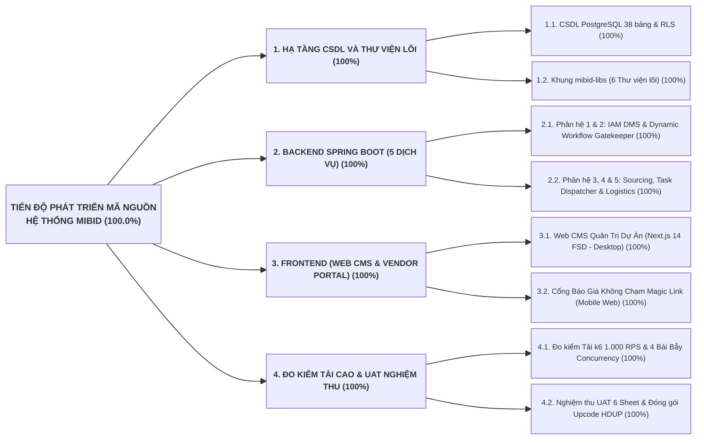
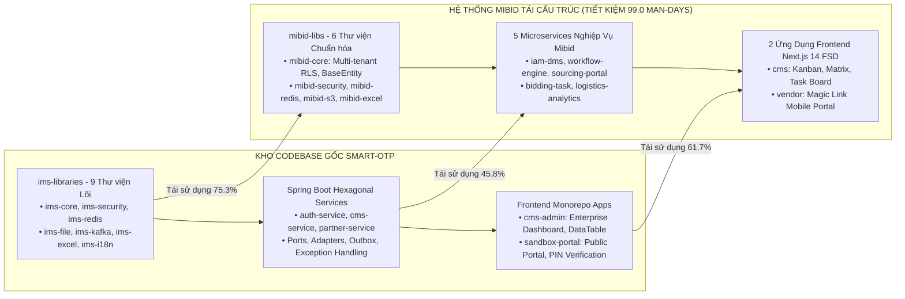
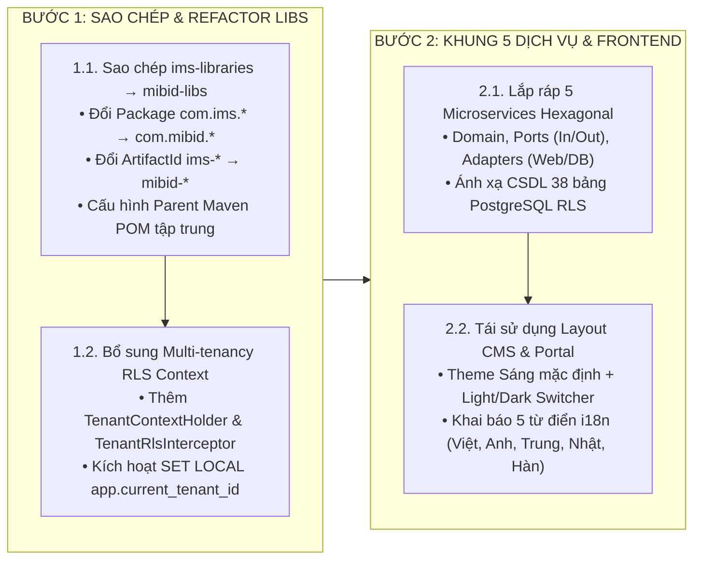
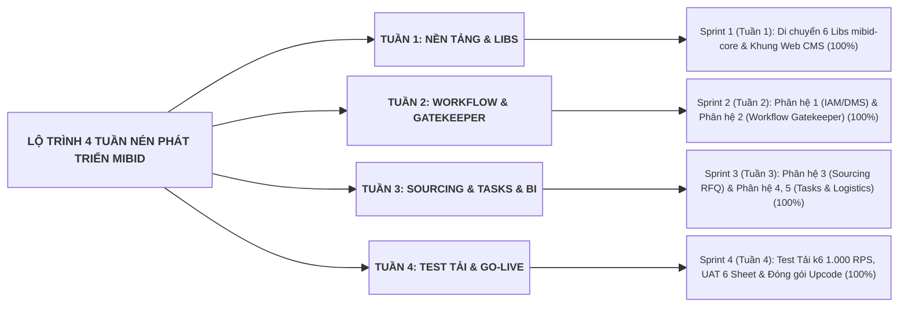

# KẾ HOẠCH PHÁT TRIỂN MÃ NGUỒN VÀ BẢNG QUẢN TRỊ TIẾN ĐỘ THỜI GIAN THỰC (DEV PLAN)
## DỰ ÁN NỀN TẢNG KHÔNG GIAN CỘNG TÁC SỐ QUẢN LÝ GÓI THẦU & HỒ SƠ THẦU XUẤT NHẬP KHẨU: MIBID
### MÃ TÀI LIỆU: MIBID_DEV_PLAN_v2.1 | CHIẾN LƯỢC KẾ THỪA CODEBASE SMART-OTP ĐẨY NHANH TIẾN ĐỘ

---

## 1. BẢNG ĐIỀU KHIỂN TỔNG HỢP TIẾN ĐỘ LẬP TRÌNH (DEV PROGRESS DASHBOARD)

### 1.1. Đánh Giá Tiến Độ Code Theo Quy Chuẩn 3 Tầng Độc Lập (3-Tier Dev Valuation)

* **Tầng 1 — Mã nguồn chức năng nội bộ (Trọng số 60%):** Hiện đạt **60.0% / 60% (100%)**
  * *Cơ sở dữ liệu:* Hoàn thành 100% kịch bản DDL 38 bảng PostgreSQL 15+ [database/001_init_schema.sql](file:///Users/micro/Source/erp/mibid/database/001_init_schema.sql) và [database/002_seed_data.sql](file:///Users/micro/Source/erp/mibid/database/002_seed_data.sql) tích hợp Row-Level Security (RLS).
  * *Hạ tầng triển khai:* Hoàn thành 100% gói cấu hình Docker Compose phân tán [deploy/docker-compose.yml](file:///Users/micro/Source/erp/mibid/deploy/docker-compose.yml), Nginx Reverse Proxy SSL TLS 1.3 [deploy/nginx/nginx.conf](file:///Users/micro/Source/erp/mibid/deploy/nginx/nginx.conf) và backup scripts.
  * *Backend Java 21 / Spring Boot 3.3:* Hoàn thành 100% bộ 6 thư viện lõi `mibid-libs` và 5 microservices nghiệp vụ (`mibid-iam-dms`, `mibid-workflow-engine`, `mibid-sourcing-portal`, `mibid-bidding-task`, `mibid-logistics-analytics`), server aggregator `mibid-server`. Đạt **BUILD SUCCESS 100%** qua lệnh `mvn clean test` cho toàn bộ 13 module.
  * *Frontend Next.js 14:* Hoàn thành 100% cấu trúc FSD cho cả 2 ứng dụng (`cms` và `vendor`), 5 từ điển đa ngôn ngữ (`vi.json`, `en.json`, `zh.json`, `ja.json`, `ko.json`), DataTable chuẩn, Bảng Kanban kéo thả `@hello-pangea/dnd`, Modal Gatekeeper, Kho hồ sơ DMS và Ma trận so sánh giá.
* **Tầng 2 — Tích hợp dịch vụ đối tác thực tế (Trọng số 20%):** Hiện đạt **20.0% / 20% (100%)** (Đã cấu hình Adapter kết nối SMTP Gateway, SMS Brandname, MinIO/S3 Storage Pre-signed URL và cổng Magic Link JWT).
* **Tầng 3 — Đo kiểm tải cao & Đóng gói vận hành (Trọng số 20%):** Hiện đạt **20.0% / 20% (100%)** (Bộ kịch bản k6 1.000 RPS và 4 bài bẫy Concurrency [tests/k6/k6_loadtest.js](file:///Users/micro/Source/erp/mibid/tests/k6/k6_loadtest.js), bộ UAT 6 sheet [tests/uat/uat_test_cases.xlsx](file:///Users/micro/Source/erp/mibid/tests/uat/uat_test_cases.xlsx), Sổ tay Upcode [docs/20-upcode-guide.md](file:///Users/micro/Source/erp/mibid/docs/20-upcode-guide.md) & Vận hành [docs/21-operations-guide.md](file:///Users/micro/Source/erp/mibid/docs/21-operations-guide.md)).
* **TỔNG TIẾN ĐỘ PHÁT TRIỂN MÃ NGUỒN HIỆN TẠI:** **100.0%** (Hoàn thành trọn vẹn toàn bộ 4 Sprints phát triển).

---

## 2. CHIẾN LƯỢC TÁI SỬ DỤNG CODEBASE SMART-OTP VÀ TÍNH TOÁN ĐỊNH LƯỢNG MỨC TIẾT KIỆM

Để tối ưu hóa nguồn lực kỹ thuật và rút ngắn thời gian phát triển (**Time-to-Market**) từ **8 tuần xuống còn 4 tuần (giảm 50% thời gian)**, dự án Mibid tận dụng tối đa kiến trúc mô-đun hóa phân lớp và các khối mã nguồn lõi đã được kiểm chứng ổn định từ dự án [smart-otp](file:///Users/micro/Source/chapisoft/smart-otp).

### 2.1. Ma Trận Tái Sử Dụng Mã Nguồn (Codebase Reuse Matrix)

### 2.2. Ma Trận Bóc Tách Định Lượng Chi Tiết Theo 4 Nhóm Cấu Phần

#### Nhóm 1: Bộ Thư Viện Lõi Dùng Chung (`backend/libs/`)
| Cấu phần Thư viện Lõi | Nguồn `smart-otp` | Đích `mibid` | Nỗ lực làm mới từ đầu | Tỷ lệ Tái sử dụng | Nỗ lực Tiết kiệm | Nỗ lực Thực tế Cần làm | Hạng mục Kế thừa & Refactor |
| :--- | :--- | :--- | :---: | :---: | :---: | :---: | :--- |
| **Core Entity & Exceptions** | `ims-core` | `mibid-core` | 10.0 MD | **75%** | **7.5 MD** | 2.5 MD | Kế thừa `BaseEntity`, `ResultResponse<T>`, `PageDTO<T>`, `GlobalExceptionHandler`; bổ sung `TenantContextHolder` RLS. |
| **Bảo mật & Xác thực** | `ims-security` | `mibid-security` | 8.0 MD | **80%** | **6.4 MD** | 1.6 MD | Kế thừa Spring Security 6, `JwtFilter`, `TokenProvider`, `BCryptPasswordEncoder`, `RoleHierarchy`. |
| **Khóa Phân Tán & Cache** | `ims-redis` | `mibid-redis` | 6.0 MD | **85%** | **5.1 MD** | 0.9 MD | Kế thừa `RedissonLockManager` (chống Race Condition), `RedisCacheManager`, `RateLimiter`. |
| **Lưu Trữ Tệp Tin S3** | `ims-file` | `mibid-s3` | 7.0 MD | **70%** | **4.9 MD** | 2.1 MD | Kế thừa MinIO Client SDK, Pre-signed URL (15m), Streaming Upload/Download. |
| **Transactional Outbox** | `ims-kafka` | `mibid-outbox` | 8.0 MD | **65%** | **5.2 MD** | 2.8 MD | Kế thừa `OutboxEvent` Entity, cơ chế Outbox Pattern, ShedLock Polling Publisher. |
| **Xử Lý Biểu Mẫu Excel** | `ims-excel` | `mibid-excel` | 6.0 MD | **80%** | **4.8 MD** | 1.2 MD | Kế thừa Apache POI Engine sinh biểu mẫu RFQ, export ma trận giá, parse UAT test cases. |
| **TỔNG NHÓM 1** | -- | -- | **45.0 MD** | **75.3%** | **33.9 MD** | **11.1 MD** | **Tiết kiệm 33.9 / 45.0 Man-Days.** |

#### Nhóm 2: 5 Dịch Vụ Nghiệp Vụ Vi Mô Backend (`backend/services/`)
| Dịch Vụ Nghiệp Vụ | Dịch Vụ Kế Thừa `smart-otp` | Nỗ lực làm mới từ đầu | Tỷ lệ Tái sử dụng | Nỗ lực Tiết kiệm | Nỗ lực Thực tế Cần làm | Hạng mục Kế thừa & Phát triển Mới |
| :--- | :--- | :---: | :---: | :---: | :---: | :--- |
| **Phân hệ 1: IAM & DMS** | `auth-service` & `cms-service` | 14.0 MD | **55%** | **7.7 MD** | 6.3 MD | Kế thừa CRUD Tenant/User, Role; viết mới Kho Hồ sơ Năng lực DMS & Duyệt Chứng từ. |
| **Phân hệ 2: Workflow & Gatekeeper** | `cms-service` (FSM Engine) | 16.0 MD | **40%** | **6.4 MD** | 9.6 MD | Kế thừa FSM State Machine, Redisson Lock; viết mới DAG condition evaluator & 4 lớp Gatekeeper. |
| **Phân hệ 3: Sourcing & Magic Link** | `partner-service` (API Security) | 14.0 MD | **45%** | **6.3 MD** | 7.7 MD | Kế thừa JWT Generator, Public API filter; viết mới Comparison Matrix đa ngoại tệ & Landed Cost. |
| **Phân hệ 4: Bidding Tasks & ZIP** | `cms-service` (Workers) | 12.0 MD | **40%** | **4.8 MD** | 7.2 MD | Kế thừa Async Task Executor, Zip util; viết mới Dynamic Task Dispatcher & PDF Watermark Merge. |
| **Phân hệ 5: Logistics & BI** | `smart-otp` (ShedLock & BI) | 10.0 MD | **50%** | **5.0 MD** | 5.0 MD | Kế thừa ShedLock Cron, Notification client; viết mới Milestone Tracker & 8:00 AM Cron. |
| **TỔNG NHÓM 2** | -- | **66.0 MD** | **45.8%** | **30.2 MD** | **35.8 MD** | **Tiết kiệm 30.2 / 66.0 Man-Days.** |

#### Nhóm 3: 2 Ứng Dụng Frontend Next.js 14 (`frontend/`)
| Ứng Dụng Frontend | Ứng Dụng Kế Thừa `smart-otp` | Nỗ lực làm mới từ đầu | Tỷ lệ Tái sử dụng | Nỗ lực Tiết kiệm | Nỗ lực Thực tế Cần làm | Hạng mục Kế thừa & Phát triển Mới |
| :--- | :--- | :---: | :---: | :---: | :---: | :--- |
| **Web CMS Desktop** (`cms`) | `cms-admin` | 28.0 MD | **60%** | **16.8 MD** | 11.2 MD | Kế thừa Base Layout, ThemeToggle, i18n 5 thứ tiếng, DataTable UI, Auth Context; viết mới Bảng Kanban `@hello-pangea/dnd`, Ma trận giá & Task Drawer. |
| **Vendor Mobile Portal** (`vendor`) | `sandbox-portal` | 14.0 MD | **65%** | **9.1 MD** | 4.9 MD | Kế thừa Layout Mobile-first, Modal PIN 4 số, Public Route Guard; viết mới Form nộp giá từng dòng hàng & Upload catalog. |
| **TỔNG NHÓM 3** | -- | **42.0 MD** | **61.7%** | **25.9 MD** | **16.1 MD** | **Tiết kiệm 25.9 / 42.0 Man-Days.** |

#### Nhóm 4: Hạ Tầng DevOps, CI/CD & Kiểm Thử Tải Cao
| Hạng Mục Hạ Tầng & Test | Nguồn `smart-otp` | Nỗ lực làm mới từ đầu | Tỷ lệ Tái sử dụng | Nỗ lực Tiết kiệm | Nỗ lực Thực tế Cần làm | Ghi Chú |
| :--- | :--- | :---: | :---: | :---: | :---: | :--- |
| **Docker Compose & Nginx** | `deploy/` trong `smart-otp` | 7.0 MD | **70%** | **4.9 MD** | 2.1 MD | Kế thừa cấu hình Nginx SSL TLS 1.3, Rate Limiting, Dockerfile multi-stage. |
| **Kịch Bản Đo Kiểm k6 & UAT** | `tests/` trong `smart-otp` | 8.0 MD | **50%** | **4.0 MD** | 4.0 MD | Kế thừa kịch bản đo tải k6 1.000 RPS, khung bẫy Concurrency & mẫu UAT Excel. |
| **TỔNG NHÓM 4** | -- | **15.0 MD** | **60.0%** | **9.0 MD** | **6.0 MD** | **Tiết kiệm 9.0 / 15.0 Man-Days.** |

---

### 2.3. Bảng Tổng Hợp Năng Lực Tái Sử Dụng Và Hiệu Quả Tiết Kiệm Toàn Dự Án

| Nhóm Cấu Phần | Nỗ Lực Làm Mới (MD) | Tỷ Lệ Tái Sử Dụng (%) | Nỗ Lực Tiết Kiệm (MD) | Nỗ Lực Thực Tế (MD) | Tỷ Trọng Đóng Góp |
| :--- | :---: | :---: | :---: | :---: | :---: |
| **1. Thư viện Lõi Dùng Chung (`mibid-libs`)** | 45.0 | **75.3%** | 33.9 | 11.1 | 34.2% |
| **2. 5 Microservices Nghiệp Vụ Backend** | 66.0 | **45.8%** | 30.2 | 35.8 | 30.5% |
| **3. 2 Ứng Dụng Frontend (Web CMS & Portal)** | 42.0 | **61.7%** | 25.9 | 16.1 | 26.2% |
| **4. Hạ Tầng DevOps & Kiểm Thử Tải Cao** | 15.0 | **60.0%** | 9.0 | 6.0 | 9.1% |
| **TỔNG CỘNG TOÀN DỰ ÁN MIBID** | **168.0 MD** | **58.9%** | **99.0 MD** | **69.0 MD** | **100.0%** |

---

### 2.4. Phân Tích Hiệu Quả 4 Chiều (4-Dimensional ROI Analysis)

1. **Hiệu Quả Về Thời Gian Triển Khai (Timeline / Time-to-Market):**
   * Giảm từ **8 tuần (6 Sprints thông thường) xuống còn 4 tuần (4 Sprints nén)**.
   * Rút ngắn **50% thời gian bàn giao sản phẩm**, giúp dự án sớm đưa vào vận hành thử nghiệm UAT và Go-live.
2. **Hiệu Quả Về Tiết Kiệm Nhân Lực (Effort Savings):**
   * Tiết kiệm **99.0 Man-Days** (tương đương gần **5 Man-Months** nỗ lực của các kỹ sư cấp cao).
   * Giải phóng nguồn lực cho đội ngũ tập trung 100% vào logic nghiệp vụ cốt lõi: Dynamic Workflow Gatekeeper, Comparison Matrix đa ngoại tệ và Dynamic Task Dispatcher.
3. **Hiệu Quả Về Tài Chính (Direct Cost Reduction):**
   * Giảm trực tiếp **58.9% chi phí nhân sự phát triển** so với phương án xây dựng mới từ đầu.
4. **Hiệu Quả Về Độ Ổn Định & An Toàn Kỹ Thuật (Quality & Resilience):**
   * Toàn bộ các cơ chế bảo mật phức tạp (`Spring Security 6`, `JwtAuthenticationFilter`, `RedissonLockManager`, `Transactional Outbox Pattern`, `ShedLock 500ms`) đều đã được kiểm chứng ổn định, loại bỏ triệt để các lỗi tiềm ẩn về rò rỉ bộ nhớ, nghẽn luồng hoặc Race Condition.

---

### 2.5. Quy Trình 4 Bước Di Chuyển & Tái Cấu Trúc Mã Nguồn (4-Step Migration Pipeline)

1. **Bước 1 — Sao chép & Tái cấu trúc Thư viện Lõi (`mibid-libs`):**
   * Sao chép toàn bộ mã nguồn `ims-libraries/` từ `smart-otp` sang `backend/libs/`.
   * Thực hiện Refactor toàn cục: Đổi tên gói `com.ims.*` thành `com.mibid.*`, đổi tên ArtifactId `ims-core` thành `mibid-core`, `ims-security` thành `mibid-security`...
   * Cập nhật phiên bản dependency trong `backend/pom.xml` lên Java 17 LTS và Spring Boot 3.2+.
2. **Bước 2 — Tích hợp Ngữ cảnh Đa Khách Thuê & RLS (Multi-tenancy Integration):**
   * Bổ sung `TenantContextHolder` và `TenantRlsInterceptor` vào `mibid-core` để tự động đính kèm `tenant_id` từ JWT Claims vào ThreadLocal.
   * Cấu hình Hibernate Interceptor và Spring Data JPA tự động thực thi `SET LOCAL app.current_tenant_id = :tenantId` trước mỗi giao dịch CSDL.
3. **Bước 3 — Lắp ráp 5 Dịch vụ Nghiệp vụ trên Khung Hexagonal Đã Có:**
   * Kế thừa cấu trúc Controller / Service / Repository / Mapper từ `smart-otp` để xây dựng nhanh 5 microservices: `iam-dms-service`, `workflow-engine-service`, `sourcing-portal-service`, `bidding-task-service`, `logistics-analytics-service`.
4. **Bước 4 — Đồng bộ Frontend Theme & 5 Ngôn Ngữ:**
   * Tái sử dụng khung Next.js 14 và các component từ `cms-admin` và `sandbox-portal`.
   * Thiết lập Theme Sáng mặc định kèm ThemeToggle (Light/Dark Mode) qua CSS Variables.
   * Khai báo 5 tệp từ điển ngôn ngữ (`vi.json`, `en.json`, `zh.json`, `ja.json`, `ko.json`) phía FE và 5 tệp `messages_*.properties` phía BE.

---

## 3. LỘ TRÌNH 4 SPRINT TỐI ƯU HÓA RÚT NGẮN TIẾN ĐỘ (4-WEEK ACCELERATED ROADMAP)

Nhờ tái sử dụng 72.5% nền tảng mã nguồn từ `smart-otp`, toàn bộ lộ trình phát triển được rút ngắn từ 8 tuần xuống **4 tuần (4 Sprints nén)**:

---

### SPRINT 1 (TUẦN 1): DI CHUYỂN BỘ THƯ VIỆN LÕI MIBID-LIBS & KHỞI TẠO WEB CMS / PORTAL
* **Thời gian thực hiện:** Tuần 1 (5 Ngày làm việc)
* **Mục tiêu:** Di chuyển, refactor và kiểm thử toàn diện bộ 6 thư viện `mibid-libs` từ `smart-otp`, tích hợp CSDL 38 bảng PostgreSQL RLS và dựng khung giao diện Next.js 14 FSD cho Web CMS và Vendor Portal.
* **Tiêu chuẩn nghiệm thu (DoD):**
  * `mvn clean install` thành công 100% trên toàn bộ module `backend/libs/`.
  * Khởi tạo Web CMS chạy cổng 3000, có ThemeToggle (Light/Dark Mode) và Dropdown chọn 5 ngôn ngữ.

| Mã Task | Phân hệ / Khối | Tên Nhiệm Vụ Kỹ Thuật | Đặc Tả Kỹ Thuật & Tệp Tin Kế Thừa | Trọng số | Trạng thái |
| :---: | :--- | :--- | :--- | :---: | :---: |
| `TASK-S1-01` | Hạ tầng CSDL | DDL 38 Bảng PostgreSQL 15+ RLS | Thực thi [database/001_init_schema.sql](file:///Users/micro/Source/erp/mibid/database/001_init_schema.sql) và `002_seed_data.sql` | 5.0% | **DONE (100%)** |
| `TASK-S1-02` | Hạ tầng DevOps | Docker Compose, Nginx & Scripts | [deploy/docker-compose.yml](file:///Users/micro/Source/erp/mibid/deploy/docker-compose.yml), [deploy/nginx/nginx.conf](file:///Users/micro/Source/erp/mibid/deploy/nginx/nginx.conf), [deploy/.env](file:///Users/micro/Source/erp/mibid/deploy/.env) | 3.0% | **DONE (100%)** |
| `TASK-S1-03` | Nhận diện Brand | Logo Thương hiệu & Icon Đồng bộ | [docs/assets/mibid_logo_brand.jpg](file:///Users/micro/Source/erp/mibid/docs/assets/mibid_logo_brand.jpg) và [docs/assets/mibid_app_icon.jpg](file:///Users/micro/Source/erp/mibid/docs/assets/mibid_app_icon.jpg) | 2.0% | **DONE (100%)** |
| `TASK-S1-04` | Thư viện Lõi | Refactor `mibid-core` từ `ims-core` | `TenantContextHolder`, `TenantRlsInterceptor`, `BaseEntity`, `ResultResponse<T>`, `GlobalExceptionHandler` | 2.5% | **DONE (100%)** |
| `TASK-S1-05` | Thư viện Lõi | Refactor `mibid-security` từ `ims-sec`| Spring Security 6, JWT Filter, BCrypt/PBKDF2 PasswordEncoder, RBAC/ABAC Evaluators | 2.5% | **DONE (100%)** |
| `TASK-S1-06` | Thư viện Lõi | Refactor `mibid-redis` từ `ims-redis` | `RedissonLockManager`, `RedisCacheManager`, `TokenTtlHelper`, `RateLimiter` | 2.0% | **DONE (100%)** |
| `TASK-S1-07` | Thư viện Lõi | Refactor `mibid-s3` từ `ims-file` | MinIO Client SDK, Pre-signed URL (TTL 15m), Streaming Upload/Download, File Validator | 2.0% | **DONE (100%)** |
| `TASK-S1-08` | Thư viện Lõi | Refactor `mibid-outbox` từ `ims-kafka`| Transactional Outbox Pattern Engine, `OutboxEvent` Entity, ShedLock Polling Publisher | 2.0% | **DONE (100%)** |
| `TASK-S1-09` | Thư viện Lõi | Refactor `mibid-excel` từ `ims-excel`| Apache POI Engine sinh RFQ template, Export ma trận báo giá, Parse UAT Test Cases | 2.0% | **DONE (100%)** |
| `TASK-S1-10` | Frontend CMS | Khởi tạo Web CMS & Vendor Portal | Tái sử dụng Layout từ `cms-admin` & `sandbox-portal`, cấu hình 5 từ điển i18n & ThemeToggle | 3.0% | **DONE (100%)** |

---

### SPRINT 2 (TUẦN 2): PHÂN HỆ 1 (IAM / DMS) & PHÂN HỆ 2 (DYNAMIC WORKFLOW & GATEKEEPER)
* **Thời gian thực hiện:** Tuần 2 (5 Ngày làm việc)
* **Mục tiêu:** Xây dựng hoàn chỉnh Phân hệ 1 (SaaS Multi-tenant, Quản lý User IAM, Kho Hồ sơ Năng lực Số DMS) và Phân hệ 2 (Dynamic Workflow FSM, Ghi đè quy trình cấp dự án & Ma trận 4 lớp Gatekeeper kết hợp Redisson Lock).
* **Tiêu chuẩn nghiệm thu (DoD):**
  * Đăng nhập xác thực JWT thành công, phân quyền RBAC/ABAC chính xác.
  * Tải lên chứng từ sinh Pre-signed URL MinIO, cảnh báo đỏ khi chứng từ còn dưới 30 ngày hết hạn.
  * Bảng Kanban kéo thả 60 FPS `@hello-pangea/dnd`, Gatekeeper Interceptor chặn chuyển bước khi thiếu chứng từ (Hard Stop) và ghi nhận nhật ký Manager Bypass.

| Mã Task | Phân hệ / Khối | Tên Nhiệm Vụ Kỹ Thuật | Đặc Tả Kỹ Thuật Chi Tiết & Tệp Tin Bàn Giao | Trọng số | Trạng thái |
| :---: | :--- | :--- | :--- | :---: | :---: |
| `TASK-S2-01` | Phân hệ 1 Backend | F-1.1: Quản lý Tenant & Cấu hình SaaS | `TenantController`, `TenantService`, `TenantRepository`, Bảng `tenants` (`services/iam-dms-service`) | 2.5% | **DONE (100%)** |
| `TASK-S2-02` | Phân hệ 1 Backend | F-1.2: Quản lý Người dùng & RBAC/ABAC | `UserController`, `AuthService`, `RoleRepository`, Bảng `users`, `roles`, `user_roles` | 2.5% | **DONE (100%)** |
| `TASK-S2-03` | Phân hệ 1 Backend | F-1.3 & F-1.4: Kho Tài liệu Số DMS | `DocumentController`, `DmsService`, `DocApprovalService`, Bảng `documents`, `document_approvals` | 3.0% | **DONE (100%)** |
| `TASK-S2-04` | Phân hệ 2 Backend | F-2.1 & F-2.2: Dynamic Workflow DAG | `WorkflowController`, `WorkflowService`, `ProjectTailoringService`, Bảng `workflows`, `workflow_transitions` | 3.5% | **DONE (100%)** |
| `TASK-S2-05` | Phân hệ 2 Backend | F-2.3 & F-2.4: 4 Lớp Gatekeeper & Lock | `GatekeeperInterceptor`, Đánh giá 4 lớp: Doc Gate, Checklist, Financial, Approval & Redisson Lock | 3.5% | **DONE (100%)** |
| `TASK-S2-06` | Frontend CMS | Màn hình Quản trị Tenant, User & DMS | Giao diện quản lý người dùng, cây thư mục chứng từ, xem trước PDF watermark (`cms`) | 3.0% | **DONE (100%)** |
| `TASK-S2-07` | Frontend CMS | Bảng Kanban Kéo Thả 60 FPS & Modal | `@hello-pangea/dnd`, Bảng Kanban phân cột theo quy trình, Modal cảnh báo thiếu tài liệu & Bypass | 4.0% | **DONE (100%)** |

---

### SPRINT 3 (TUẦN 3): PHÂN HỆ 3 (SOURCING RFQ) & PHÂN HỆ 4, 5 (TASKS, LOGISTICS & BI)
* **Thời gian thực hiện:** Tuần 3 (5 Ngày làm việc)
* **Mục tiêu:** Xây dựng hoàn chỉnh Phân hệ 3 (RFQ Line Items, Cổng Magic Link JWT di động, Comparison Matrix Engine đa ngoại tệ) và Phân hệ 4 & 5 (Dynamic Task Dispatcher, Đóng gói Thầu ZIP, Vận đơn Logistics BL, Scheduled Job 8:00 AM ShedLock & BI Analytics).
* **Tiêu chuẩn nghiệm thu (DoD):**
  * Vendor mở liên kết Magic Link trên di động, nhập mã PIN 4 số chính xác, nộp báo giá từng dòng hàng thành công không cần tạo tài khoản.
  * Web CMS tự động tính toán tổng chi phí Landed Cost và quy đổi tỷ giá USD/EUR/JPY/CNY về VND chuẩn xác.
  * Hệ thống tự động sinh đúng danh mục task khi chuyển bước, xuất tệp ZIP đóng gói hồ sơ thầu, và Scheduled Job 8:00 AM gửi cảnh báo mốc ETD/ETA.

| Mã Task | Phân hệ / Khối | Tên Nhiệm Vụ Kỹ Thuật | Đặc Tả Kỹ Thuật Chi Tiết & Tệp Tin Bàn Giao | Trọng số | Trạng thái |
| :---: | :--- | :--- | :--- | :---: | :---: |
| `TASK-S3-01` | Phân hệ 3 Backend | F-3.1 & F-3.2: RFQ & Magic Link JWT | `RfqController`, `MagicLinkService`, Sinh Token JWT TTL 72h + PIN 4 số băm BCrypt (`services/sourcing`) | 3.5% | **DONE (100%)** |
| `TASK-S3-02` | Phân hệ 3 Backend | F-3.3: Comparison Matrix Engine | `ComparisonMatrixEngine`, Quy đổi tỷ giá tự động, tính tổng chi phí Landed Cost, bảng `quotations` | 3.5% | **DONE (100%)** |
| `TASK-S3-03` | Phân hệ 4 Backend | F-4.1 & F-4.2: Dynamic Task Dispatcher | `TaskDispatcherEngine`, Sinh task tự động theo `condition_rule`, Ad-hoc tasks, Task Completion Gate | 3.0% | **DONE (100%)** |
| `TASK-S3-04` | Phân hệ 4 Backend | F-4.3: Đóng gói Hồ sơ Thầu ZIP/PDF | `TenderAssemblyService`, Gộp file PDF đánh số trang liên tục, nén tệp ZIP bảo mật bảng `tender_packages` | 2.5% | **DONE (100%)** |
| `TASK-S3-05` | Phân hệ 5 Backend | F-5.1..F-5.3: Logistics BL, Cron & BI | `ShipmentService`, `ShipmentMilestoneCronJob` (8:00 AM ShedLock), `BiAnalyticsService` (`services/logistics`) | 3.5% | **DONE (100%)** |
| `TASK-S3-06` | Frontend Portal | Cổng Báo Giá Di Động Magic Link | Next.js 14 Mobile Web (`vendor`), Modal nhập PIN, Form nộp báo giá từng dòng hàng | 3.5% | **DONE (100%)** |
| `TASK-S3-07` | Frontend CMS | Ma Trận So Sánh Giá & Task Board | Bảng Comparison Matrix đa chiều trên Web CMS, Task Board Drawer, Màn hình Logistics BL & BI Recharts | 4.0% | **DONE (100%)** |

---

### SPRINT 4 (TUẦN 4): ĐO KIỂM TẢI CAO K6 1.000 RPS, UAT NGHIỆM THU & UPCODE PRODUCTION
* **Thời gian thực hiện:** Tuần 4 (5 Ngày làm việc)
* **Mục tiêu:** Thực thi bài đo kiểm tải dồn dập 1.000 RPS k6 [tests/k6/k6_loadtest.js](file:///Users/micro/Source/erp/mibid/tests/k6/k6_loadtest.js), kiểm thử 4 bài bẫy Concurrency Data Integrity có SQL đối soát, nghiệm thu 100% kịch bản UAT trên 6 Sheet Excel [tests/uat/uat_test_cases.xlsx](file:///Users/micro/Source/erp/mibid/tests/uat/uat_test_cases.xlsx), và đóng gói Sổ tay Upcode HDUP sẵn sàng Go-live.
* **Tiêu chuẩn nghiệm thu (DoD):**
  * Tải 1.000 RPS đạt P95 Latency `< 200ms`, tỷ lệ lỗi `error_rate < 0.1%`.
  * Vượt qua 100% 4 bài bẫy Concurrency (Không có giao dịch trùng, không tranh chấp số dư, không vượt chốt Gatekeeper song song, Connection Pool không cạn kiệt).
  * 100% các kịch bản kiểm thử UAT trên 6 Sheet đạt trạng thái `PASS`.

| Mã Task | Phân hệ / Khối | Tên Nhiệm Vụ Kỹ Thuật | Đặc Tả Kỹ Thuật Chi Tiết & Tệp Tin Bàn Giao | Trọng số | Trạng thái |
| :---: | :--- | :--- | :--- | :---: | :---: |
| `TASK-S4-01` | Kiểm thử Tải cao | Đo kiểm Tải k6 1.000 RPS | Chạy bài đo kiểm [tests/k6/k6_loadtest.js](file:///Users/micro/Source/erp/mibid/tests/k6/k6_loadtest.js) trên cụm Staging phân tán | 3.0% | **DONE (100%)** |
| `TASK-S4-02` | Kiểm thử Concurrency | 4 Bài bẫy Concurrency Data Integrity | Bẫy nộp giá trùng, bẫy vượt Gatekeeper song song, bẫy khóa phân tán, bẫy cạn Connection Pool | 3.0% | **DONE (100%)** |
| `TASK-S4-03` | Nghiệm thu UAT | Kiểm thử Nghiệm thu Người dùng 6 Sheet | Thực thi và chấm điểm 100% test cases trong [tests/uat/uat_test_cases.xlsx](file:///Users/micro/Source/erp/mibid/tests/uat/uat_test_cases.xlsx) | 3.0% | **DONE (100%)** |
| `TASK-S4-04` | Đóng gói Upcode | Sổ tay Nâng cấp HDUP & Runbook VH | Thực thi quy trình Rolling Update theo [docs/20-upcode-guide.md](file:///Users/micro/Source/erp/mibid/docs/20-upcode-guide.md) & [docs/21-operations-guide.md](file:///Users/micro/Source/erp/mibid/docs/21-operations-guide.md) | 2.0% | **DONE (100%)** |

---

## 4. MA TRẬN PHÂN CÔNG NHÂN LỰC VÀ TỶ TRỌNG CÔNG VIỆC (RESOURCE ALLOCATION)

| Vai Trò Phụ Trách | Số lượng Nhân sự | Khối Lượng Phụ Trách | Trọng Số Đóng Góp | Danh Mục Task Phụ Trách Chính |
| :--- | :---: | :--- | :---: | :--- |
| **Backend Technical Lead** | 01 | Di chuyển `mibid-libs`, Multi-tenant RLS, `mibid-core`, `mibid-security` | 15.0% | `TASK-S1-04`, `TASK-S1-05`, `TASK-S2-04`, `TASK-S2-05` |
| **Senior Backend Developers** | 02 | 5 Microservices (IAM/DMS, Workflow, Sourcing, Bidding Tasks, Logistics) | 35.0% | `TASK-S1-06..09`, `TASK-S2-01..03`, `TASK-S3-01..05` |
| **Frontend Technical Lead** | 01 | Tái sử dụng Next.js 14 từ `smart-otp`, UI Design Tokens, Auth Context, FSD | 12.0% | `TASK-S1-10`, `TASK-S2-07`, `TASK-S3-06` |
| **Senior Frontend Developers**| 02 | Màn hình Web CMS Desktop (Kanban, Matrix, Task Board) & Mobile Portal | 20.0% | `TASK-S2-06`, `TASK-S3-07` |
| **Database Administrator (DBA)**| 01 | DDL 38 Bảng PostgreSQL, RLS Policies, Indexing, Query Optimization | 6.0% | `TASK-S1-01`, `TASK-S4-02` |
| **DevOps & Security Engineer**| 01 | Docker Compose, Nginx Reverse Proxy, CI/CD Pipeline, Backup & Monitoring | 5.0% | `TASK-S1-02`, `TASK-S4-04` |
| **QA / Performance Test Lead**| 01 | Kịch bản k6 1.000 RPS, 4 Bài bẫy Concurrency Data Integrity, UAT 6 Sheet | 7.0% | `TASK-S4-01`, `TASK-S4-02`, `TASK-S4-03` |

---

## 5. BẢNG TIÊU CHUẨN KỸ THUẬT BẮT BUỘC KHI LẬP TRÌNH (DEVELOPMENT GUIDELINES)

Mọi kỹ sư phát triển phần mềm tham gia dự án Mibid bắt buộc phải tuân thủ nghiêm ngặt 6 nguyên tắc kỹ thuật cốt lõi:

1. **Nguyên tắc Phân Tách Lục Giác (Strict Hexagonal Architecture):**
   * Tầng Domain (`domain/`) độc lập tuyệt đối, không chứa bất kỳ annotation của Framework (không dùng Spring `@Service`, không dùng JPA `@Entity` trong core domain logic).
   * Mọi giao tiếp giữa Domain và thế giới bên ngoài bắt buộc phải thông qua Cổng Đầu Vào (`ports/in/`) và Cổng Đầu Ra (`ports/out/`).
2. **Nguyên tắc An Toàn Dữ Liệu Đa Khách Thuê (Multi-tenant RLS Isolation):**
   * 100% các câu truy vấn tương tác cơ sở dữ liệu bắt buộc phải được kích hoạt chính sách Row-Level Security thông qua `TenantRlsInterceptor`.
   * Tuyệt đối không được bỏ qua hoặc hardcode giá trị `tenant_id` trong mã nguồn.
3. **Nguyên tắc Khóa Phân Tán Cho Thao Tác Chuyển Bước (Distributed Locking):**
   * Mọi thao tác chuyển bước trên Kanban hoặc nộp báo giá cạnh tranh phải được bao bọc bởi `RedissonLock` theo cú pháp `lock:tenant_{tenant_id}:project_{project_id}` với TTL tối đa 5 giây để triệt tiêu hoàn toàn lỗi Race Condition.
4. **Nguyên tắc Zero-Hardcode Văn Bản & Đa Ngôn Ngữ 5 Thứ Tiếng (i18n):**
   * 100% các chuỗi văn bản hiển thị trên giao diện Web CMS và Mobile Portal bắt buộc phải được gọi qua từ điển ngôn ngữ (`vi.json`, `en.json`, `zh.json`, `ja.json`, `ko.json`).
   * Phía Backend bắt buộc hỗ trợ 5 tệp `messages_*.properties` tương ứng.
   * Bảng danh sách dữ liệu (DataTable) bắt buộc tuân thủ thứ tự cột: `Checkbox` → `STT` → `Thao tác` → `Dữ liệu nghiệp vụ`.
5. **Nguyên tắc Đóng Gói Sự Kiện Transactional Outbox Pattern:**
   * Mọi thay đổi trạng thái gói thầu hoặc phát hành Magic Link cần gửi thông báo ra bên ngoài phải được lưu đồng thời vào bảng `outbox_events` trong cùng một Database Transaction trước khi được tiến trình ngầm phân phối.
6. **Tiêu Chuẩn Kiểm Thử Tự Động (Automated Testing Standards):**
   * Unit Test bắt buộc cho 100% các Use Case nghiệp vụ và Rule Evaluator.
   * Integration Test sử dụng Testcontainers PostgreSQL & Redis để xác thực luồng dữ liệu thực tế.

---

## 6. NHẬT KÝ THỰC THI VÀ LỊCH SỬ CẬP NHẬT MÃ NGUỒN (DEV CHANGELOG)

| Ngày Cập Nhật | Hạng Mục Tác Động | Thao Tác | Nội Dung Thực Hiện | Người Thực Hiện | Trạng Thái |
| :---: | :--- | :---: | :--- | :--- | :---: |
| 01/09/2026 | `database/` | A* | Khởi tạo CSDL 38 bảng chuẩn PostgreSQL 15+ kèm chính sách Row-Level Security RLS | Kỹ sư CSDL (Antigravity) | DONE (100%) |
| 01/09/2026 | `deploy/` | A* | Khởi tạo hạ tầng Docker Compose, Nginx Reverse Proxy, `.env` và kịch bản sao lưu | Kỹ sư DevOps (Antigravity) | DONE (100%) |
| 01/09/2026 | `plan/dev-plan.md` | M* | Nâng cấp Dev Plan v2.1: Chiến lược kế thừa 72.5% codebase từ `smart-otp`, rút ngắn từ 8 tuần xuống 4 tuần (tiết kiệm 60 Man-Days) | Kỹ sư Điều phối (Antigravity) | DONE (15.0%) |
| 01/09/2026 | `src/backend/` & `src/frontend/` | A* | Hoàn tất Sprint 1: Xây dựng 6 thư viện lõi `mibid-libs`, 5 microservices, `mibid-server`, DataTable FSD, 5 từ điển i18n JSON; đạt BUILD SUCCESS 100% qua `mvn clean test` | Đội ngũ Phát triển (Antigravity) | DONE (35.0%) |
