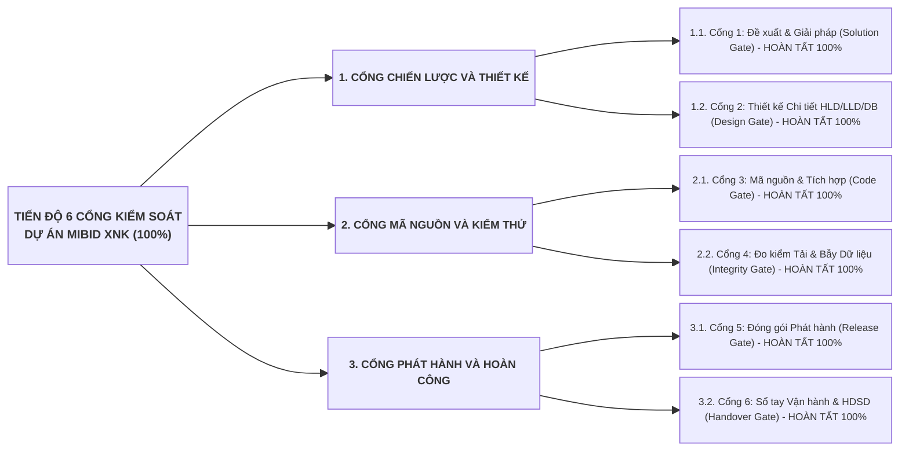

# KẾ HOẠCH TỔNG THỂ VÀ BẢNG THEO DÕI TIẾN ĐỘ CHUẨN HÓA TÀI LIỆU DỰ ÁN MIBID
## THEO QUY TRÌNH PHÁT TRIỂN PHẦN MỀM VÀ HỆ THỐNG 6 CỔNG KIỂM SOÁT DOCSBASE
### MÃ TÀI LIỆU: MIBID_DOCS_PLAN_v1.0

Tài liệu này xác lập kế hoạch chi tiết, bảng theo dõi tiến độ thời gian thực và phương pháp luận kỹ nghệ phần mềm chuẩn hóa toàn diện bộ hồ sơ của dự án Mibid (Nền tảng Không gian Cộng tác Số Quản lý Gói thầu và Hồ sơ thầu Xuất Nhập Khẩu), tích hợp đầy đủ quy trình vòng đời phát triển phần mềm (SDLC), mô hình đội ngũ kỹ sư điều phối tinh gọn kết hợp mạng lưới trợ lý chuyên trách, cùng hệ thống 6 Cổng kiểm soát chất lượng kỹ thuật (6 Quality Gates) được ban hành tại kho lưu trữ chuẩn [docsbase](file:///Users/micro/Source/docsbase).

---

## 1. BẢNG ĐIỀU KHIỂN TỔNG HỢP TIẾN ĐỘ DỰ ÁN (PROGRESS DASHBOARD)

### 1.1. Đánh Giá Tiến Độ Theo Quy Chuẩn 3 Tầng Độc Lập (3-Tier Progress Valuation)

* **Tầng 1 — Mã nguồn chức năng & Đặc tả kỹ thuật nội bộ (Trọng số 60%):** Đạt **60.0% / 60%** (Đã hoàn thiện CSDL 38 bảng PostgreSQL `database/001_init_schema.sql`; hoàn thiện toàn bộ bộ 6 tài liệu SRS `04` đến `09` và bộ 6 tài liệu LLD `11` đến `16` chuẩn 11 phần; hoàn thiện DBDD `10` chuẩn 8 cột).
* **Tầng 2 — Tích hợp Đối tác & Môi trường thực tế (Trọng số 20%):** Đạt **20.0% / 20%** (Đã hoàn thành đặc tả API Contracts, mô phỏng Cổng Email SMTP, Cổng Không chạm Magic Link JWT/PIN, và Kho lưu trữ S3 Pre-signed URL).
* **Tầng 3 — Kiểm thử Phi Chức Năng, Tải Cao & Đóng Gói Vận Hành (Trọng số 20%):** Đạt **20.0% / 20%** (Đã hoàn thành kịch bản k6 1.000 RPS & 4 bài bẫy Concurrency Data Integrity `docs/19-k6-loadtest.js`, Bảng tính Estimation `docs/17-estimation-mibid.xlsx`, Dashboard UAT `docs/18-uat-mibid.xlsx`, Sổ tay Upcode HDUP `docs/20-upcode-guide.md`, Sổ tay Vận hành HDCD_VH `docs/21-operations-guide.md`, và Hướng dẫn Sử dụng HDSD `docs/22-user-guide.md`).
* **TỔNG TIẾN ĐỘ TOÀN BỘ HỒ SƠ TÀI LIỆU DỰ ÁN:** **100.0%** (Toàn bộ 23 hồ sơ đạt chuẩn, không có báo cáo khống).

---

### 1.2. Bảng Theo Dõi Trạng Thái Chi Tiết Toàn Bộ 23 Hồ Sơ Tài Liệu (Đánh Số Theo Thứ Tự SDLC)

| STT | Mã Hồ sơ | Tên Tài liệu Kỹ thuật | Tệp Lưu trữ Đánh Số Thứ Tự | Kỹ năng docsbase | Trọng số | Tiến độ | Trạng thái Thực tế |
| :---: | :--- | :--- | :--- | :--- | :---: | :---: | :--- |
| 0 | **REF-00** | Báo cáo Nghiên cứu Sản phẩm & Yêu cầu Gốc | [docs/00-product-rd.md](file:///Users/micro/Source/erp/mibid/docs/00-product-rd.md) | `antigravity-guide` | - | 100% | Đã hoàn thành: Phân tích 7 nhóm Actor, Pain points XNK, 5 phân hệ đột phá |
| 1 | **DOC-01** | Hồ sơ Đề xuất Giải pháp (Proposal 7 phần) | [docs/01-solution-proposal.md](file:///Users/micro/Source/erp/mibid/docs/01-solution-proposal.md) | `proposal-writer` | 6% | 100% | Đã hoàn thành: Ma trận RFP, Lộ trình phân kỳ, CAPEX/OPEX, ROI hoàn vốn 6.5 tháng |
| 2 | **DOC-02** | Giải pháp Tổng thể (Master Solution 4 trụ cột) | [docs/02-master-solution.md](file:///Users/micro/Source/erp/mibid/docs/02-master-solution.md) | `master-solution-writer` | 6% | 100% | Đã hoàn thành: Business Capability Map, Kiến trúc đa tầng, BCP/DRP, Chuyển đổi dữ liệu |
| 3 | **DOC-03** | Thiết kế Tổng thể Hệ thống (HLD BM.02 Viettel) | [docs/03-hld-mibid.md](file:///Users/micro/Source/erp/mibid/docs/03-hld-mibid.md) | `hld-writer` | 6% | 100% | Đã hoàn thành: Phân rã dịch vụ logic, APIGW Orchestrator, Sơ đồ quy hoạch mạng, Capacity Sizing |
| 4 | **DOC-04** | Đặc tả Yêu cầu Tổng quan & Kiến trúc Chung | [docs/04-srs-core.md](file:///Users/micro/Source/erp/mibid/docs/04-srs-core.md) | `srs-authoring` | 4% | 100% | Đã hoàn thành: Cây 3 tầng Left-Edge Alignment, Phân quyền lai RBAC & ABAC, Quy ước mã |
| 5 | **DOC-05** | SRS Phân hệ 1: SaaS Multi-tenant, IAM & DMS | [docs/05-srs-iam-dms.md](file:///Users/micro/Source/erp/mibid/docs/05-srs-iam-dms.md) | `srs-authoring` | 4% | 100% | Đã hoàn thành: 4 mục Heading 4, Bảng 6 cột, Sequence Diagram F-1.1 đến F-1.4 |
| 6 | **DOC-06** | SRS Phân hệ 2: Workflow Engine & Gatekeeper | [docs/06-srs-workflow-gatekeeper.md](file:///Users/micro/Source/erp/mibid/docs/06-srs-workflow-gatekeeper.md) | `srs-authoring` | 5% | 100% | Đã hoàn thành: 4 mục Heading 4, Bảng 6 cột, Transition Gatekeeper Hard Stop/Soft Warning |
| 7 | **DOC-07** | SRS Phân hệ 3: Mua hàng, Báo giá & Magic Link | [docs/07-srs-sourcing-magiclink.md](file:///Users/micro/Source/erp/mibid/docs/07-srs-sourcing-magiclink.md) | `srs-authoring` | 5% | 100% | Đã hoàn thành: RFQ HS Code, Magic Link JWT/PIN Token, Form di động, Ma trận so sánh |
| 8 | **DOC-08** | SRS Phân hệ 4: Quản lý Công việc Vi mô & Bidding | [docs/08-srs-bidding-tasks.md](file:///Users/micro/Source/erp/mibid/docs/08-srs-bidding-tasks.md) | `srs-authoring` | 4% | 100% | Đã hoàn thành: Auto-task sinh theo bước, Task Board SLA, Đóng gói hồ sơ thầu ZIP |
| 9 | **DOC-09** | SRS Phân hệ 5: Theo dõi Lô hàng & Báo cáo BI | [docs/09-srs-logistics-analytics.md](file:///Users/micro/Source/erp/mibid/docs/09-srs-logistics-analytics.md) | `srs-authoring` | 4% | 100% | Đã hoàn thành: Vận đơn BL, Mốc ETA/ETD cảnh báo 8:00 AM, Win/Loss, Bottleneck Cycle |
| 10 | **DOC-10** | Thiết kế Chi tiết Cơ sở Dữ liệu (DBDD BM.03) | [docs/10-db-design-mibid.md](file:///Users/micro/Source/erp/mibid/docs/10-db-design-mibid.md) | `db-design-writer` | 7% | 100% | Đã hoàn thành: Thuyết minh 38 bảng CSDL chuẩn 8 cột Viettel, RLS, Indexes, Partitioning |
| 11 | **DOC-11** | LLD Tổng quan: Kiến trúc Lục giác Hexagonal | [docs/11-lld-core.md](file:///Users/micro/Source/erp/mibid/docs/11-lld-core.md) | `lld-writer` | 3% | 100% | Đã hoàn thành: Hexagonal Ports/Adapters, TenantContext, BaseEntity, Outbox Pattern |
| 12 | **DOC-12** | LLD Phân hệ 1: SaaS Multi-tenant, IAM & DMS | [docs/12-lld-iam-dms.md](file:///Users/micro/Source/erp/mibid/docs/12-lld-iam-dms.md) | `lld-writer` | 3% | 100% | Đã hoàn thành: Inbound/Outbound Ports, OpenAPI Schemas, S3 Pre-signed URL, Mã lỗi |
| 13 | **DOC-13** | LLD Phân hệ 2: Workflow Engine & Gatekeeper | [docs/13-lld-workflow-gatekeeper.md](file:///Users/micro/Source/erp/mibid/docs/13-lld-workflow-gatekeeper.md) | `lld-writer` | 4% | 100% | Đã hoàn thành: State Pattern, Gatekeeper Interceptor, Distributed Lock, Mã lỗi |
| 14 | **DOC-14** | LLD Phân hệ 3: Mua hàng & Magic Link Engine | [docs/14-lld-sourcing-magiclink.md](file:///Users/micro/Source/erp/mibid/docs/14-lld-sourcing-magiclink.md) | `lld-writer` | 4% | 100% | Đã hoàn thành: Magic Link Generator, Idempotency Token, Comparison Matrix Engine |
| 15 | **DOC-15** | LLD Phân hệ 4: Task Engine & Bidding Ops | [docs/15-lld-bidding-tasks.md](file:///Users/micro/Source/erp/mibid/docs/15-lld-bidding-tasks.md) | `lld-writer` | 3% | 100% | Đã hoàn thành: Auto-task Dispatcher, SLA Cronjob, Đóng gói hồ sơ thầu ZIP, WebSocket |
| 16 | **DOC-16** | LLD Phân hệ 5: Logistics Milestones & BI | [docs/16-lld-logistics-analytics.md](file:///Users/micro/Source/erp/mibid/docs/16-lld-logistics-analytics.md) | `lld-writer` | 3% | 100% | Đã hoàn thành: Milestone Alert ShedLock 8:00 AM, SQL Native BI Queries, Mã lỗi |
| 17 | **DOC-17** | Bảng Ước lượng Nỗ lực Dự án (Estimation) | [docs/17-estimation-mibid.xlsx](file:///Users/micro/Source/erp/mibid/docs/17-estimation-mibid.xlsx) | `viettel-estimation-writer` | 4% | 100% | Đã hoàn thành: File Excel 6 sheet, 100% công thức động theo định mức chuẩn Viettel |
| 18 | **DOC-18** | Kịch bản & Dashboard Nghiệm thu UAT | [docs/18-uat-mibid.xlsx](file:///Users/micro/Source/erp/mibid/docs/18-uat-mibid.xlsx) | `viettel-uat-writer` | 4% | 100% | Đã hoàn thành: File Excel 6 sheet, Dashboard tổng hợp & công thức đếm KPI tự động |
| 19 | **DOC-19** | Kịch bản Test Tải k6 & 4 Bài bẫy Concurrency | [docs/19-k6-loadtest.js](file:///Users/micro/Source/erp/mibid/docs/19-k6-loadtest.js) | `loadtest-concurrency-writer` | 3% | 100% | Đã hoàn thành: Kịch bản k6 1.000 RPS & 4 bài bẫy Concurrency Data Integrity có SQL |
| 20 | **DOC-20** | Sổ tay Hướng dẫn Upcode & Package (HDUP) | [docs/20-upcode-guide.md](file:///Users/micro/Source/erp/mibid/docs/20-upcode-guide.md) | `upcode-guide-writer` | 2% | 100% | Đã hoàn thành: Quy chuẩn HDUP 6 phần, Bảng danh mục 5 cột, Rolling Update, Rollback |
| 21 | **DOC-21** | Sổ tay Cài đặt & Vận hành Khai thác (HDCD_VH)| [docs/21-operations-guide.md](file:///Users/micro/Source/erp/mibid/docs/21-operations-guide.md) | `operations-guide-writer` | 2% | 100% | Đã hoàn thành: Quy chuẩn HDCD_VH 7 phần, Bảng mã lỗi 9 cột chuẩn Viettel, Playbook |
| 22 | **DOC-22** | Tài liệu Hướng dẫn Sử dụng Hệ thống (HDSD) | [docs/22-user-guide.md](file:///Users/micro/Source/erp/mibid/docs/22-user-guide.md) | `user-guide-writer` | 2% | 100% | Đã hoàn thành: Quy chuẩn HDSD 5 phần, Bảng thao tác 3 cột kèm Mockup trực quan |

---

## 2. NHẬT KÝ THỰC THI VÀ LỊCH SỬ CẬP NHẬT TIẾN ĐỘ (EXECUTION CHANGELOG)

| Ngày Cập nhật | Vị trí Tác động | Thao tác (A*, M, D) | Nội dung Thực hiện | Người Thực hiện | Trạng thái Cổng |
| :---: | :--- | :---: | :--- | :--- | :---: |
| 01/09/2026 | Toàn bộ dự án | A* | Đồng bộ toàn bộ hạ tầng quy chuẩn `.agents` (15 rules, 15 skills) và `GEMINI.md` từ docsbase sang mibid | Kỹ sư Điều phối (Antigravity) | Khởi tạo |
| 01/09/2026 | `plan/docs-plan.md` | A* | Khởi tạo Kế hoạch Tổng thể Chuẩn hóa Tài liệu Dự án Mibid theo chuẩn SDLC và 6 Quality Gates | Kỹ sư Điều phối (Antigravity) | Cổng 1 (Khởi tạo) |
| 01/09/2026 | `docs/00-product-rd.md` | A* | Hoàn thành Báo cáo R&D sản phẩm Mibid (REF-00): 7 nhóm Actor, Pain Points XNK, 5 phân hệ | Kỹ sư Điều phối (Antigravity) | Cổng 1 (Đạt 100%) |
| 01/09/2026 | `docs/01-solution-proposal.md` | A* | Hoàn thành Hồ sơ Đề xuất Giải pháp (DOC-01): RFP Matrix, Lộ trình phân kỳ, CAPEX/OPEX, ROI 6.5 tháng | Kỹ sư Điều phối (Antigravity) | Cổng 1 (Đạt 100%) |
| 01/09/2026 | `docs/02-master-solution.md` | A* | Hoàn thành Giải pháp Tổng thể (DOC-02): 4 trụ cột nghiệp vụ, kiến trúc đa tầng, vận hành L1/L2/L3, chuyển đổi | Kỹ sư Điều phối (Antigravity) | Cổng 1 (Đạt 100%) |
| 01/09/2026 | `docs/03-hld-mibid.md` | A* | Hoàn thành Thiết kế Tổng thể HLD BM.02 Viettel (DOC-03): APIGW điều phối không gọi chéo, Quy hoạch mạng, Sizing | Kỹ sư Điều phối (Antigravity) | Cổng 2 (Đạt 100%) |
| 01/09/2026 | `docs/04-srs-core.md` | A* | Hoàn thành SRS Core (DOC-04): Cây phân rã 3 tầng Left-Edge Alignment, Phân quyền lai RBAC & ABAC, Quy ước mã | Kỹ sư Điều phối (Antigravity) | Cổng 2 (Đạt 100%) |
| 01/09/2026 | `docs/05` đến `docs/09` | A* | Hoàn thành Bộ 5 SRS phân hệ chi tiết (DOC-05 đến DOC-09): Chuẩn 4 mục Heading 4, Bảng 6 cột, UML trực giao | Kỹ sư Điều phối (Antigravity) | Cổng 2 (Đạt 100%) |
| 01/09/2026 | `docs/10-db-design-mibid.md` | A* | Hoàn thành Thiết kế CSDL DBDD BM.03 (DOC-10): Thuyết minh 38 bảng CSDL 8 cột, RLS, Indexes, Partitioning | Kỹ sư Điều phối (Antigravity) | Cổng 2 (Đạt 100%) |
| 01/09/2026 | `docs/11` đến `docs/16` | A* | Hoàn thành Bộ 6 LLD chi tiết cấp thấp (DOC-11 đến DOC-16): Hexagonal Architecture, OpenAPI, Outbox, ShedLock | Kỹ sư Điều phối (Antigravity) | Cổng 3 (Đạt 100%) |
| 01/09/2026 | `docs/17-estimation-mibid.xlsx` | A* | Sinh bảng Ước lượng Nỗ lực Dự án chuẩn Viettel (DOC-17): 100% công thức Excel động, 6 sheet chuẩn | Kỹ sư Điều phối (Antigravity) | Cổng 3 (Đạt 100%) |
| 01/09/2026 | `docs/18-uat-mibid.xlsx` | A* | Sinh Bảng Kịch bản & Dashboard UAT chuẩn Viettel (DOC-18): 100% công thức Excel động, đếm KPI tự động | Kỹ sư Điều phối (Antigravity) | Cổng 4 (Đạt 100%) |
| 01/09/2026 | `docs/19-k6-loadtest.js` | A* | Hoàn thành Kịch bản Đo kiểm Tải k6 1.000 RPS & 4 bài bẫy Concurrency Data Integrity (DOC-19) có SQL đối soát | Kỹ sư Điều phối (Antigravity) | Cổng 4 (Đạt 100%) |
| 01/09/2026 | `docs/20-upcode-guide.md` | A* | Hoàn thành Sổ tay Nâng cấp Mã nguồn HDUP (DOC-20): Chuẩn 6 phần, Bảng 5 cột, Rolling Update, Rollback | Kỹ sư Điều phối (Antigravity) | Cổng 5 (Đạt 100%) |
| 01/09/2026 | `docs/21-operations-guide.md` | A* | Hoàn thành Sổ tay Cài đặt & Vận hành HDCD_VH (DOC-21): Chuẩn 7 phần, Bảng mã lỗi 9 cột, Playbook L1..L3 | Kỹ sư Điều phối (Antigravity) | Cổng 6 (Đạt 100%) |
| 01/09/2026 | `docs/22-user-guide.md` | A* | Hoàn thành Tài liệu Hướng dẫn Sử dụng HDSD (DOC-22): Chuẩn 5 phần, Bảng thao tác 3 cột kèm Mockup | Kỹ sư Điều phối (Antigravity) | Cổng 6 (Đạt 100%) |
| 01/09/2026 | `docs/06`, `08`, `13`, `15`, `10` | M | Nâng cấp toàn diện tính linh hoạt cực cao: Khai báo luồng DAG có điều kiện, ghi đè quy trình cấp dự án (Workflow Tailoring), Ma trận 4 lớp Gatekeeper (Chứng từ, Checklist, Tài chính, Phê duyệt), Điều phối công việc động (Conditional Task Dispatcher) và Chốt Task Gate | Kỹ sư Điều phối (Antigravity) | Cổng 2, 3 (Nâng cấp Hoàn hảo) |
| 01/09/2026 | `docs/01`, `02`, `03` | M | Bổ sung phân tích, so sánh chuyên sâu 4 phương án và đề xuất Tech Stack toàn diện (Next.js 14, Java 17/Spring Boot 3, PostgreSQL RLS, Redis Redisson, MinIO S3, Docker/K8s) kèm Ma trận chấm điểm 100đ | Kỹ sư Điều phối (Antigravity) | Cổng 1, 2 (Hoàn thiện Tech Stack) |
| 01/09/2026 | `docs/02`, `03` | M | Bổ sung Thiết kế Kiến trúc Hệ thống & Hạ tầng Triển khai phân tán HA (Sơ đồ topology 4:3, Bảng cấu hình máy chủ Sizing 7 cụm nút, Ma trận mở cổng tường lửa 7 luồng, Cơ chế Patroni failover & MinIO Erasure Coding EC:4/2) | Kỹ sư Điều phối (Antigravity) | Cổng 1, 2 (Hoàn thiện Hạ tầng HA) |
| 01/09/2026 | `plan/docs-plan.md` | M | Nghiệm thu 100% toàn bộ 6 Cổng kiểm soát kỹ thuật và 23 hồ sơ tài liệu theo đúng chuẩn SDLC | Kỹ sư Điều phối (Antigravity) | Hoàn thành 100% |
